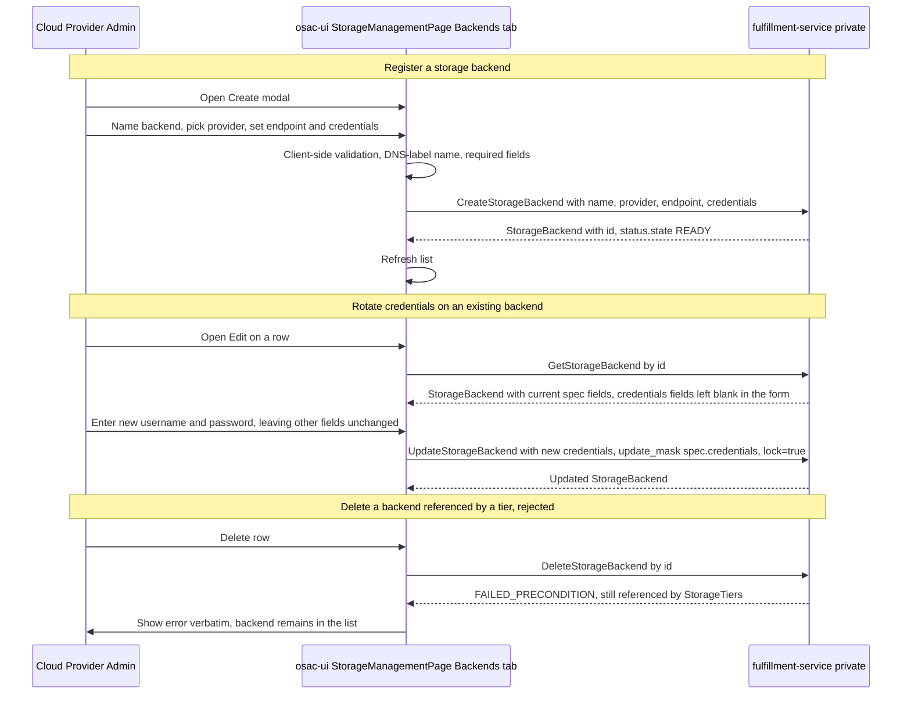
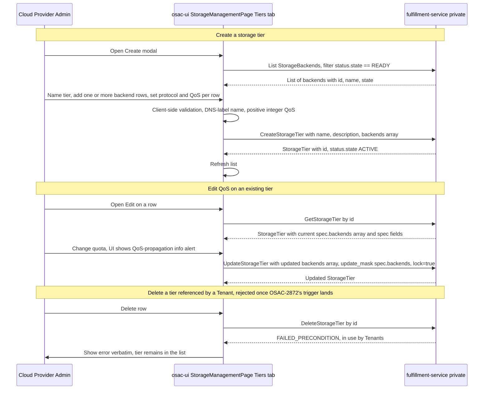

# Storage Tier & Backend — UI Management

## Summary

This design specifies the `osac-ui` implementation for both `StorageBackend` (OSAC-1111) and `StorageTier` (OSAC-1110) admin management: a combined "Storage" admin section, with a Backends tab and a Tiers tab, where Cloud Provider Admins register storage infrastructure and compose named tier offerings (e.g., "fast", "standard") on top of it. See [PRD](prd.md) for detailed requirements and [design.md](design.md) for the `StorageTier` API contract this UI consumes.

## Motivation

OSAC has no API-managed inventory of storage infrastructure or tier offerings today: backend configuration lives in Ansible extra vars, and tier configuration lives in the `STORAGE_TIERS` environment variable plus Kubernetes label conventions — both invisible to the OSAC API and to any UI. `StorageBackend` and `StorageTier` replace these with DB-backed private gRPC resources. `osac-ui` is the only *graphical* interface Cloud Provider Admins have to manage this data — neither resource has a public API today, though both already have private `osac` CLI support (`osac create/describe storagetier`, `osac create/describe storagebackend`, confirmed merged in `fulfillment-service`). A public, tenant-facing Get/List API for `StorageTier` (not `StorageBackend`) is planned separately under OSAC-3014, to let VMaaS tenants see which tiers are available when selecting a disk tier during ComputeInstance creation (OSAC-1710); that public surface, and any UI built on it, is out of scope for this admin-only design — see Drawbacks.

Neither the OSAC-1110 nor the OSAC-1111 PRD states a UI requirement — unlike `ClusterVersion` (OSAC-1269), whose PRD explicitly required "The UI console supports catalog management for admins" (FR-9). An earlier revision of this document used that absence, plus the precedent of `NetworkClass` (a structurally similar resource with no CRUD UI in `osac-ui` today), to scope `StorageBackend` out entirely and treat it as read-only support data for the `StorageTier` UI. The OSAC-1111 design owner reviewed that scoping and confirmed the real Cloud Provider Admin workflow is incomplete without it: an admin registers a `StorageBackend` (vendor, endpoint, credentials) first, then composes `StorageTier`s on top of the registered backends, and needs to see and manage backend registrations through the same UI rather than falling back to the CLI or raw API calls partway through an otherwise-graphical workflow. This design now builds full CRUD for both resources on that basis.

### User Stories

- As a Cloud Provider Admin, I want to register a new storage backend (provider, management endpoint, credentials) through a form, so that I don't have to construct API/CLI calls by hand to make it available for tier composition.
- As a Cloud Provider Admin, I want to see every registered storage backend with its provider, endpoint, and state in one place, so that I know what infrastructure is available before composing tiers.
- As a Cloud Provider Admin, I want to update a backend's endpoint, description, or credentials without re-registering it, so that I can rotate credentials or correct a mistake in place.
- As a Cloud Provider Admin, I want to delete a backend that is no longer needed, and be blocked with a clear reason if a tier still references it, so that I don't silently break tier definitions.
- As a Cloud Provider Admin, I want to compose a named storage tier from one or more registered backends with QoS settings, so that I can offer a differentiated storage product without manually constructing gRPC/REST calls (e.g., via `grpcurl` or the private REST endpoint) or using the `osac` CLI.
- As a Cloud Provider Admin, I want to see every existing storage tier with its backend, protocol, and state in one place, so that I can audit the tier definitions without direct API access. (Here and elsewhere, "catalog" refers only to lists of `StorageBackend`/`StorageTier` definitions — it is unrelated to `osac-ui`'s separate `ClusterCatalogItem`/`CatalogManagementListPage` provisioning-template feature, which this design does not touch.)
- As a Cloud Provider Admin, I want to adjust a tier's QoS settings or backend association after creation, so that I can correct or tune an offering without recreating it.
- As a Cloud Provider Admin, I want to delete a tier that is no longer needed, and be blocked with a clear reason if a Tenant still depends on it, so that I don't silently break existing tenant storage.

### Goals

- Follow `osac-ui`'s existing hooks-layer conventions (`useApiFetch` + `useApiQuery`/`useMutation` + `apiQueryKey`) for full `StorageBackend` and `StorageTier` CRUD, private-only — no public API exists for either yet, so there is no public counterpart to build against today. (OSAC-3014 will add a public, tenant-facing Get/List API for `StorageTier` later; that will need its own hook module when it lands, following the existing public/private split pattern used elsewhere in `osac-ui`, e.g. `ClusterVersion`'s `api/v1/cluster-versions.ts` vs. `api/v1/private/cluster-versions.ts` — not built here. No public API is planned for `StorageBackend`.)
- Model both admin screens on `osac-ui`'s existing table-plus-row-actions list-page shape (`VirtualNetworksListPage`/`ClustersTable`), since no full-CRUD admin page exists yet in `osac-ui` to copy wholesale.
- Combine `StorageBackend` and `StorageTier` under one "Storage" nav entry with two tabs, reflecting their tight coupling (a tier cannot be created without at least one registered backend) rather than two separate top-level nav items.
- Introduce two UI primitives with no existing precedent in this codebase: a masked credential input (`StorageBackend.spec.credentials`) and an immutable-field-on-edit form pattern (both resources' identity fields — `metadata.name` on both, plus `spec.provider` on `StorageBackend`).
- Reintroduce role-gated admin navigation and routing in `osac-ui`, following the exact shape of equivalent code that existed for a prior admin feature before being fully removed when that feature was reverted (see Implementation Details, "Navigation and Routing").

### Non-Goals

- Any UI for Volume/PVC management or inventory — out of scope per OSAC-2872 (Storage Control Plane), which explicitly states "No UX changes in this EP... UI integration is OSAC-984 scope."
- `StorageBackend` lifecycle-state transitions (e.g., "Mark maintenance," "Decommission") — the real, merged `StorageBackendState` enum defines only `READY` today (`UNSPECIFIED`/`READY`); `MAINTENANCE`/`DECOMMISSIONED` do not exist as enum values yet, so there is nothing to build a transition UI against. This design builds the state label to display whatever state exists, but no lifecycle-action UI, and revisits this when the enum grows (see Risks and Mitigations).
- Any tenant-facing surface for *this admin screen* — neither resource has a public API today, so there is nothing for a tenant to see or do in the UI this design builds. (This does not preclude a *separate* tenant-facing surface elsewhere once OSAC-3014's public `StorageTier` Get/List API lands, e.g. a tier picker in the VMaaS disk-configuration wizard for OSAC-1710 — that is a distinct UI surface, owned by a future design, not this one. No public API is planned for `StorageBackend`.)
- Tenant-to-tier assignment UI — owned by OSAC-2872 (Storage Control Plane)'s policy engine, not this design.
- A generic, field-type-driven form-rendering system — consistent with how every other resource in `osac-ui` hardcodes its own widgets rather than deriving them from proto metadata.

## Proposal

`osac-ui` gains: two new hook modules (`storage-backends.ts` and `storage-tiers.ts`, both full CRUD), one new combined admin page (`StorageManagementPage`) with a Backends tab and a Tiers tab, two new lifecycle-state label components, and a reintroduced role-gated "Administration" nav section and route guard. No backend API changes are proposed by this EP; it consumes the `StorageBackends`/`StorageTiers` private gRPC services exactly as specified in [design.md](design.md) and [../OSAC-1111-storage-backend/design.md](../OSAC-1111-storage-backend/design.md).

### Workflow Description

**Actors:** Cloud Provider Admin (all interactions; no other actor has access to this UI).

#### Flow 1: Register and manage a storage backend

**Preconditions:** None — this is the first step in the storage setup workflow.



The diagram shows the three primary flows the Backends tab supports: registration (name, provider, endpoint, credentials), credential rotation (only changed fields submitted, name/provider locked), and deletion blocked by an existing tier reference. All three route through the same private `StorageBackends` service.

#### Flow 2: Compose a storage tier from registered backends

**Preconditions:** At least one `StorageBackend` exists in the `READY` state (Flow 1).



The diagram shows the three primary flows the Tiers tab supports: creation (with a `READY`-filtered backend picker), QoS editing (informing the admin that some changes require StorageClass recreation to take effect for new volumes), and deletion (surfacing the server's referential-integrity rejection verbatim rather than pre-checking it client-side). The deletion flow's `FAILED_PRECONDITION` path is not yet reachable in practice: the fulfillment-service's current migrations implement the `StorageBackend`↔`StorageTier` referential-integrity triggers (verified in `76_add_storage_tier_ref_triggers.up.sql`), but the tenant-reference-blocks-delete trigger is still deferred to a follow-up migration shipping with OSAC-2872 (Storage Control Plane) — OSAC-23, the enhancement this deferral was originally scoped against, is closed; OSAC-2872 is the current live epic that owns tenant-to-tier assignment and the corresponding backend enforcement. Until that trigger lands, `DeleteStorageTier` always succeeds — the UI still implements this error-handling path now, since it costs nothing extra and the trigger is expected to land before this UI ships.

### API Extensions

None. This EP introduces no new backend API surface, CRDs, webhooks, or finalizers. It is a pure consumer of the `StorageBackends` and `StorageTiers` private gRPC services already specified in [../OSAC-1111-storage-backend/design.md](../OSAC-1111-storage-backend/design.md) and [design.md](design.md). The only new artifacts are `osac-ui`-internal: two hook modules and their corresponding `ApiRoute` string-literal entries (`'v1/private/storage_backends'`, `'v1/private/storage_tiers'`) in `libs/ui-components/src/api/types.ts`.

### Implementation Details/Notes/Constraints

#### 1. Hooks Layer

Two new private-only hook modules in `libs/ui-components/src/api/v1/private/`, both full CRUD, following the existing `networking.ts` CRUD hook shape (`useMutation` + `useApiQueryClient()` + an `invalidate*Queries(qc)` helper in `onSuccess`):

| Hook | RPC | Notes |
|---|---|---|
| `usePrivateStorageBackends(params)` | `List` | pagination + CEL filter + ordering supported by the hook; the list page renders every backend unpaginated, consistent with the catalog's expected small size |
| `usePrivateStorageBackend(id)` | `Get` | edit-form prefill; also used by the Tiers tab to resolve a tier's currently-assigned backend when it has fallen out of the `READY` filter (see §8) |
| `useCreateStorageBackend()` | `Create` | submits `metadata.name`, `spec: { provider, endpoint, description, credentials }` |
| `useUpdateStorageBackend()` | `Update` | submits only changed fields among `spec.endpoint`/`spec.description`/`spec.credentials` with a matching `update_mask`; `metadata.name`/`spec.provider` never included (both immutable, rejected by the server with `INVALID_ARGUMENT` if changed); uses `lock=true` for optimistic concurrency |
| `useDeleteStorageBackend()` | `Delete` | no client-side pre-check for in-use references |
| `usePrivateStorageTiers(params)` | `List` | pagination + CEL filter + ordering supported by the hook; the list page renders every tier unpaginated, consistent with the catalog's expected small size |
| `usePrivateStorageTier(id)` | `Get` | edit-form prefill |
| `useCreateStorageTier()` | `Create` | submits `metadata.name`, `spec: { description, backends: [...] }` |
| `useUpdateStorageTier()` | `Update` | submits `spec.description` and/or the complete `spec.backends` array (never an indexed sub-path — standard protobuf `FieldMask` addresses whole fields, not repeated-element indices) with a matching `update_mask`; `metadata.name` never included (immutable, rejected with `INVALID_ARGUMENT`); uses `lock=true` for optimistic concurrency |
| `useDeleteStorageTier()` | `Delete` | no client-side pre-check for in-use references |

Exports `STORAGE_BACKEND_READY_LIST_FILTER = "this.status.state == ${StorageBackendState.READY}"` from `storage-backends.ts`, restricting the Tiers tab's backend picker to usable backends, mirroring `instance-types.ts`'s `INSTANCE_TYPE_ACTIVE_LIST_FILTER`.

#### 2. Navigation and Routing

`osac-ui` currently has **no "Administration" nav section**: `navRowsForRole(role, t)` in `apps/app-frontend/src/shell/shellNav.ts` ignores `role` entirely and returns only two tenant-facing sections (`nav-tenant-services`, `nav-tenant-networking`). A prior admin feature (unrelated to storage) had a role-gated `nav-administration` section and a matching role-conditional `<Route>` in `AppShell.tsx`, but both were fully removed when that feature was reverted for reasons unrelated to storage.

This design reintroduces the same shape for "Storage":

- `navRowsForRole` conditionally pushes `{ kind: 'section', sectionId: 'nav-administration', label: t('Administration'), children: [{ id: 'storage', label: t('Storage'), path: '/admin/storage' }] }` when `role === 'providerAdmin'`. Unlike the removed code this reintroduction is modeled on (which also granted `tenantAdmin`, appropriate for that feature's tenant-scoped catalog items), both `StorageBackend` and `StorageTier` are platform-scoped and managed exclusively by Cloud Provider Admins — `tenantAdmin` is a tenant-scoped role in `osac-ui`'s three-tier model (`providerAdmin` | `tenantAdmin` | `tenantUser`) and has no legitimate access to either.
- `AppShell.tsx` gains a matching role-conditional route: `{role === 'providerAdmin' && <Route path="/admin/storage/*" element={<ShellRoute><StorageManagementPage /></ShellRoute>} />}`. A non-admin — including a `tenantAdmin` — navigating to the URL directly falls through to the existing catch-all route and is redirected, rather than the page rendering and issuing API calls that would fail server-side.

This is a route-level guard, in addition to nav-entry hiding — not a substitute for the private API's own OPA-enforced authorization, which remains the authoritative check regardless of what the UI does.

#### 3. Backends List Page

`libs/ui-components/src/pages/admin/StorageManagementPage.tsx` renders a `Tabs` component with "Backends" (default) and "Tiers" tabs, each wrapping a plain PatternFly `Table` (no generic column abstraction exists in `osac-ui` today — see `ClustersTable.tsx`). The Backends tab: columns NAME, PROVIDER, ENDPOINT, STATE, and a row-actions kebab (Edit, Delete). STATE renders via `StorageBackendStateLabel` (§9). Delete calls `useDeleteStorageBackend()` with no pre-check; a blocked delete (`FAILED_PRECONDITION`, backend referenced by an active `StorageTier` — enforced today by the `check_storage_backend_not_in_use_by_tier` trigger, verified in `76_add_storage_tier_ref_triggers.up.sql`) is shown verbatim and the row stays in place.

#### 4. Backend Create Form

A modal (`StorageBackendCreateModal`) modeled on `osac-ui`'s existing `VirtualNetworkCreateModal` (Formik + Yup, single mutation on submit): `name` (`InputField`, DNS-label validated, §11), `provider` (`Select`, options `vast`/`ceph`/`pure` — constrained rather than free text, since OSAC-2872 (Storage Control Plane) resolves the vendor CSI controller via `{provider}.osac-csi-backend.svc.cluster.local`, making the exact string a live Kubernetes Service DNS name downstream; a typo in a free-text field would silently break volume provisioning with no client-side signal), `endpoint` (`InputField`, required), `description` (`InputField`, optional), `credentials.username` (`InputField`, required), `credentials.password` (`TextInput type="password"`, required — a new primitive with no existing precedent in this codebase; searched and confirmed no masked-password input exists anywhere in `osac-ui` today). Submits `{ metadata: { name }, spec: { provider, endpoint, description, credentials: { username, password } } }` via `useCreateStorageBackend()`.

#### 5. Backend Edit Form

`StorageBackendEditForm`: `name` and `provider` render disabled (both immutable — enforced server-side, rejecting either change with `INVALID_ARGUMENT`); `endpoint`, `description`, and `credentials.username`/`credentials.password` remain editable. The credential fields start **blank**, with helper text "Leave blank to keep the current credentials," and are included in the `Update` payload only when non-empty — this is the first implementation of an immutable-field-on-edit pattern in this codebase (locking specific fields while leaving others on the same record editable); there is no existing component to extend or copy. Submits via `useUpdateStorageBackend()` with `lock=true` for optimistic concurrency.

#### 6. Tiers List Page

The Tiers tab: columns NAME, BACKENDS, PROTOCOL(S), STATE, and a row-actions kebab (Edit, Delete). BACKENDS resolves every entry in `spec.backends[].backendId` to a name via a batched `List` call to the backend hook plus a `Map<string, StorageBackend>` lookup — avoiding one `Get` per row — and renders the resolved names comma-separated, falling back to the raw ID for any entry that fails to resolve individually (a tier with a mix of resolved and unresolved backends shows both forms in the same cell). PROTOCOL(S) similarly lists each backend association's protocol, comma-separated, since different backends within one tier can use different protocols. STATE reads `status.state` and renders via `StorageTierStateLabel` (§9). Delete calls `useDeleteStorageTier()` with no pre-check; a blocked delete (`FAILED_PRECONDITION`, tier referenced by a Tenant) is shown verbatim and the row stays in place — see the Workflow Description note on this path not being reachable until OSAC-2872's trigger lands.

#### 7. Tier Create Form

A modal (`StorageTierCreateModal`) modeled on `osac-ui`'s existing `VirtualNetworkCreateModal` (Formik + Yup, single mutation on submit): `name` (DNS-label validated, §11), `description` (optional), and a repeatable **backend associations** section — one or more rows, each with `backend` (select, populated from `usePrivateStorageBackends({ filter: STORAGE_BACKEND_READY_LIST_FILTER })`), `protocol` (`NFS`/`BLOCK`), `maxReadBandwidthMbs` / `maxWriteBandwidthMbs` / `quotaGib` (positive-integer numeric fields), and `encryptionEnabled` (checkbox). Submits `{ metadata: { name }, spec: { description, backends: [{ backendId, protocol, maxReadBandwidthMbs, maxWriteBandwidthMbs, quotaGib, encryptionEnabled }, ...] } }` — one array entry per row.

**Backend associations are entered via `BackendAssociationsArrayField`**, a new shared component (used by both the Tier Create and Edit forms) following `osac-ui`'s existing repeatable-row pattern from `ClusterNodeSetsArrayField.tsx` — the only precedent for this shape in the codebase, and the one to copy exactly rather than inventing a new convention. No `FieldArray`/`useFieldArray` from Formik is used anywhere in `osac-ui`; the established pattern is hand-rolled array manipulation via `setFieldValue`:

- Formik state holds `spec.backends: BackendAssociationRow[]`, where each row carries a client-only `rowId` (`crypto.randomUUID()`, generated by `createEmptyBackendAssociationRow()`) used as the React `key` — never the array index — so removing a row doesn't cause sibling rows to remount or lose focus.
- Each row renders inside a PatternFly `FormFieldGroup` (`FormFieldGroupHeader` titled "Backend {n}", 1-based), fields stacked vertically inside, matching `ClusterNodeSetsArrayField.tsx`'s layout exactly — not a card or accordion.
- **Remove:** a plain `Button` (`variant="plain"`, `MinusCircleIcon`, `aria-label`) in the `FormFieldGroupHeader`'s `actions` slot, present on every row except the first — at least one backend association is always required and the first row cannot be removed, matching the existing precedent.
- **Add:** a `variant="link"` `Button` with `PlusCircleIcon`, labeled "Add backend", below the last row, appending a new empty row via `setFieldValue('spec.backends', [...values.spec.backends, createEmptyBackendAssociationRow()])`. Disabled while the backend picker's `List` call is loading.
- Each row's backend `Select` excludes backends already chosen in a sibling row (computed via `useMemo` over all rows' selected `backendId`s, mirroring `ClusterNodeSetsArrayField.tsx`'s duplicate-host-type exclusion for node sets) — a tier cannot reference the same backend twice.
- Yup validation: `yup.array().of(backendAssociationRowSchema).min(1, ...).test('unique-backend-ids', ...)`, in the same style as `ClusterNodeSetsArrayField.tsx`'s sibling `schemas.ts`.

**The server currently rejects more than one entry in `spec.backends`** with `INVALID_ARGUMENT` ("only one backend association is supported in v0.1") — verified in `private_storage_tiers_server.go`'s `validateBackends`. This UI is built for the full OSAC-1110 FR-3 requirement ("one or more backend associations") per confirmed reviewer/product direction (PR review discussion, `storage_tier_type.pb.go`'s `Backends` field already modeled as a repeated field), not the server's current interim restriction — an admin adding a second backend row and submitting will see the server's real `INVALID_ARGUMENT` message until that server-side restriction is lifted. See Risks and Mitigations.

#### 8. Tier Edit Form

`StorageTierEditForm`: `name` renders disabled (immutable — enforced server-side in `validateStorageTierUpdate`, which rejects any `metadata.name` change with `INVALID_ARGUMENT`); `description` and the entire backend-associations list — via the same `BackendAssociationsArrayField` used by the Create form (§7) — remain editable, since only `metadata.name` is immutable. Prefill maps each of the tier's existing `spec.backends` entries to one row (assigning each a fresh client-only `rowId`, since the server doesn't persist one); an admin can add further rows, remove existing ones (down to a minimum of one), or edit any row's fields.

Editing *anything* in the backend-associations list — adding a row, removing one, or changing a single field on one row — submits the *complete*, current `spec.backends` array with `update_mask: ["spec.backends"]`; there is no per-row or per-field partial update, since standard protobuf `FieldMask` has no syntax for addressing individual elements of a repeated field. The form's Formik state always holds the full array regardless of what changed, and submits it whole.

Each row's backend `Select` option list is the union of the `READY`-filtered list and that row's own currently-assigned backend (fetched via `usePrivateStorageBackend(backendId)` if it has since left `READY`) — this avoids the create form's simpler always-`READY` filter silently dropping an existing selection when its backend has moved out of `READY`. The duplicate-backend exclusion (§7) still applies across rows during editing. Changing any QoS field on any row shows an inline info alert: "Bandwidth and quota changes take effect immediately for existing and new volumes. Changes to encryption or protocol require the associated StorageClass to be recreated before new volumes pick them up; existing volumes are unaffected."

#### 9. Lifecycle State Labels

Both `StorageBackendStateLabel` and `StorageTierStateLabel` wrap the shared `ResourceStatusLabel`/`StatusKind` primitive rather than introducing standalone components: `StorageBackendStateLabel` maps `READY` to `status="ready"` (green, "Ready") and `UNSPECIFIED` to `status="unspecified"` (grey); `StorageTierStateLabel` maps `ACTIVE` to `status="ready"` (green, "Active") and `UNSPECIFIED` to `status="unspecified"` (grey). `StatusKind`'s remaining values (`failed`, `progressing`) describe runtime reconciliation states that neither resource — having no reconciler — ever reaches, so each mapping only ever produces two of the primitive's four possible renderings; `ResourceStatusLabel`'s `text` prop still carries resource-specific wording ("Ready", "Active") rather than reusing generic reconciliation text, keeping the semantic mismatch contained to two small, obvious mapping functions rather than exposed to callers.

#### 10. Data Model (as consumed by this UI)

Both `StorageBackend` and `StorageTier` use the standard OSAC `spec`/`status` object shape, not a flat structure:

```text
StorageBackend {
  id, metadata { name },                // name immutable after creation
  spec: {
    provider: string,                    // immutable after creation; constrained to vast | ceph | pure in this UI
    endpoint: string,
    description?: string,
    credentials: { username: string, password: string }
  },
  status: { state: READY, message?: string }   // READY is the only value defined today; UNSPECIFIED is the proto3 zero value
}

StorageTier {
  id, metadata { name },                // name immutable after creation
  spec: {
    description?: string,
    backends: [ BackendAssociation ]    // this UI supports one or more per FR-3; server currently rejects >1 (see Risks)
  },
  status: { state: ACTIVE, message?: string }  // ACTIVE is the only value defined today
}
BackendAssociation {
  backendId: string,                    // references StorageBackend.id
  protocol: NFS | BLOCK,
  maxReadBandwidthMbs: int32,
  maxWriteBandwidthMbs: int32,
  quotaGib: int64,
  encryptionEnabled: bool
}
```

Both protos are already merged and generated: `storage_backend_type_pb`/`storage_backends_service_pb` and `storage_tier_type_pb`/`storage_tiers_service_pb` exist in `osac-ui`'s generated types (`libs/types`) and are already exported from `libs/types/src/index-private.ts` — verified directly against `fulfillment-service`'s `origin/main` (`StorageBackend`: PR #728, merged 2026-06-18; `StorageTier`: PR #832, merged 2026-07-02, restructured to `spec`/`status` by PR #887, merged 2026-07-12) and against `osac-ui`'s current `libs/types`. This design has no remaining external blocker to being built — see Risks and Mitigations for the two behaviors (multi-backend, tenant-reference-delete) that are ahead of current server capability.

#### 11. Validation Constraints

- `StorageBackend.metadata.name` and `StorageTier.metadata.name`: RFC 1035 DNS label (1–63 chars, lowercase alphanumeric plus hyphens, no leading/trailing hyphen), validated client-side before submission on both create forms. **Confirmed the server performs no format validation of its own for either**: `private_storage_backends_server.go`'s `validateStorageBackendCreate` and `private_storage_tiers_server.go`'s `validateStorageTierCreate` both only check that `metadata.name` is non-empty (the OSAC-1111 design's stated intent to reuse a generic DNS-label validator was not implemented this way). This client-side check is therefore the *only* validation preventing an incompatible name from being submitted, not a defensive duplicate of a server-side rule — OSAC-2872 (Storage Control Plane) generates the StorageClass name `osac-{tenant}-{tier}` directly from the tier name, so an invalid name here would surface as a failure much later, in volume provisioning.
- `StorageBackend.spec.endpoint`, `spec.credentials.username`, `spec.credentials.password`: required, non-empty, rejected client-side before submission; the server is the final authority (its own validation is limited to non-empty checks per `validateStorageBackendCreate`).
- `maxReadBandwidthMbs`, `maxWriteBandwidthMbs`, `quotaGib`: positive integers, rejected client-side before submission; the server is the final authority.

### Security Considerations

`StorageBackend.spec.credentials` (`username`/`password`) are collected via a masked `TextInput type="password"` on create and never pre-filled on edit — the edit form's credential fields start blank with helper text ("Leave blank to keep the current credentials"), and are included in the `Update` payload only when non-empty. Whether `GetStorageBackend`/`ListStorageBackends` return credentials in plaintext or redacted is unconfirmed; the blank-by-default convention is followed regardless of the answer, since displaying a stored secret in a form field is poor practice either way. Since neither resource has a public API, there is no risk of credential exposure to tenants through this UI — the private API's existing OPA-enforced admin-only access control is the sole gate. `StorageBackend.spec.provider` is constrained to a fixed `Select` (`vast`/`ceph`/`pure`) rather than free text, since OSAC-2872 resolves the vendor CSI controller via `{provider}.osac-csi-backend.svc.cluster.local` — a typo in a free-text field would silently break volume provisioning with no client-side signal.

Write access (create/update/delete) to both resources is restricted to Cloud Provider Admins via the existing OPA-based authorization already enforced server-side; the UI's role-gated nav entry and route (§2) are defense-in-depth, not a substitute for that check.

### Failure Handling and Recovery

| Scenario | UI behavior |
|---|---|
| Backend Create/Update: duplicate active backend name | Server's `ALREADY_EXISTS` shown as a form-level error. |
| Backend Update: attempt to change `metadata.name` or `spec.provider` | Not reachable through the UI (both render disabled on edit); if attempted via a stale client, server's `INVALID_ARGUMENT` shown verbatim. |
| Backend Delete: backend still referenced by an active `StorageTier` | Server's `FAILED_PRECONDITION` shown verbatim (enforced today — see §3). |
| Tier Create/Update: duplicate active tier name | Server's `ALREADY_EXISTS` shown as a form-level error. |
| Tier Create/Update: referenced `StorageBackend` does not exist (e.g., deleted between the picker's `List` call and submission) | Server's `NOT_FOUND` naming the invalid backend ID shown as a form-level error. |
| Tier Create/Update: more than one backend row submitted, before the server's v0.1 single-backend restriction is lifted | Server's `INVALID_ARGUMENT` ("only one backend association is supported in v0.1") shown as a form-level error; the row(s) are not removed from the form so the admin can retry after the restriction is lifted or remove rows manually. |
| Update (either resource): concurrent conflicting write | Server's `FAILED_PRECONDITION`/`ABORTED` (stale version) shown as a submission error; admin re-fetches and retries. |
| Tier Delete: tier still referenced by a Tenant | Server's `FAILED_PRECONDITION` shown verbatim. Not yet reachable in the current backend — the enforcing trigger is deferred to OSAC-2872 (see Workflow Description); build the handling now regardless, since it costs nothing extra and the trigger is expected before this UI ships. |
| Backend picker's `List` call fails or is slow (Tiers tab) | `Select` shows its loading state; on failure, no options render. |
| Tiers list table's backend-name lookup fails | BACKENDS column falls back to the raw `backendId`. |

### RBAC / Tenancy

Both `StorageBackend` and `StorageTier` are platform-scoped, non-tenant resources managed exclusively by Cloud Provider Admins. The "Storage" nav entry and route are visible/reachable only when `role === 'providerAdmin'` — `tenantAdmin`, a tenant-scoped role, is deliberately excluded, unlike the removed prior-feature code this reintroduction is modeled on for mechanism (§2), whose two-role check does not apply to platform-only resources. No new RBAC concept is introduced beyond the reintroduced nav/route-gating mechanism itself. There is no tenant-facing visibility to reason about for either resource, since neither has a public API.

### Observability and Monitoring

No new observability changes. Existing monitoring mechanisms (fulfillment-service gRPC Prometheus metrics and structured logging) already cover the underlying API calls; this design adds no client-side telemetry beyond what any other page in `osac-ui` already emits (none, per current convention).

### Risks and Mitigations

**DNS-label name validity is enforced only by this UI, not by the server, for both resources.** §11 documents that neither `private_storage_backends_server.go` nor `private_storage_tiers_server.go` performs name-format validation — any direct `osac` CLI or API caller can persist a name that later breaks StorageClass generation in OSAC-2872, bypassing this UI's client-side check entirely. *Mitigation:* none available within this document's scope — this UI cannot enforce a constraint on callers that don't go through it. The fulfillment-service should add the same RFC 1035 validation to both resources' Create/Update RPCs server-side (matching the client-side rule this design already applies); that is a backend change to the respective `design.md`s, not this UI design, and is flagged here as a cross-team follow-up rather than implemented.

**Reintroducing removed nav/route-gating code.** This design restores role-gated admin navigation and routing that existed for an unrelated, now-reverted feature. *Mitigation:* the reintroduction follows the exact shape of the removed code (conditional section push in `navRowsForRole`, conditional `<Route>` in `AppShell.tsx`), so it carries no new architectural risk — only the risk of reproducing a stale variant if the removed code is copied without verifying it against the current `shellNav.ts`/`AppShell.tsx` at implementation time.

**This UI's multi-backend support is ahead of the server's current v0.1 capability.** `validateBackends` in `private_storage_tiers_server.go` still rejects more than one `spec.backends` entry with `INVALID_ARGUMENT` as of this revision, even though this design builds the full multi-row UI per OSAC-1110 FR-3 and confirmed reviewer/product direction. An admin who adds a second backend row and submits will hit that rejection until the fulfillment-service's own restriction is lifted. *Mitigation:* the UI is built correctly against the target contract now, and the multi-backend *feature* (as opposed to the UI code) is gated on a corresponding fulfillment-service change. The Failure Handling table's `INVALID_ARGUMENT` row ensures the interim experience (single-backend-only, in practice) fails clearly rather than silently.

**Delete-blocked-by-tenant-reference cannot be exercised until OSAC-2872 lands.** The UI implements this error-handling path (§ Failure Handling and Recovery) against a server behavior that does not exist yet — the DB trigger enforcing it is deferred to a follow-up migration shipping with OSAC-2872 (Storage Control Plane), the current live epic that owns tenant-to-tier assignment. *Mitigation:* none needed for this UI's correctness — the code path is inert until the trigger lands, not incorrect. Component/unit tests for this path must mock the `FAILED_PRECONDITION` response rather than relying on integration test coverage, since no real backend will produce it before OSAC-2872 ships.

**`StorageBackend`'s lifecycle-state enum may grow.** `STORAGE_BACKEND_STATE_MAINTENANCE`/`STORAGE_BACKEND_STATE_DECOMMISSIONED` were described as intended future values in the OSAC-1111 design but do not exist in the merged proto's enum today. *Mitigation:* `StorageBackendStateLabel` (§9) is written generically against `ResourceStatusLabel`'s `StatusKind` mapping so a new enum value only requires a new mapping line, not a new component; lifecycle-*action* UI (Mark maintenance, Decommission) is out of scope until those values actually exist (see Non-Goals) and should be designed fresh when they do, since there is no current contract to build against.

**Masked-credential input and immutable-field-on-edit are new UI primitives with no existing precedent.** Both are being introduced for the first time in this codebase. *Mitigation:* both are narrowly scoped (a single PatternFly `TextInput type="password"`; a `disabled` prop on specific `InputField`s) rather than new abstractions, keeping the risk of a poorly-generalized first implementation low.

### Drawbacks

Building full CRUD for `StorageBackend` — not just a read-only picker — adds real scope: a masked-credential-input primitive, an immutable-field-on-edit form pattern, and a second full list/create/edit/delete surface, none of which existed in an earlier, narrower revision of this design. This is a deliberate trade-off accepted on the OSAC-1111 design owner's explicit input that the admin workflow is incomplete without it (see Motivation) — the cost is real added implementation surface, weighed against an incomplete admin experience otherwise.

This design also does not anticipate OSAC-3014's future public `StorageTier` Get/List API. When that lands, a tenant-facing consumer (e.g., a tier picker in the VMaaS disk-configuration wizard for OSAC-1710) will need its own hook module and UI, following the existing public/private split pattern (e.g. `ClusterVersion`'s `api/v1/cluster-versions.ts` vs. `api/v1/private/cluster-versions.ts`). No changes to this admin design are anticipated as a result — the private CRUD surface this design builds and a future public read-only surface are independent — but this is called out as a known adjacent piece of work this design does not cover.

## Alternatives (Not Implemented)

**`StorageTier`-only UI, treating `StorageBackend` as read-only support data.** Pros: smaller scope — no masked-credential-input primitive, no second full CRUD surface, no immutable-`provider`-on-edit handling. Cons: leaves backend registration and credential rotation to the CLI/raw API mid-workflow, which the OSAC-1111 design owner identified in review as an incomplete admin experience — "a Cloud Admin will first configure the `StorageBackend` and will then configure the `StorageTier` for the backend," and it "seems incomplete... to create a `StorageTier` without having the ability to see information on the `StorageBackend`." Rejected on that direct product-workflow input from the resource's own design owner.

**Standalone `StorageBackendStateLabel`/`StorageTierStateLabel` with their own color maps, bypassing `ResourceStatusLabel` entirely.** Pros: no semantic mismatch to explain — resources with no reconciler never need a mapping to `StatusKind`'s reconciliation-oriented values. Cons: duplicates a component that already renders exactly the needed PatternFly `Label` shape, for enums that map onto `StatusKind` with no ambiguity. Rejected in favor of thin wrappers around `ResourceStatusLabel`: the semantic mismatch is real, but confining it to two small, explicit mapping functions is cheaper than two components duplicating `ResourceStatusLabel`'s rendering logic.

**Single-select backend picker in the Tier form, matching only the server's current v0.1 constraint.** Pros: avoids building UI ahead of a server capability, and avoids the interim `INVALID_ARGUMENT` experience for any admin who tries a second backend. Cons: contradicts OSAC-1110 FR-3's explicit "one or more backend associations" requirement, and contradicts confirmed reviewer/product direction (PR review discussion — multiple backends per tier is the intended design, not a deferred nice-to-have). Rejected: building to the single-backend interim behavior would require a second, disruptive UI rework the moment the server catches up, for a UI-side cost (a repeatable-row component, following an existing in-codebase pattern) that is not itself expensive.

**Reuse Formik's `FieldArray`/`useFieldArray` for the repeatable backend rows.** Pros: a standard, purpose-built Formik primitive for array fields. Cons: no existing usage anywhere in `osac-ui` — every repeatable-row form in this codebase (e.g., `ClusterNodeSetsArrayField.tsx`) hand-rolls array manipulation via `setFieldValue` instead. Rejected in favor of matching that established convention exactly, rather than introducing a second, inconsistent pattern for the same kind of problem.

**Do nothing (continue with Ansible extra vars and the `STORAGE_TIERS` env var).** Pros: zero UI work. Cons: this is the status quo both PRDs are replacing — no API-managed catalogs, no UI, blocks OSAC-2872. Rejected because both PRDs require API-managed catalogs with CRUD access and there is no other planned graphical interface for Cloud Provider Admins to manage either resource.

## Test Plan

**Unit and component tests** (Vitest + React Testing Library, mocked Connect transport per `osac-ui` convention — no fetch/REST mocks):
- Hook modules: correct RPC invoked per hook, cache invalidation on mutation success, `STORAGE_BACKEND_READY_LIST_FILTER`'s literal value.
- Nav/routing: `navRowsForRole` includes the `nav-administration` section only for `providerAdmin`, and excludes it for both `tenantAdmin` and `tenantUser`; a non-admin navigating to `/admin/storage` directly is redirected rather than shown the page.
- Backends tab: table renders expected rows/columns, empty/loading states, delete success and `FAILED_PRECONDITION` (referenced-by-tier) handling.
- Backend create form: DNS-label validation, required-field validation (endpoint, credentials), the password field renders as `type="password"` and is never rendered as plain text, `ALREADY_EXISTS` error surfacing.
- Backend edit form: prefill, `name`/`provider` rendered disabled, credential fields render blank on open (never pre-filled from fetched data), a credential change is included in the submitted payload while leaving them blank omits them, stale-version conflict handling.
- Tiers tab: table renders expected rows/columns, backend-name resolution and its ID-fallback path, empty/loading states, delete success and `FAILED_PRECONDITION` handling.
- Tier create form: DNS-label and positive-integer validation, backend picker excludes non-`READY` backends, `ALREADY_EXISTS`/`NOT_FOUND`/multi-backend `INVALID_ARGUMENT` error surfacing.
- `BackendAssociationsArrayField`: adding a row appends an empty one with a fresh `rowId`; removing a row is unavailable on the first row and removes any other row without affecting sibling rows' state (verifying `rowId`-based keying, not index-based, avoids cross-row state bleed); a backend already selected in one row is excluded from every other row's options; array-level Yup validation rejects zero rows and duplicate `backendId`s.
- Tier edit form: prefill renders one row per existing `spec.backends` entry, `name` rendered disabled, each row's backend picker includes that row's non-`READY` currently-assigned backend, QoS-change alert triggers correctly, stale-version conflict handling, adding/removing rows on an existing tier submits the complete updated array.

**E2E tests** (owned by QE, authored in `osac-test-infra` via the `/e2e` workflow — `osac-ui` has no e2e tests of its own):
- Full backend register → edit → delete flow, including delete-blocked-by-tier-reference.
- Full tier create → list → edit → delete flow against a real (or kind-deployed) fulfillment-service, including duplicate-name rejection and delete-blocked-by-tenant-reference.
- Role gating: a non-admin does not see the nav entry and cannot reach the page by direct URL.

The tenant-reference-blocks-delete scenario cannot be exercised as a true e2e test until OSAC-2872's enforcing trigger lands (see Risks and Mitigations) — cover it with a mocked `FAILED_PRECONDITION` response in the meantime, and add the real e2e case once the trigger exists.

## Documentation

Admin-facing documentation should cover credential handling expectations for the Backends tab (the "leave blank to keep unchanged" convention on edit is not self-evident) — otherwise this remains a narrow, largely self-explanatory pair of CRUD screens, consistent with how other simple admin catalog resources (`NetworkClass`) have no dedicated user guide in the OSAC docs repo today. Revisit scope if user feedback indicates the QoS fields or backend-state semantics need additional written guidance.

## Graduation Criteria

Graduation criteria will be defined when targeting a release. Expected stages: Dev Preview -> Tech Preview -> GA based on production deployment feedback, tracking the graduation of the underlying `StorageBackend`/`StorageTier` APIs.

## Upgrade / Downgrade Strategy

This is new UI with no upgrade impact — it is additive to `osac-ui` and does not change behavior for any existing route or nav entry. Downgrade requires removing the "Storage" nav entry, its route, and the two new hook modules; no data migration is involved since all state lives in the fulfillment-service.

## Version Skew Strategy

Proto backward compatibility (additive-only field changes) covers schema-level version skew, but this UI depends on more than the schema: it also assumes the specific behaviors verified in this document — the `spec.backends` single-entry constraint (`validateBackends` rejecting more than one), the `status.state == READY` filter semantics, the `update_mask`/`FieldMask` handling, and the exact error codes in Failure Handling and Recovery. None of these are guaranteed by additive schema compatibility alone; a fulfillment-service version older than the one this design was verified against (StorageBackend PR #728, StorageTier PR #832/#887) may not exhibit them. **Minimum supported fulfillment-service version:** the commit introducing PR #887 (StorageTier `spec`/`status` restructuring, 2026-07-12) — this UI's payload shapes are written against that structure and will fail against an older, flat-shape server. There is no client-side capability gate or version check in this design; deploying this UI against an older fulfillment-service is a deployment-sequencing concern, not one this UI detects or handles at runtime.

## Support Procedures

**Detecting failures:** Browser console errors on the Storage admin page; fulfillment-service gRPC error-rate metrics for `StorageBackends`/`StorageTiers` RPCs (existing dashboards, no new ones added).

**Disabling the feature:** Remove the "Storage" route and nav entry (revert §2's changes). No impact on any other `osac-ui` page — this feature has no dependents.

**Recovery:** Re-enable by restoring the route and nav entry. No data loss risk, since all state lives in the fulfillment-service, not in `osac-ui`.

## Infrastructure Needed

None.

---

## Provenance

Authored: draft @ design 0.5.0 - 68284c8, workspace worktree-delightful-gliding-perlis @ 57ca666
Final: respond @ design 0.5.0 - 68284c8, workspace docs/OSAC-1110-1111-storage-ui-design @ 47288de (25 behind origin/main)

> Context changed between draft and respond.

<!-- ai-workflow-provenance:{"schema_version":1,"provenance_kind":"session","workflow":"design","workflow_version":"0.5.0","ai_workflows":"68284c8","source_repo":"47288de","source_repo_branch":"docs/OSAC-1110-1111-storage-ui-design","commits_behind_main":25,"commits_ahead_main":3,"main_ref":"main","phases":["draft","revise","respond","respond","respond","respond"],"authoring_modes":["skill"],"context_changed":true} -->
