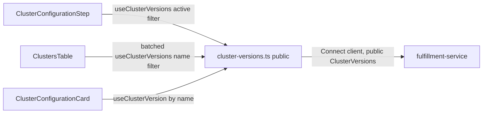

# ClusterVersion — UI Design

| Field       | Value                                 |
|-------------|---------------------------------------|
| Author(s)   | Elay Aharoni |
| Jira        | [OSAC-1269](https://issues.redhat.com/browse/OSAC-1269) |
| PRD         | [prd.md](./prd.md) |
| Date        | 2026-07-30 |

# 1. Overview

This design specifies the `osac-ui` implementation for `ClusterVersion` (OSAC-1269): a managed catalog of OpenShift versions that replaces raw `release_image` input across the cluster-creation wizard, catalog item field definitions, and cluster list/detail views. It covers two UI surfaces: (1) version selection in the cluster-creation wizard, replacing the free-text release-image field; (2) version and lifecycle-state display on cluster list and detail views via a client-side join against the `ClusterVersion` catalog. Per the PRD's FR-9 (revised in `enhancement-proposals` PR #191), `ClusterVersion` catalog management (create, delete, lifecycle transitions) is CLI/API-only in v0.2 — `osac-ui` has no admin surface for it. The backend API and data model — the fulfillment-service `ClusterVersions` service and `ClusterSpec.version_name` — are an already-finalized contract [Codebase: enhancement-proposals `design.md`]; this document addresses only how `osac-ui` consumes and surfaces them. See the [PRD](./prd.md) for the full product requirements.

# 2. Goals and Non-Goals

## 2.1 Goals

- Follow the existing hooks-layer conventions (`useApiFetch` + `useApiQuery` + `apiQueryKey`) established in `libs/ui-components/src/api/v1/networking.ts` and `instance-types.ts` for `ClusterVersion` API access. [Codebase: `docs/api-query-arch.md`]
- Reuse the existing client-side cross-resource join pattern (`useVmDetailsDisplay.ts`) for resolving and displaying a cluster's version and lifecycle state. [Codebase: `libs/ui-components/src/components/vm/DetailsPage/useVmDetailsDisplay.ts`]
- Batch-fetch `ClusterVersion` data for the cluster list table instead of issuing one fetch per row. [Codebase: `libs/ui-components/src/components/Cluster/ClustersTable.tsx`]

## 2.2 Non-Goals

- ACM `ClusterImageSet` auto-sync UI — versions remain admin-entered in v0.2. [PRD: §2.2 Non-Goals]
- A generic, backend-driven "field type" rendering system for catalog field definitions. Version selection remains a hardcoded wizard-step widget, consistent with how `instance_type` is implemented today — the `FieldDefinition` proto has no type discriminator to drive one. [Codebase: `catalogProvision/catalogFieldDefinition.ts`]
- CLI implementation — covered by the linked fulfillment-service design, not this document.
- **`ClusterVersion` catalog management UI** (create, delete, lifecycle state transitions, set-default) — per PRD FR-9 (revised in `enhancement-proposals` PR #191), this is CLI/API-only in v0.2; "the interaction model is expected to change when versions become system-populated (OSAC-1415)." `osac-ui` has no admin surface for `ClusterVersion` at all. [PRD: FR-9] [User]
- **UI for changing an existing cluster's version after creation.** `allowed_upgrades` and the associated version-change validation were removed from the backend data model entirely in PR #191 (not deferred — deleted). There is no version-change API surface for `osac-ui` to build against. Resolves the prior Open Question 8.1. [Codebase: `enhancement-proposals` `design.md`, PR #191] [User]

# 3. Motivation / Background

Today, `ClusterConfigurationStep.tsx` renders `spec.releaseImage` as a plain-text `InputField`, requiring the user to paste an exact OCI pullspec with no validation until the server rejects it during provisioning. `ClusterConfigurationCard.tsx` echoes the same raw string back on the cluster detail page. Neither surface resolves, validates, or contextualizes the value in any way.

`ClusterVersion` replaces this raw string with a managed reference (`version_name`) that the fulfillment-service already validates, resolves, and tracks through a lifecycle (active/deprecated/obsolete) [Codebase: `design.md`]. The UI's job is twofold: replace the wizard's free-text field with a version picker sourced from the catalog; and, everywhere a cluster's version is displayed, resolve `version_name` to its descriptive metadata and *current* lifecycle state, since the cluster object stores only a name reference and lifecycle state can change independently of the cluster (FR-6). Populating and maintaining the catalog itself is a Cloud Provider Admin task performed via CLI/API — per PRD FR-9, `osac-ui` has no admin surface for it in v0.2.

# 4. Design

## 4.1 Architecture

Both UI surfaces share a single new, read-only hook module:

- **`libs/ui-components/src/api/v1/cluster-versions.ts`** (public) — `useClusterVersions(params)`, `useClusterVersion(id)`. Used by both tenant-facing surfaces (wizard picker, cluster list/detail join). Backed by `@osac/types`' public `ClusterVersions` service, which never returns `spec.image` and hides disabled/obsolete entries from `List` unless explicitly filtered [Codebase: `design.md` "Public `ClusterVersions/List` hides disabled and obsolete..."].

There is no private hook module for this resource in `osac-ui`. Per PRD FR-9 (revised in PR #191), `ClusterVersion` catalog management is CLI/API-only — `osac-ui` never needs `Create`/`Update`/`Delete`/lifecycle mutations, and therefore never needs `spec.image` (private-only) or `@osac/types/private`'s `ClusterVersions` service at all. This is a simpler shape than the `ClusterCatalogItems` public/private split (`cluster-catalog-item.ts` vs. `private/cluster-catalog-item.ts`), which exists specifically because *that* resource has an admin-managed UI counterpart — `ClusterVersion` does not.



This diagram shows that no component talks to a Connect client directly — every UI surface routes through the one hook module, which reaches the fulfillment-service `ClusterVersions` service's public API. The reader's takeaway: adding a new consumer of version data never requires a new API integration, only a new hook call against the existing module.

**Wizard (tenant-facing).** `ClusterConfigurationStep.tsx` replaces the `spec.releaseImage` `InputField` with a `SelectField name="spec.versionName"`, fed by `useClusterVersions({ filter: CLUSTER_VERSION_ACTIVE_LIST_FILTER })` — mirroring `VmConfigurationStep.tsx`'s `instanceType` field exactly [Codebase: `wizard/adapters/computeInstance/VmConfigurationStep.tsx`]. `fields.ts` renames `CLUSTER_RELEASE_IMAGE_WIRE_PATH` (`'release_image'`) to `CLUSTER_VERSION_NAME_WIRE_PATH` (`'version_name'`) and the form field from `releaseImage` to `versionName`; `schemas.ts`, `payload.ts`, `applyCatalogDefaults.ts`, and `clusterAdapter.ts` rename their `releaseImage`/`spec.releaseImage` references accordingly. `getCatalogFieldOverlay('version_name', definitions, t('Version'))` still supplies label/editable/default overlay from the catalog item's field definitions, matching FR-10 and today's `release_image` overlay usage.

`CLUSTER_VERSION_ACTIVE_LIST_FILTER` must match both `ACTIVE` and `DEPRECATED` states (`this.spec.state in [1, 2]`, i.e. `CLUSTER_VERSION_STATE_ACTIVE`/`CLUSTER_VERSION_STATE_DEPRECATED`) plus `enabled == true` — **not** `ACTIVE` alone. FR-7/FR-15 require that "creating a cluster with a deprecated version succeeds" and that deprecated versions "remain available for new cluster creation," so they must appear as selectable dropdown options; only `OBSOLETE` (state `3`) and disabled entries are excluded. Options are built with a new `formatClusterVersionOptionLabel` helper (`libs/ui-components/src/components/vm/utils.ts`-style, co-located with the new `cluster-versions.ts` module or an analogous `components/Cluster/utils.ts`), appending a "(deprecated)" suffix for `DEPRECATED` entries. Per FR-7/FR-15, selecting a deprecated version does not block submission; the step renders an inline PatternFly `Alert` (`variant="warning"`) below the select when the chosen version's state is `DEPRECATED` (e.g., "Version 4.17.0 is deprecated and will be removed in a future release."). Server-side validation errors (version not found, obsolete, or unresolvable) surface through the wizard's existing submission-error handling — no new error-display mechanism is introduced.

**Cluster list (`ClustersTable.tsx`, tenant- and admin-visible).** The table's container computes the distinct `version_name` values referenced by the currently-rendered clusters and calls `useClusterVersions({ filter: buildClusterVersionNamesFilter(names) })` once — a targeted `metadata.name` lookup (`this.metadata.name in [...]`), not a lifecycle-wide listing [User]. This is deliberately not a lifecycle/enablement filter, which avoids the tautology problem of the rejected all-states alternative (see §5) — but it does **not** fully eliminate the underlying ambiguity: the public `List` RPC's rule ("hides disabled and obsolete by default unless explicitly filtered on lifecycle or availability fields") is about which *fields* the filter touches, and a `metadata.name` filter touches neither `spec.state` nor `spec.enabled`, so it's unconfirmed whether disabled/obsolete entries are still returned. To be correct regardless of how that resolves: after the `List` response arrives, compute which requested names are **missing** from it, and resolve them with `useQueries` from `@tanstack/react-query` — **not** by calling `useClusterVersion(name)` per missing name in a loop, which would call a variable number of hooks across renders and violate the Rules of Hooks. `useQueries` takes an array of query configs (one `Get`-by-name per missing name, built with the same `queryFn`/`queryKey` shape `useClusterVersion` uses internally) and itself is a single hook call whose *array argument* may vary in length across renders — this is exactly the case it exists for. This is a narrow, explicit exception to this codebase's "use `useApiQuery`, not `@tanstack/react-query` directly" convention: `useApiQuery` only wraps single, statically-shaped queries, and there is no batched equivalent today (this codebase's ESLint rule restricts `useQuery`/`useQueryClient` specifically by name and does not block `useQueries`). This fallback is bounded by how many referenced versions are actually hidden by the `List` default (expected to be rare — most rows resolve from the single `List` call), which is a fundamentally different cost profile from the rejected "per-row `Get` for every cluster" alternative in §5. It builds a `Map<string, ClusterVersion>` keyed by `metadata.name` from the combined `List` + fallback `Get` results. Each row looks up its `cluster.spec?.versionName` in the map — no per-row fetch for the common case. If no clusters are rendered, skip the fetch entirely (an empty name list has nothing to resolve). Two new columns: **Version** (the resolved `spec.version` string, e.g. "4.17.0", falling back to the raw `version_name` while the map is loading or if the entry can't be resolved even via the `Get` fallback — mirroring `ClusterConfigurationCard.tsx`'s existing catalog-item-name fallback) and **Lifecycle** (`ClusterVersionStateLabel`, blank if unresolved).

**Cluster detail (`ClusterConfigurationCard.tsx`).** The line that currently renders `displayValue(cluster.spec?.releaseImage)` is replaced with `useClusterVersion(cluster.spec?.versionName)`, rendering the version string plus `ClusterVersionStateLabel`, with a `Skeleton` while loading — the exact pattern already used in the same file for `cluster.spec?.catalogItem` via `useClusterCatalogItem`. A single `Get`-by-name call resolves regardless of the version's lifecycle state (FR-2's "a specific version can be viewed regardless of its state"), so no all-states filter is needed here, unlike the list table's batched `List` call.

There is no admin catalog management UI for `ClusterVersion` in `osac-ui` — per PRD FR-9 (revised in PR #191), catalog management (create, delete, lifecycle transitions, set-default) is CLI/API-only in v0.2. Everything about the admin list page, row actions (Edit/Deprecate/Obsolete/Reactivate/Set-as-default/Delete), and the create form that appeared in earlier drafts of this design has been removed — see §5 for why it isn't relocated elsewhere either.

**Lifecycle state label.** A new `ClusterVersionStateLabel` component, co-located under `libs/ui-components/src/components/Cluster/` alongside `ClusterStatusLabel.tsx`, maps `ClusterVersionState` to a PatternFly `Label`: `ACTIVE` → green, `DEPRECATED` → orange (per UX, not gold/amber), `OBSOLETE` → grey. [User]

## 4.2 Data Model / Schema Changes

No schema changes originate in `osac-ui` — `ClusterVersion` is defined and owned by the fulfillment-service. Two prerequisites outside this design's control block implementation:

1. `libs/types/src/index.ts` (public barrel) does not yet export the already-generated `cluster_version_type_pb`/`cluster_versions_service_pb` modules, though they exist on disk (landed 2026-07-15) and the private variant is already exported from `index-private.ts`. This is a hand-maintained barrel file requiring a two-line addition alongside the existing `cluster_type_pb`/`clusters_service_pb` exports. [Codebase: `libs/types/src/index.ts`]
2. `ClusterSpec.version_name` and `ClusterTemplateSpecDefaults.version_name` are specified in the fulfillment-service design but not yet present in the generated types on disk (`ClusterSpec` still has `release_image`). A `pnpm gen-types` re-run is required once the corresponding proto change merges in fulfillment-service `main`. [Codebase: `libs/types/buf.gen.yaml`]

## 4.3 API Changes

No new backend API — this section covers the new `osac-ui`-internal hook surface wrapping the already-specified `ClusterVersions` service [Codebase: enhancement-proposals `design.md`]. One new `ApiRoute` entry in `libs/ui-components/src/api/types.ts`: `'v1/cluster_versions'` (public only — no private route, per §4.1).

| Hook | Module | RPC | Notes |
|---|---|---|---|
| `useClusterVersions(params)` | public | `List` | `select: data.items`; used with `CLUSTER_VERSION_ACTIVE_LIST_FILTER` (wizard) or `buildClusterVersionNamesFilter(names)` (cluster table join — filters by the referenced clusters' `metadata.name` values, not by lifecycle state) |
| `useClusterVersion(id)` | public | `Get` | `select: data.object`; used by cluster detail join |

`osac-ui` has no mutation hooks for `ClusterVersion` — `Create`/`Update`/`Delete`/lifecycle-state transitions are CLI/API-only per PRD FR-9, so there's no `useCreateClusterVersion()`/`useUpdateClusterVersion()`/`useDeleteClusterVersion()`/`useSetClusterVersionLifecycleState()` in this design, and no `ClusterVersionsUpdateRequest`/`update_mask` concern for `osac-ui` to account for.

Example — wizard lists selectable versions:

```json
// Request (useClusterVersions, CLUSTER_VERSION_ACTIVE_LIST_FILTER)
{ "filter": "this.spec.state in [1, 2] && this.spec.enabled == true" }

// Response (spec.image absent — public schema)
{ "items": [ { "id": "uuid", "metadata": { "name": "4-17-0" }, "spec": { "version": "4.17.0", "enabled": true, "isDefault": true, "state": "ACTIVE" }, "status": {} } ] }
```

Example — cluster table join resolves exactly the versions referenced by the rendered clusters, regardless of their lifecycle state or enablement:

```json
// Request (useClusterVersions, buildClusterVersionNamesFilter(["4-17-0", "4-16-0"]))
{ "filter": "this.metadata.name in ['4-17-0', '4-16-0']" }
```

`buildClusterVersionNamesFilter()` filters by identity (`metadata.name`), not by lifecycle state or enablement — this was chosen over a broad "match every state and enabled value" filter (§5's rejected alternative, a tautology equivalent to no filter). It is **not**, on its own, guaranteed to bypass the public `List` RPC's default disabled/obsolete hiding — that rule keys off which fields the filter touches, and this filter touches neither `spec.state` nor `spec.enabled`. The design accounts for this explicitly rather than assuming it away: any requested name absent from the `List` response is resolved with a `Get` call via `useQueries` (see the Cluster list paragraph above, and the hook-safety note there), which is documented elsewhere in this design to resolve regardless of lifecycle state. **The exact `List` behavior for a name-only filter should still be confirmed against the real fulfillment-service during Story 2.01's implementation** — if it turns out disabled/obsolete entries already come back correctly, the `Get` fallback path will simply never trigger, so this design is correct either way.

All changes are additive to the API surface from the UI's perspective; the `Clusters`/`ClusterTemplates` field rename (`release_image` → `version_name`) is a breaking change already accounted for in the fulfillment-service design and covered by §7 below.

## 4.4 Scalability and Performance

Impact is minimal and bounded by existing patterns. The cluster list table's batched `ClusterVersion` fetch adds one additional `List` call per table render (cached 5s per the shared `QueryClient` defaults), independent of cluster count — this avoids the N+1 pattern a naive per-row implementation would introduce. The version catalog itself is expected to be small (tens of entries, not thousands), so client-side map construction and lookup are O(n) with negligible cost. No new polling behavior is introduced beyond the existing 30s background refetch interval already applied to all `useApiQuery` hooks.

## 4.5 Security Considerations

`osac-ui` only ever calls the public `ClusterVersions` API (`List`/`Get`) — it never imports `@osac/types/private` for this resource, since it has no admin surface that would need `spec.image` or write access. `spec.image` is therefore structurally unreachable from any `osac-ui` code path, with no code-review convention or lint rule needed to enforce it (unlike `ClusterCatalogItems`, where a public/private split genuinely exists because that resource does have an admin-facing UI counterpart). Write access to `ClusterVersion` (create/update/delete/lifecycle transitions) is CLI/API-only per PRD FR-9, enforced server-side via OPA — not a concern for this design at all.

## 4.6 Failure Handling and Recovery

| Scenario | UI behavior |
|---|---|
| Wizard: selected version becomes obsolete/deleted between load and submit | `CreateCluster` rejects with `InvalidArgument`; the wizard surfaces the server error via its existing submission-error handling and the user reselects a version. |
| Wizard: `ClusterVersions/List` call fails or is slow | `SelectField` shows its existing loading state (`isLoading`); on failure, the field shows no options and the wizard's existing field-level error display applies — no new error UI. |
| Cluster detail/list: referenced version was deleted (rare — delete is blocked while referenced, but can occur if reference cleanup and version deletion race, or for legacy pre-migration clusters per the PRD's Assumptions) | Falls back to displaying the raw `version_name` with no lifecycle label, mirroring the existing `ClusterConfigurationCard` fallback for an unresolved `catalogItem`. |

## 4.7 RBAC / Tenancy

`ClusterVersion` is a platform-global, non-tenant-scoped resource [Codebase: `design.md` RBAC/Tenancy — `"shared"` tenant]. All authenticated users can read it via the public API. Create/update/delete/lifecycle transitions are Cloud Provider Admin-only per PRD FR-9, enforced server-side via OPA — but that's a CLI/API concern, not an `osac-ui` one: there's no admin route or nav entry for `osac-ui` to gate.

## 4.8 Extensibility / Future-Proofing

The wizard's hardcoded-widget approach (no generic field-type registry) means a future field with similar "pick from a managed catalog" needs (e.g., a future `ComputeImage` catalog for VMaaS, noted as a PRD non-goal here) would follow the same recipe as `instanceType`/`versionName`: a dedicated hook, a dedicated `SelectField`, and an overlay call for label/editable/default — not a new abstraction. `allowed_upgrades` was removed from the backend data model entirely in PR #191, not deferred — if OSAC-1415 introduces a version-change or upgrade-graph capability later, that will need its own design, informed by whatever API shape ships at that time; nothing in this design should be read as a placeholder for it. Resolves the prior Open Question 8.1.

# 5. Alternatives Considered

**Generic field-type-driven form rendering** (a `field_definitions`-declared type enum that picks a widget automatically, rather than hardcoding `SelectField` for `version_name`). Rejected: the `FieldDefinition` proto has no type discriminator today, and introducing one would require a coordinated fulfillment-service proto change out of scope for this UI design; the hardcoded-widget approach is also what `instance_type` already does, so it introduces no new inconsistency.

**Per-row version fetch in `ClustersTable.tsx`** instead of a batched list + lookup map. Rejected: with N clusters, this issues N `Get` calls per table render; TanStack Query's cache would dedupe repeated calls for the same version across rows but still issues one request per distinct version referenced on first render, and doesn't scale as cleanly as a single `List` call scoped to exactly the referenced names. (This is distinct from the small, bounded `Get` fallback described in §4.1 for names the `List` call's filter doesn't surface — that fallback fires for at most the handful of hidden-by-default entries, not once per cluster.)

**A state/enabled-based "all states" filter** (e.g. `this.spec.state in [0,1,2,3] && this.spec.enabled in [true,false]`) for the cluster table's batched lookup, instead of filtering by the referenced clusters' `metadata.name` values. Rejected: this is a tautology — it's logically equivalent to no filter at all — and it depends on an unconfirmed assumption about whether the public `List` RPC's default disabled/obsolete hiding can be overridden by a filter that doesn't discriminate on those exact fields. A `metadata.name`-scoped filter sidesteps the question entirely: it's a targeted identity lookup, not a lifecycle listing, so there's no default-hiding behavior to reason about. [User]

**Extending `ResourceStatusLabel`'s `StatusKind` union with `'deprecated' | 'obsolete'`** instead of a standalone `ClusterVersionStateLabel`. Rejected in favor of a standalone component: `StatusKind`'s existing semantics (ready/failed/progressing/unspecified) describe runtime reconciliation state, and every other consumer of `ResourceStatusLabel` relies on that meaning; adding catalog-lifecycle semantics to the same union risks a consumer accidentally treating a "deprecated" `ClusterVersion` as some kind of resource-condition failure. A standalone component (following the same `Cluster/*StatusLabel.tsx` file-per-resource convention) keeps the two lifecycle semantics from bleeding into each other.

# 6. Observability and Monitoring

No new observability changes. Existing monitoring mechanisms (fulfillment-service gRPC metrics and structured logging) already cover the underlying API calls [Codebase: `design.md` Observability and Monitoring]; this design adds no client-side telemetry beyond what any other page in the app already emits (none, per current codebase conventions).

# 7. Impact and Compatibility

The wizard's field rename (`releaseImage` → `versionName`) and the removal of the free-text release-image input are backward-incompatible with any in-progress cluster-creation flow relying on the old field name, but this is coordinated with the fulfillment-service's `release_image` → `version_name` API change, which is itself a breaking change scheduled for the same v0.2 milestone [PRD: §"Version Skew Strategy" — "The fulfillment-service and osac-ui are affected... Both ship in the same coordinated v0.2 deployment, so no version skew concern"]. No existing production catalog items reference `release_image` (per the PRD's Assumptions), so no catalog item migration is required in the UI. The `libs/types` regeneration is a prerequisite, not a concurrent change — this design cannot compile until it lands.

# 8. Open Questions

No open questions remain. The two previously open in this section are both resolved by `enhancement-proposals` PR #191 (revised PRD/BE design):

- *Does this design need UI for changing an existing cluster's version?* — **No.** `allowed_upgrades` was removed from the backend data model entirely (not deferred), and PRD FR-9 explicitly scopes `osac-ui` to wizard selection + lifecycle display only. See §2.2 Non-Goals and §4.8.
- *Should a lint rule enforce the `spec.image` public/private boundary?* — **Moot.** `osac-ui` has no private `ClusterVersions` hook at all now (§4.1, §4.5), so there's no boundary to enforce.

---

## Provenance

Authored: draft @ design 0.4.1 - 96de078, workspace fix/proxy-any-wrapper-type-resolution @ afbc45d (2 behind origin/main)
Final: respond @ design 0.8.0 - a605aa5, workspace main @ 4d7ae6c

> Context changed between draft and respond.

<!-- ai-workflow-provenance:{"schema_version":1,"provenance_kind":"session","workflow":"design","workflow_version":"0.8.0","ai_workflows":"a605aa5","source_repo":"4d7ae6c","source_repo_branch":"main","commits_behind_main":0,"commits_ahead_main":0,"main_ref":"main","phases":["draft","respond","respond","respond","revise","respond"],"authoring_modes":["skill"],"context_changed":true,"origin_untracked":false} -->
