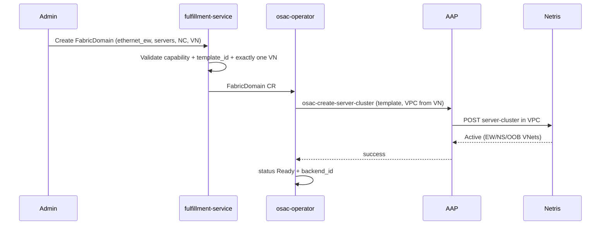

# Multi-Fabric East-West Networking

## Summary

This design introduces **FabricDomain** as a first-class OSAC resource for
**east-west fabric isolation**: a group of servers that share an isolation
boundary on a high-performance fabric type (Ethernet/Spectrum-X, later
InfiniBand, NVLink).

**VirtualNetwork remains the north-south / IP isolation boundary** (unchanged).
East-west is a different isolation plane. Hard multi-tenant AI networking
requires both:

| Plane | Role | OSAC object |
|-------|------|-------------|
| North-south / IP | Reachability, tenant IP isolation, ingress/egress | **VirtualNetwork** (+ Subnet) — existing |
| East-west / fabric | Who may talk server-to-server on the high-perf fabric (RoCE, IB, NVLink) | **FabricDomain** — new |

**Phase 1** delivers Ethernet east-west via **Netris Server Clusters**. Each
FabricDomain **requires exactly one VirtualNetwork** so the Server Cluster is
created in that VN's Netris VPC and nodes remain reachable on N-S. Backend
config (`template_id`, …) lives on **NetworkClass**. No new VPC resource is
introduced.

The AAP path for Server Cluster create/delete is already implemented
(osac-aap PR #447). VPC → Server Cluster in existing VPC → OSAC Subnet
coexistence and tenant isolation were validated on zeus12.

## Motivation

High-performance workloads need high-bandwidth, low-latency east-west
connectivity with hard multi-tenant isolation. OSAC already provides north-south
and general networking (unified networking / EP #50) via VirtualNetwork.
IP isolation alone does **not** isolate the GPU fabric: two tenants can have
separate VirtualNetworks and still share an open Spectrum-X, InfiniBand, or
NVLink domain if fabric membership is not programmed.

| Fabric | Isolation primitive | Typical manager |
|--------|---------------------|-----------------|
| Ethernet / Spectrum-X (RoCE) | VRF + L3VPN / V-Nets | Netris |
| InfiniBand | PKey + HCA GUID membership | UFM (often via Netris) |
| NVLink Multi-Node | NVLink logical partition | NMX-C or NICo |

Manual alignment of VRFs, PKeys, and NVLink partitions does not scale. The API
must stay **backend-agnostic** so Spectrum-X, IB, NVLink, and NICo plug in
without redesign.

### Why not only VirtualNetwork?

- VirtualNetwork isolates the **IP plane**.
- Fabric membership (EW L3VPN, PKey, NVLink partition) is a **separate plane**.
- NVIDIA NICo treats NVLink logical partitions as independent of exclusive VPC
  ownership: a default partition on a VPC is optional, and the same partition
  may be associated with multiple VPCs ("no exclusivity between VPCs").
  ([NICo NVLink Partitioning](https://docs.nvidia.com/infra-controller/infra-controller/documentation/operations-day-2/nv-link-partitioning))
- NVIDIA DGX SuperPOD separates Multi-Node NVLink, compute InfiniBand, storage,
  and management fabrics with **different node memberships** (e.g. storage nodes
  are not on NVLink).
  ([SuperPOD Network Fabrics](https://docs.nvidia.com/dgx-superpod/reference-architecture-scalable-infrastructure-gb200/latest/network-fabrics.html))

## Goals

- First-class **FabricDomain** for east-west isolation with its own lifecycle.
- Keep **VirtualNetwork** as the N-S / IP boundary; do not redefine it in this EP.
- Backend-specific configuration on **NetworkClass**, not on every domain object.
- Phase 1: Ethernet east-west via Netris Server Clusters; reuse existing AAP roles.
- Clear extension path to InfiniBand (UFM) and NVLink (NMX-C / NICo).
- Phase 1: required 1:1 association with VirtualNetwork (Netris VPC binding + N-S).

## Non-Goals

- Phase 1 InfiniBand or NVLink implementation (API shape reserved only).
- Introducing a new top-level **VPC** resource or demoting VirtualNetwork to a
  segment under VPC (separate hierarchy discussion if desired).
- Pool-based automatic server assignment (explicit server lists in Phase 1).
- Tenant-facing PKey or NVLink partition resources (backend/template concerns).
- Virtual-cluster / SR-IOV east-west (bare-metal Phase 1).
- Changing whether networking CRs are cluster-scoped vs namespaced (follow
  existing OSAC networking conventions; examples below are illustrative).

---

## Proposal

### Core model

```text
FabricDomain
  type: ethernet_ew | infiniband_ew | nvlink | …
  servers: [hostname, …]
  network_class: <ref>           # resolves backend + parameters
  virtual_networks: [vn]         # Phase 1: exactly one (required)
  status: phase, backend_id, message, …

NetworkClass
  capabilities:
    supports_east_west_ethernet: true/false
    supports_east_west_infiniband: true/false   # Phase 2
    supports_nvlink: true/false                 # Phase 3
  east_west_config:
    ethernet_ew: { template_id, … }
    infiniband_ew: { … }                        # Phase 2
    nvlink: { … }                               # Phase 3

VirtualNetwork   # existing — N-S / IP isolation boundary
  └── Subnet     # existing — IP segments
```

**Principles**

1. **N-S isolation** = VirtualNetwork (existing). Nodes are reachable because
   tenants already have (or get) a VirtualNetwork.
2. **E-W isolation** = FabricDomain (new). Who may communicate on the
   high-performance fabric.
3. FabricDomain does **not** replace VirtualNetwork. Phase 1 **requires** one
   VirtualNetwork association so:
   - the Netris Server Cluster is created in that VN's VPC;
   - N-S remains in place for reachability.
4. NetworkClass selects the implementation and holds backend-specific config.
5. Subnets remain the IP/address-plane API. They do not represent PKeys or
   NVLink partitions.
6. **No new VPC resource** in this design. Today's VirtualNetwork is the
   VPC-like object for Netris binding.

### API sketch (fulfillment-service)

```protobuf
message FabricDomainSpec {
  string type = 1;                       // ethernet_ew | infiniband_ew | nvlink
  repeated string servers = 2;           // hostnames
  string network_class = 3;              // required
  repeated string virtual_networks = 4;  // Phase 1: exactly one
}

message FabricDomainStatus {
  FabricDomainPhase phase = 1;
  string backend_id = 2;                 // e.g. Netris Server Cluster ID
  string message = 3;
}

message NetworkClassCapabilities {
  // existing: supports_ipv4, supports_ipv6, …
  bool supports_east_west_ethernet = 5;
  bool supports_east_west_infiniband = 6;
  bool supports_nvlink = 7;
}

message EastWestConfig {
  EthernetEastWestConfig ethernet_ew = 1;
  InfiniBandEastWestConfig infiniband_ew = 2;  // Phase 2
  NVLinkEastWestConfig nvlink = 3;             // Phase 3
}

message EthernetEastWestConfig {
  string template_id = 1;  // Netris Server Cluster Template ID (Phase 1)
}

message InfiniBandEastWestConfig {
  string mode = 1;         // "netris" | "direct_ufm"
  string pkey_policy = 2;  // "auto" | …
}

message NVLinkEastWestConfig {
  string backend = 1;      // "netris" | "nmx-c" | "nico"
  string endpoint = 2;     // optional for direct backends
}
```

**Validation (Phase 1)**

- `type` must match a capability on the referenced NetworkClass.
- `servers` non-empty.
- For `ethernet_ew`, NetworkClass must have `east_west_config.ethernet_ew.template_id`.
- `virtual_networks` length == 1; VN must exist and be same-tenant.
- Type `infiniband_ew` / `nvlink` rejected until Phase 2/3.

### Why Phase 1 requires VirtualNetwork (1:1)

This is a **product constraint**, not a Netris hard limit.

Netris can create a Server Cluster in an existing VPC **or** create a VPC as
part of Server Cluster create. We require an existing OSAC VirtualNetwork so:

1. **Validated path:** zeus12 used VPC first → Server Cluster in that VPC →
   OSAC Subnet.
2. **Single source of truth:** OSAC VN owns the VPC identity; we do not let
   Netris create an unmanaged VPC that OSAC must later adopt.
3. **N-S stay explicit:** EW is additive; reachability remains on VN/Subnet.

One Netris Server Cluster still lives in **one** Netris VPC. Multi-VN
association on FabricDomain (sharing) is deferred past Phase 1.

### Which NICs / HCAs / GPUs are used?

| Fabric | What FabricDomain lists | What selects interfaces |
|--------|-------------------------|-------------------------|
| Ethernet | Server **hostnames** | **Server Cluster Template** (from NetworkClass): `serverNics` per V-Net (EW, storage, NS, OOB) |
| InfiniBand | Server hostnames | Backend policy (typically HCAs on host / GUID policy) |
| NVLink | Server hostnames | GPUs on those servers; partition membership via NMX-C/NICo |

Phase 1 does **not** put NIC names on FabricDomain. The template owns Ethernet
NIC mapping. Creating a FabricDomain drives a Server Cluster whose template
typically programs **both** EW and NS (and OOB) V-Nets — FabricDomain expresses
the EW isolation **intent**; it does not mean "EW-only interfaces."

### GPU vs storage traffic separation

| Goal | How |
|------|-----|
| Separate GPU vs storage on **Ethernet** | **One** FabricDomain (`ethernet_ew`) + template with multiple V-Nets (EW-GPU L3VPN, storage V-Net). OSAC Subnets attach to IP-addressable segments. |
| Separate GPU vs storage on **InfiniBand** | Same domain + multi-PKey layout in NetworkClass/backend, **or** two `infiniband_ew` FabricDomains if independent lifecycle is required. PKeys are not OSAC Subnets. |
| GPU collectives vs storage with **NVLink** | **Different** FabricDomains: `nvlink` for GPU–GPU; `ethernet_ew` or `infiniband_ew` for storage. Storage does not run on NVLink. |

### Spectrum-X / RoCE example (N-S and E-W both Ethernet)

When north-south and east-west are both Ethernet (Spectrum-X / RoCE), they are
different **roles**, not different object models:

```yaml
# Infra-owned: how Ethernet EW is implemented
apiVersion: networking.osac.io/v1
kind: NetworkClass
metadata:
  name: spectrum-x-ai
spec:
  capabilities:
    supports_ipv4: true
    supports_east_west_ethernet: true
  east_west_config:
    ethernet_ew:
      template_id: "spectrum-x-gpu-template"
      # Template defines V-Nets + NIC map, e.g.:
      #   - East-West (L3VPN / RoCE) → eth1..eth8
      #   - North-South + storage    → eth9, eth10
      #   - OOB                      → eth11
---
# Tenant IP / north-south plane (VirtualNetwork ≈ VPC for Netris)
apiVersion: networking.osac.io/v1
kind: VirtualNetwork
metadata:
  name: tenant-a-vn
spec:
  network_class: spectrum-x-ai
---
# Optional explicit IP segments
apiVersion: networking.osac.io/v1
kind: Subnet
metadata:
  name: tenant-a-ns
spec:
  virtual_network: tenant-a-vn
  cidr: 10.10.0.0/24
---
# East-west isolation domain (RoCE / Spectrum-X GPU fabric)
apiVersion: networking.osac.io/v1
kind: FabricDomain
metadata:
  name: tenant-a-gpu-ew
spec:
  type: ethernet_ew
  network_class: spectrum-x-ai
  servers:
    - hgx-01
    - hgx-02
    - hgx-03
    - hgx-04
    - hgx-05
    - hgx-06
    - hgx-07
    - hgx-08
  virtual_networks:
    - tenant-a-vn   # Phase 1: bind Server Cluster into this VN's Netris VPC
```

**Mapping**

| OSAC | Netris / data plane |
|------|---------------------|
| VirtualNetwork | VPC |
| FabricDomain | Server Cluster in that VPC (template → EW L3VPN + NS/storage V-Nets) |
| Subnet | OSAC-managed IP segment alongside Server Cluster auto-VNets |

Servers get **N-S** via VirtualNetwork/Subnet + template NS V-Net, and **E-W**
via the same Server Cluster's EW V-Net. FabricDomain does not remove N-S.

### High-level walk-through: tenant isolation (N-S + E-W)

**Setup (Phase 1 / Netris Ethernet)**

1. Infra provides NetworkClass `spectrum-x-ai` with an EW-capable Server Cluster
   Template (EW L3VPN + NS/storage V-Nets + NIC map).
2. **Tenant A**
   - VirtualNetwork `tenant-a-vn` → Netris VPC-A (N-S / IP)
   - Subnet(s) under `tenant-a-vn` for node addressing
   - FabricDomain `tenant-a-gpu-ew` (servers hgx-00, hgx-01) → Server Cluster in VPC-A
3. **Tenant B**
   - VirtualNetwork `tenant-b-vn` → Netris VPC-B
   - FabricDomain `tenant-b-gpu-ew` (servers hgx-02, hgx-03) → Server Cluster in VPC-B

**Data plane (from template + VPC isolation)**

| Path | Same tenant (A↔A) | Cross tenant (A↔B) |
|------|-------------------|---------------------|
| North-south (IP / NS V-Net) | Allowed within VPC-A | Blocked (separate VPC/VRF) |
| East-west (RoCE / EW L3VPN) | Allowed within A's Server Cluster | Blocked (separate VPC + EW V-Net) |

**Validated on zeus12 (netris-lab, `ew_fabric_enable`)**

- Two Server Clusters in separate VPCs (hgx-00+01 vs hgx-02+03).
- Same-tenant: EW and NS ping succeeded.
- Cross-tenant: EW and NS 100% loss.
- OSAC Subnet coexisted with Server Cluster auto-VNets (distinct VXLAN IDs).

**What each object did**

- VirtualNetwork → tenant VPC (N-S isolation boundary).
- FabricDomain → Server Cluster in that VPC (EW isolation + template NS/EW NIC plumbing).
- Nodes remain reachable on N-S via VN/Subnet; GPU traffic is isolated on E-W per tenant.

### Multiple FabricDomains, few NetworkClasses

NetworkClass is a catalog entry ("how we implement EW on this backend").
FabricDomain is an instance ("these servers, this fabric type"). Many domains
may reference one NetworkClass. Multiple NetworkClasses only when backends or
templates differ (e.g. GPU vs storage template, Netris vs NICo).

### Who manages InfiniBand / NVLink?

| Deployment style | Ethernet | InfiniBand | NVLink |
|------------------|----------|------------|--------|
| **Netris-centric (typical Phase 1+)** | Netris | Netris → UFM | Netris → NMX or NICo |
| **Direct UFM** | (other) | OSAC → UFM | — |
| **NICo-centric** | (other / Netris) | — | OSAC → NICo → NMX-C |

Phase 1 OSAC talks to **Netris**. Direct UFM and NICo are additional NetworkClass
backends later.

### Phase 1 behavior (Ethernet / Netris)

1. Admin configures NetworkClass with `supports_east_west_ethernet` and
   `east_west_config.ethernet_ew.template_id`.
2. Tenant/admin has VirtualNetwork (N-S).
3. Admin creates FabricDomain (`type=ethernet_ew`, `servers`, `network_class`,
   `virtual_networks: [that VN]`).
4. Operator resolves template from NetworkClass; resolves VN → Netris VPC id.
5. Create Netris Server Cluster **in that VPC**.
6. Netris applies template (EW L3VPN, NS, OOB V-Nets, port mapping).
7. Status: Ready + `backend_id` = Server Cluster ID.

**Validated (zeus12, netris-lab, `ew_fabric_enable`):** VPC first → Server Cluster
in existing VPC → OSAC Subnet. Four VNets coexisted with distinct VXLAN IDs; no
conflicts. Same-tenant EW/NS traffic worked; cross-tenant blocked.

Resize = update `servers` → idempotent Server Cluster update.  
Delete FabricDomain → delete Server Cluster (VN/VPC unchanged unless empty and
OSAC-owned).

### NIC mapping (Phase 1 detail)

Server Cluster Template example (Netris, infra-owned):

```json
[
  {
    "postfix": "East-West",
    "type": "l3vpn",
    "serverNics": ["eth1", "eth2", "eth3", "eth4", "eth5", "eth6", "eth7", "eth8"]
  },
  {
    "postfix": "North-South-in-band-and-storage",
    "type": "l2vpn",
    "serverNics": ["eth9", "eth10"]
  },
  {
    "postfix": "OOB-Management",
    "type": "l2vpn",
    "serverNics": ["eth11"]
  }
]
```

FabricDomain does not repeat this. Changing NIC layout = change template on
NetworkClass, not the domain object.

---

## Workflow (Phase 1)



---

## Implementation notes

- **fulfillment-service:** FabricDomain CRUD + validation; NetworkClass
  `east_west_config` + capabilities.
- **osac-operator:** FabricDomain reconciler; map type → AAP job; resolve
  template from NC; VN → VPC id.
- **osac-aap:** Existing create/delete server_cluster tasks (PR #447);
  capability `supports_east_west_ethernet`.
- **Scoping:** Follow existing OSAC networking resource conventions
  (cluster/tenant scoped as established for VirtualNetwork); examples in this
  doc are illustrative.

## Phase 1 limitations

- VirtualNetwork association required (exactly one); zero or many deferred.
- No server eligibility validation (admin trusted on hostnames).
- NIC mapping only via Netris template.
- `template_id` is Netris-specific (scoped to NetworkClass).
- Templates pre-created by infra; OSAC does not manage template lifecycle.
- Bare-metal only; no SR-IOV/VM EW.
- IB/NVLink types reserved in API, not implemented.

## Test plan (Phase 1)

- Unit: validation rules; capability checks; template resolution; VN required.
- Integration: NC with east_west_config → FabricDomain CR → status.
- E2E (netris-lab): FabricDomain → Server Cluster in VN VPC → isolation →
  resize servers → delete.
- Coexistence: VPC → Server Cluster → OSAC Subnet (already validated on zeus12).

---

## Alternatives (considered and rejected for this design)

### 1. ServerCluster as child of VirtualNetwork

```text
VirtualNetwork
  └── ServerCluster (type, servers, …)
```

**Rejected as the primary model.**

- Treats non-IP fabric isolation (IB PKey, NVLink partition) as owned by an IP
  object.
- Sharing one server group across two VirtualNetworks requires two child objects
  on the same hosts → dual-writer / split-brain reconciliation risk.
- Non-uniform membership (e.g. 32 nodes on Ethernet EW, 16 on NVLink, storage
  Ethernet-only) is awkward under a single parent VN server list.
- NVIDIA NICo explicitly allows the same NVLink logical partition on multiple
  VPCs (no exclusivity).

Independent create/delete of a *child* relative to the parent VN is possible
(like Subnet), but that does not fix ownership, sharing, or non-IP semantics.

### 2. New top-level VPC parent of VirtualNetwork + ServerCluster

```text
VPC
  ├── VirtualNetwork
  ├── ServerCluster
  └── …
```

**Out of scope for this enhancement.**

- Introduces a new VPC resource and demotes today's VirtualNetwork (already the
  VPC-like object for Netris).
- Valid as a **separate** networking hierarchy redesign if the project wants
  AWS-style naming; it is not required to ship east-west isolation.
- Phase 1 FabricDomain already binds to VirtualNetwork for Netris VPC context.
  If a VPC parent is added later, FabricDomain can associate with it the same
  way it associates with VirtualNetwork.

### 3. fabric_bindings on VirtualNetwork or Subnet

**Rejected earlier.** Couples EW lifecycle to address-plane objects; weak
multi-fabric clarity; risks leaking `template_id` into every binding.

### 4. Do nothing

**Rejected by PRD.** Manual multi-fabric isolation does not scale.

---

## Naming

**FabricDomain** is used in this design. Alternatives such as
`IsolationDomain` are acceptable if the project prefers clearer "isolation"
wording. The architectural decision is first-class EW isolation + required VN
in Phase 1—not the final string name.

Avoid OSAC API name **ServerCluster** unless adopting alternative (1); that
name pulls Netris-specific and "child of VPC/VN" connotations.

---

## Open questions (narrow)

1. Final resource name: FabricDomain vs IsolationDomain.
2. Phase 2: when to allow zero or multiple VirtualNetwork associations.
3. Typed `EastWestConfig` messages vs generic `map<string,string>` parameters.
4. Status fields to echo for debug (resolved template_id, VPC id, VNet names).

---

## References

- PRD: OSAC-1382 (merged)
- osac-aap PR #447 (Server Cluster AAP roles)
- zeus12 validation: VPC → Server Cluster in VPC → OSAC Subnet; isolation tests
- [NICo NVLink Partitioning](https://docs.nvidia.com/infra-controller/infra-controller/documentation/operations-day-2/nv-link-partitioning)
- [DGX SuperPOD Network Fabrics (GB200)](https://docs.nvidia.com/dgx-superpod/reference-architecture-scalable-infrastructure-gb200/latest/network-fabrics.html)
- Netris Server Cluster + UFM/NMX integrations
