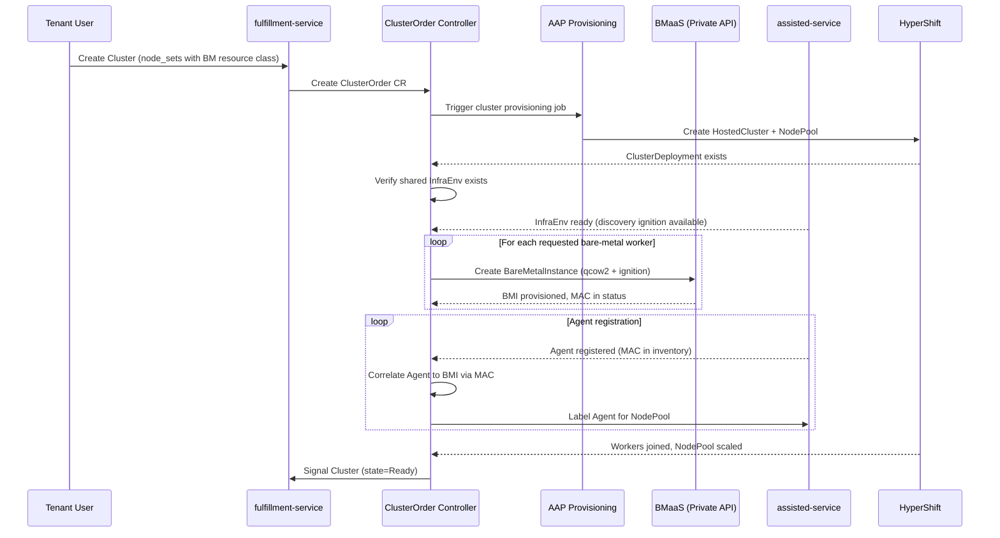
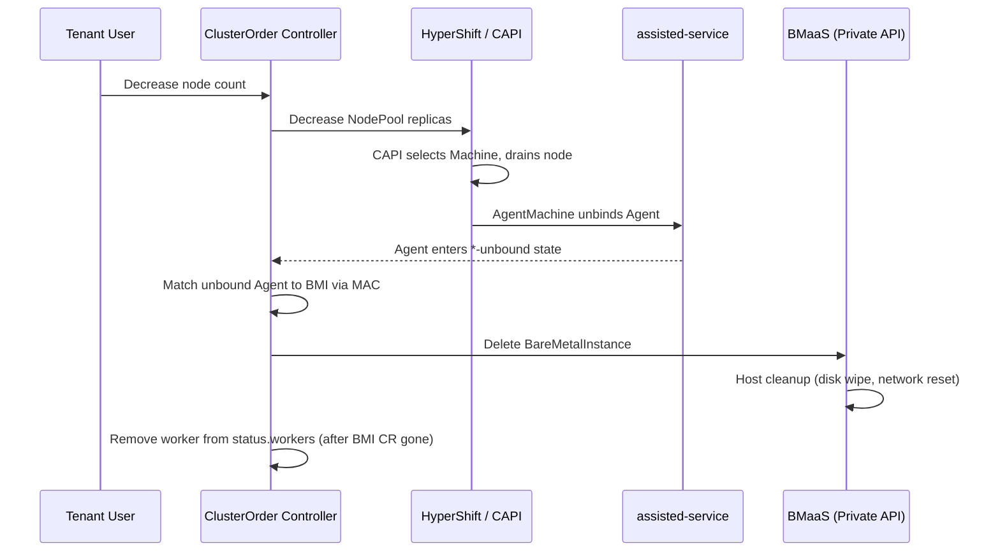

# CaaS Bare-Metal Worker Node Provisioning

## Summary

This design adds on-demand bare-metal worker node provisioning to CaaS by having the osac-operator ClusterOrder controller create BareMetalInstances via the fulfillment-service private gRPC API. Each instance references a pre-registered RHCOS DiskImage and carries discovery ignition inline from the shared platform-level InfraEnv, causing the host to register as an assisted-service Agent and join the HyperShift-managed cluster as a worker node. The existing BareMetalPool-based static pre-boot pool is removed. See [PRD](prd.md) for detailed requirements.

## Motivation

CaaS currently provisions bare-metal worker nodes through a static pre-boot pool: a cron job maintains hosts running the Assisted Installer ISO via BareMetalPool resources. This wastes capacity on idle hosts, is difficult to right-size, and couples cluster provisioning to a fragile pool management process. When the pool is exhausted, cluster scale-up fails silently until an administrator intervenes.

The new approach eliminates the pool by provisioning workers on-demand. When a ClusterOrder specifies bare-metal resource classes, the controller creates individual BareMetalInstances through the BMaaS private API, each configured with discovery ignition and a version-matched RHCOS DiskImage. This gives CaaS per-instance control over image and boot configuration while keeping all infrastructure details hidden from tenants. The PoC (OSAC-2817) validated this flow end-to-end: BMI provisioning took approximately 6 minutes, the agent registered successfully, and the worker joined the HyperShift cluster.

### Goals

- Reuse the existing ClusterOrder controller reconciliation pattern and the private gRPC API for BMI lifecycle management.
- Keep all CaaS-managed bare-metal infrastructure (BMIs, InfraEnvs, Agents) invisible to tenant-facing APIs and UIs.
- Support both initial provisioning and manual scale-up/scale-down through the same controller logic.
- Ensure host cleanup on scale-down and cluster deletion flows through BMaaS's existing deprovision pipeline (disk wipe, network reset).
- Remove the BareMetalPool-based static pre-boot pool workflow entirely — no coexistence period.
- Require no changes to the tenant-facing Cluster API or CLI experience.

### Non-Goals

- Autoscaling based on workload utilization (deferred to a future CaaS autoscaling feature).
- VM-based worker nodes (deferred to VMaaS integration).
- Static IP or NMStateConfig support for worker nodes (deferred; not validated by the PoC).
- Network boot acceleration or caching strategies `[Jira: OSAC-2134]`.

## Proposal

The ClusterOrder controller in osac-operator gains a new reconciliation phase for bare-metal worker management. When a ClusterOrder's `nodeRequests` reference bare-metal resource classes, the controller:

1. Ensures a shared `InfraEnv` CR exists on the hub cluster to generate discovery ignition (one per platform, not per cluster).
2. Fetches discovery ignition from the InfraEnv and creates `BareMetalInstance` objects with the ignition passed inline as `user_data`, referencing the RHCOS DiskImage.
3. Correlates registered Agents to BMIs via MAC address, binds them to the cluster's ClusterDeployment, and labels them for NodePool selection.

No new CRDs are introduced. The design extends the ClusterOrder CRD status with a `workers` field to track CaaS-managed worker resources. BareMetalInstances created by CaaS are assigned to the builtin `system` tenant, making them invisible to tenant APIs via the existing tenancy logic.

**Dependencies (unresolved — block implementation):**

| Dependency | Jira | Impact if not delivered |
|-----------|------|----------------------|
| MAC address in BareMetalInstance status | [OSAC-2308](https://redhat.atlassian.net/browse/OSAC-2308), [OSAC-3254](https://redhat.atlassian.net/browse/OSAC-3254) | Agent-to-BMI correlation impossible; entire feature blocked |
| DiskImage resource + BMI DiskImage integration | [OSAC-2540](https://redhat.atlassian.net/browse/OSAC-2540), [OSAC-1270](https://redhat.atlassian.net/browse/OSAC-1270) | Controller cannot resolve RHCOS boot image; BMI creation blocked |
| BMaaS networking for subnet attachment | [OSAC-1437](https://redhat.atlassian.net/browse/OSAC-1437) | BMI creation requires `network_attachments`; without BMaaS subnet support, workers cannot be moved to the tenant subnet and will not receive DHCP-assigned IPs on the correct network |

The existing BareMetalPool-based static pre-boot pool is removed as part of this work. The `cluster_infra` AAP step that creates BareMetalPool CRs and the scheduled `osac-import-agents` AAP job that discovers and imports hosts are no longer used by CaaS. Any remaining BareMetalPool resources are drained and cleaned up during rollout. The BareMetalPool CRD itself is retained (it serves BMaaS standalone use cases) but CaaS no longer creates or references BareMetalPool resources.

### Workflow Description

**Actors:** Cloud Infrastructure Admin (registers RHCOS DiskImages per OCP version), Tenant User (creates/scales clusters), osac-operator controller (orchestrates), fulfillment-service (BMI lifecycle), assisted-service (agent discovery), HyperShift (cluster management).

#### Provisioning Flow

Starting state: a Tenant User creates a Cluster with `node_sets` referencing a bare-metal resource class (e.g., `bare-metal-standard`). The fulfillment-service Cluster controller creates a ClusterOrder CR on the hub cluster.



The diagram shows the end-to-end provisioning flow. The controller waits for each phase to complete before proceeding: AAP provisions the HostedCluster, the InfraEnv generates ignition, BMIs provision hosts, and agents register and join the cluster. The controller updates ClusterOrder status conditions at each phase transition.

**Step-by-step:**

1. The ClusterOrder controller detects `nodeRequests` with bare-metal resource classes by checking the resource class against BareMetalInstanceType definitions.
2. After AAP creates the HostedCluster and the ClusterDeployment CR exists, the controller ensures the shared platform-level `InfraEnv` CR exists (see InfraEnv Creation). The InfraEnv has no `clusterRef` — agents register as unbound and the controller explicitly binds them to the correct cluster in step 8.
3. The controller reads the InfraEnv's `status.bootArtifacts.discoveryIgnitionURL` and fetches the discovery ignition content. The ignition is architecture-neutral (the `assisted-installer-agent` image is a multi-arch manifest), so the same InfraEnv serves hosts of any architecture.
4. For each bare-metal worker requested, the controller calls `BareMetalInstances.Create` on the private API with: `spec.catalog_item` resolved from the resource class, `spec.image` set to the resolved RHCOS DiskImage ID (see RHCOS DiskImage Resolution), `spec.user_data` set to the fetched ignition content inline (the `user_data` field accepts raw first-boot data up to 64KB; the PoC measured 15KB), `spec.network_attachments` built from the Cluster's `ClusterNetworkAttachment` (subnet + security groups) and the node set's HostType (fabric interface), and `metadata.tenant = "system"` (see System Tenant Isolation). The network attachment mapping is a pass-through: the controller reads the Cluster's `ClusterNetworkAttachment` for the subnet and security group references, resolves the fabric interface name from the node set's HostType definition (first interface with role `fabric`), and constructs a `BareMetalNetworkAttachment` with `primary: true`. BMaaS handles the physical networking — moving the host to the tenant subnet VLAN and assigning an IP via fabric DHCP — as part of BMI provisioning (dependency: OSAC-1437). If the host fails to join the tenant network, the agent will not register on the expected subnet, and the existing `AgentRegistrationTimeout` handles this failure mode. API and ingress VIPs are provisioned by the existing AAP template (MetalLB LoadBalancer Services) and are not managed by this controller.
5. The controller updates ClusterOrder status with the BMI references in `workers[]`.
6. BMaaS allocates a host, writes the qcow2 to disk via Ironic, and boots with the discovery ignition. The host registers as an Agent with assisted-service.
7. The controller watches Agent CRs in the cluster namespace. When a new Agent appears, the controller matches its inventory MAC address against BMI status MAC addresses (`status.host.mac_address`, dependency OSAC-2308/OSAC-3254).
8. Once correlated, the controller sets the Agent's `clusterDeploymentName` to the cluster's ClusterDeployment and applies the `agentBareMetal` role label so the NodePool's `agentLabelSelector` selects it. This requires the osac-operator to modify `agent-install.openshift.io/v1beta1` Agent resources — a cross-API-group coupling. This is unavoidable: the assisted-service Agent API does not provide an auto-bind mechanism for late-binding agents, so an external controller must set `clusterDeploymentName` and apply labels. The osac-operator's RBAC must include `patch` on `agents` in the `agent-install.openshift.io` API group.
9. HyperShift installs the Agent as a worker node. The controller monitors NodePool `.status.replicas` to confirm convergence.

#### Scale-Up

A Tenant User increases `node_sets[].size` for a bare-metal node set. The fulfillment-service updates the Cluster object, the Cluster controller updates the ClusterOrder's `nodeRequests`, and the controller detects the delta between desired and current worker count.

**Step-by-step:**

1. The controller computes `desired - current` where `current` is `status.currentWorkers` (workers in active phases: `Provisioning`, `WaitingForAgent`, `Binding`, `Ready`). Workers in `Failed` phase do not count toward capacity — new workers are created to fill the gap once their retry backoff expires.
2. The controller re-reads the shared InfraEnv's `status.bootArtifacts.discoveryIgnitionURL` to fetch fresh ignition.
3. The controller resolves the RHCOS DiskImage from the NodePool's current release image (not the ClusterOrder's original). This ensures workers added after a cluster upgrade use a compatible boot image.
4. For each new worker, the controller follows provisioning steps 4-9 from the initial flow (the ignition content is re-fetched in step 2 above).
5. Partial success is reported: if 3 of 5 new workers succeed and 2 fail, the ClusterOrder status shows 3 additional `Ready` workers and 2 `Failed`. The tenant sees the cluster with the successfully added workers; the failed slots are visible via ClusterOrder conditions and events.

#### Scale-Down



This diagram shows the scale-down flow. CAPI handles node drain and agent unbinding automatically. The controller reacts to the agent reaching an unbound state and then cleans up the BMI.

**Step-by-step:**

1. The controller computes the excess worker count (current minus desired).
2. The controller removes `Failed` workers first — deletes their dead BMIs and removes their `status.workers` entries. If more removals are needed after clearing all failed slots, the controller decreases NodePool `.spec.replicas` by the remaining excess.
3. CAPI's MachineDeployment controller (used by HyperShift's default Replace upgrade type) manages MachineSets, which select Machines for deletion. CaaS does not control the selection order.
4. CAPI drains each selected node, then the AgentMachine controller unbinds the Agent (clears `ClusterDeploymentName`, removes labels and ignition refs).
5. Because BMH resources exist, the Agent enters `UnbindingPendingUserAction`. The BMH agent controller triggers Ironic deprovision (clears `bmh.Spec.Image`, removes the `detached` annotation).
6. The controller watches for Agents transitioning to any `*-unbound` terminal state (`discovering-unbound`, `known-unbound`, `disconnected-unbound`, `insufficient-unbound`, `disabled-unbound`).
7. The controller matches the unbound Agent back to a BMI via MAC address.
8. The controller calls `BareMetalInstances.Delete` on the private API. BMaaS handles full host cleanup (disk wipe, network reset) before returning the host to inventory. CaaS does not independently verify cleanup completion — this is a trust boundary between CaaS and BMaaS. If BMaaS cleanup fails, the host must not be reallocated; this guarantee is BMaaS's responsibility.
9. The controller retains the worker entry in `status.workers` until the BMI CR no longer exists on the hub cluster (confirming terminal deletion). This prevents orphaned hosts — if `Delete` succeeds but cleanup stalls, the controller still has the reference to retry or alert.

#### Cluster Deletion

On ClusterOrder deletion, the controller runs the scale-down flow for all remaining workers (steps 2-9) before allowing the AAP deprovision job to destroy the HostedCluster. The shared InfraEnv is not deleted — it is a platform-level resource that persists across cluster lifecycles. The ClusterOrder's finalizer prevents premature deletion, ensuring all BMIs are cleaned up before the ClusterOrder is removed.

### API Extensions

**Modified CRDs:**

- `ClusterOrder` (osac-operator): new `workers` status field for tracking CaaS-managed worker resources. No spec changes — `nodeRequests[].resourceClass` already carries the information needed to identify bare-metal node sets.

**Existing CRs used (not new CRD definitions):**

- `InfraEnv` (agent-install.openshift.io/v1beta1): a shared platform-level InfraEnv in the `hardware-inventory` namespace. The controller verifies it exists but does not create or own it — it is a deployment prerequisite managed by the Cloud Provider Admin (the same InfraEnv already used by the existing agent import flow).

**Modified behavior of existing resources:**

- `BareMetalInstance` (fulfillment-service): CaaS-created BMIs are assigned to the builtin `system` tenant. No changes to the public API are required — the existing tenancy logic (`DetermineVisibleTenants`) already excludes the `system` tenant from regular user queries, making CaaS BMIs invisible to tenants automatically.

**Tenant-visible status:** The PRD requires tenant-visible failure conditions. ClusterOrder conditions (`WorkersFailed`, `InfraEnvReady`, `RHCOSImageNotFound`) live on the hub cluster, which tenants cannot access. The existing feedback controller syncs ClusterOrder status to the public Cluster API via the `Signal` RPC. This design extends the feedback controller to translate worker conditions into the tenant-visible Cluster status:

- `WorkersFailed=True` on ClusterOrder → `WORKER_PROVISIONING_FAILED` condition on the public Cluster, with a tenant-safe message (e.g., "2 of 5 worker nodes failed to provision") that omits infrastructure details (no BMI names, MACs, or Ironic errors)
- Workers in `Failed` with high attempt count → Cluster condition message includes the attempt count and next retry time, so tenants know retries are ongoing
- All other conditions (`InfraEnvReady=False`, `RHCOSImageNotFound`) → mapped to a generic `WORKER_PROVISIONING_BLOCKED` condition on the Cluster, indicating the cluster cannot provision workers due to an infrastructure issue requiring Cloud Infrastructure Admin intervention

This ensures tenants see provisioning progress and actionable failure messages without exposure to CaaS internals. The condition names and feedback controller extension must align with OSAC-1604 (status reporting improvements) to avoid overlap — this design defines CaaS-specific worker conditions, while OSAC-1604 defines the general status reporting framework.

**Operational impact:** If the osac-operator is down, no new bare-metal workers are provisioned and scale-up/scale-down operations stall. Existing workers continue running — HyperShift manages the cluster independently. On restart, the controller reconciles current state and resumes any pending operations.

## UX Alignment

This section does not apply. No UI changes are required — CaaS-managed BMIs are hidden from tenant-facing views.

### Implementation Details/Notes/Constraints

#### ClusterOrder CRD Status Extensions

```go
type ClusterOrderStatus struct {
    // ... existing fields ...

    // Aggregate worker counts (aligned with the CAPI MachineDeployment convention).
    // +kubebuilder:validation:Optional
    DesiredWorkers *int32 `json:"desiredWorkers,omitempty"`
    // +kubebuilder:validation:Optional
    CurrentWorkers *int32 `json:"currentWorkers,omitempty"`
    // +kubebuilder:validation:Optional
    ReadyWorkers *int32 `json:"readyWorkers,omitempty"`

    // Per-worker lifecycle state.
    // +kubebuilder:validation:Optional
    Workers []WorkerStatus `json:"workers,omitempty"`
}

type WorkerStatus struct {
    // Name of the worker slot (e.g., "bm-cluster-a-worker-0").
    Name string `json:"name"`
    // Kind of the backing resource (BareMetalInstance or ComputeInstance).
    Kind string `json:"kind"`
    // ResourceID is the fulfillment-service resource ID.
    ResourceID string `json:"resourceID,omitempty"`
    // Phase of the worker lifecycle.
    // +kubebuilder:validation:Enum=Provisioning;WaitingForAgent;Binding;Ready;Failed;Unbinding;Deleting
    Phase string `json:"phase"`
    // AttemptCount tracks how many times this worker slot has been provisioned.
    // Resets to 0 when a replacement stays Ready beyond MinHealthyDuration.
    AttemptCount int32 `json:"attemptCount"`
    // LastFailureReason is a machine-readable reason for the last failure (e.g., AgentRegistrationTimeout).
    // +kubebuilder:validation:Optional
    LastFailureReason string `json:"lastFailureReason,omitempty"`
    // LastFailureMessage is a human-readable description of the last failure.
    // +kubebuilder:validation:Optional
    LastFailureMessage string `json:"lastFailureMessage,omitempty"`
    // LastFailureTime is when the last failure occurred.
    // +kubebuilder:validation:Optional
    LastFailureTime *metav1.Time `json:"lastFailureTime,omitempty"`
    // NextRetryTime is when the controller will attempt the next retry.
    // +kubebuilder:validation:Optional
    NextRetryTime *metav1.Time `json:"nextRetryTime,omitempty"`
}
```

**Aggregate counts** align with the CAPI MachineDeployment convention: `desiredWorkers` (from `nodeRequests`), `currentWorkers` (non-terminal: Provisioning + WaitingForAgent + Binding + Ready), `readyWorkers` (Ready phase only). This gives tenants, operators, and metering systems a single-glance view of cluster health without inspecting individual workers.

**Per-worker state** is persisted in `workers[]`, not tracked in-memory. Each `WorkerStatus` entry carries the lifecycle phase, retry state, and failure details. The controller updates these fields on each reconciliation cycle. On restart, the controller rebuilds phases from live BMI and Agent state but preserves `attemptCount` and failure history from the persisted status — no dependency on Kubernetes events for retry tracking.

Example: a 5-worker cluster where 3 workers are ready and 2 are retrying:

```yaml
status:
  phase: Progressing
  desiredWorkers: 5
  currentWorkers: 3
  readyWorkers: 3
  conditions:
    - type: WorkersFailed
      status: "True"
      reason: ProvisioningFailed
      message: "2 of 5 bare-metal workers failed provisioning, retrying"
    - type: InfraEnvReady
      status: "True"
  workers:
    - name: bm-cluster-a-worker-0
      kind: BareMetalInstance
      resourceID: "uuid-0"
      phase: Ready
      attemptCount: 1
    - name: bm-cluster-a-worker-1
      kind: BareMetalInstance
      resourceID: "uuid-1"
      phase: Ready
      attemptCount: 1
    - name: bm-cluster-a-worker-2
      kind: BareMetalInstance
      resourceID: "uuid-2"
      phase: Failed
      attemptCount: 2
      lastFailureReason: AgentRegistrationTimeout
      lastFailureMessage: "Agent did not register within 30m"
      lastFailureTime: "2026-08-10T14:30:00Z"
      nextRetryTime: "2026-08-10T15:00:00Z"
    - name: bm-cluster-a-worker-3
      kind: BareMetalInstance
      resourceID: "uuid-3"
      phase: Ready
      attemptCount: 1
    - name: bm-cluster-a-worker-4
      kind: BareMetalInstance
      resourceID: "uuid-4"
      phase: Failed
      attemptCount: 3
      lastFailureReason: BMIProvisioningFailed
      lastFailureMessage: "Host allocation failed: no available hosts"
      lastFailureTime: "2026-08-10T14:25:00Z"
      nextRetryTime: "2026-08-10T14:55:00Z"
```

The `workers[]` list always contains all worker references regardless of their individual state. The `WorkersFailed` condition provides the aggregate summary. The ClusterOrder remains in `Progressing` phase (not `Failed`) because 3 workers are operational. Per-worker detail (which slot failed, why, when the next retry is) is visible directly in the status.

The controller tracks worker lifecycle through phases: `Provisioning` → `WaitingForAgent` → `Binding` → `Ready` (and `Unbinding` → `Deleting` for scale-down). `Failed` is reachable only from provisioning phases (`Provisioning`, `WaitingForAgent`, `Binding`) and triggers automatic retry. Teardown issues (e.g., agent unbinding timeout, BMI deletion failure) keep the worker in `Unbinding` or `Deleting` with error details in `lastFailureReason` — they do not transition to `Failed` and do not trigger replacement, since the intent is removal, not reprovisioning.

**Retry behavior:** The API is declarative — the controller retries indefinitely until the desired state is reached. There is no `PermanentlyFailed` state. When a worker enters `Failed`, the controller deletes the failed BMI and creates a replacement with escalating backoff:

| Failure type | Examples | Backoff | Rationale |
|---|---|---|---|
| Transient infrastructure | BMaaS API timeout, Ironic temporary error, host allocation contention | Short exponential: 30s, 60s, 120s, capped at 5m | Likely to resolve quickly; fresh host allocation may succeed immediately |
| Resource availability | No hosts available for the requested BareMetalInstanceType | Long exponential: 5m, 15m, 30m, capped at 30m | Inventory needs time to free up; aggressive retry wastes API calls |
| Agent registration timeout | Host booted but agent did not register within 30m | Long exponential: 5m, 15m, 30m, capped at 30m | Root cause (bad image URL, broken InfraEnv, network) is unlikely to self-resolve; gives operator time to investigate before next attempt burns another host |

The `attemptCount` is persisted in `WorkerStatus` and survives controller restarts. After the initial escalation period (first 3 attempts), the backoff caps at the maximum for that failure type and the controller continues retrying at that interval. If a replacement succeeds and stays `Ready` for 1 hour (`MinHealthyDuration`), the `attemptCount` resets to 0 — distinguishing a resolved transient issue from a recurring problem.

The `WorkersFailed` condition reports which slots are retrying (with attempt number and next retry time), so operators are alerted and can investigate. For persistent misconfigurations (wrong DiskImage, broken network), the capped backoff ensures the controller does not burn hosts aggressively while still converging once the root cause is fixed.

**Scale-down priority:** When the tenant scales down, the controller removes `Failed` workers first — they have no running node, no bound agent, and only a dead BMI to clean up. Healthy workers are only removed after all failed slots are cleared.

This satisfies the PRD requirement: "CaaS automatically handles provisioning retries and release of failed bare-metal resources, so that transient BMaaS failures do not leave orphaned infrastructure."

#### InfraEnv Creation

The controller ensures a single shared InfraEnv exists at the platform level, rather than creating one per cluster. The InfraEnv spec:

```yaml
apiVersion: agent-install.openshift.io/v1beta1
kind: InfraEnv
metadata:
  name: infraenv
  namespace: hardware-inventory
spec:
  pullSecretRef:
    name: pull-secret
```

The InfraEnv has no `clusterRef` and no `sshAuthorizedKey` — it generates unbound discovery ignition that is not scoped to any cluster. Agent-to-cluster binding happens explicitly in the correlation phase (step 9), where the controller sets `clusterDeploymentName` on each Agent after MAC-based matching.

**Why a shared InfraEnv:** The discovery ignition is architecture-neutral (`assisted-installer-agent` is a multi-arch manifest) and does not vary by cluster or tenant. The `cpuArchitecture` field on InfraEnv only affects ISO/kernel/rootfs URLs in `status.bootArtifacts`, not the ignition content — and this design uses the ignition-only flow, not ISO download. The InfraEnv's pull secret is a platform-level credential (Cloud Provider Admin's registry credentials for pulling the discovery agent image), separate from the per-cluster pull secret used for OCP release images. The existing OSAC deployment already uses a single `infraenv` in the `hardware-inventory` namespace with a platform-level `pull-secret`.

Agent-to-cluster isolation is enforced by the MAC correlation algorithm (see MAC Address Correlation), which scopes matching to the ClusterOrder's owned BMIs. Cross-tenant agent misassignment is not possible because each BMI carries the `osac.openshift.io/cluster-order` ownership label, and the controller only binds Agents whose MAC matches a BMI owned by the current ClusterOrder.

#### RHCOS DiskImage Resolution

The controller resolves the RHCOS boot image via a pre-registered DiskImage resource (dependency: OSAC-2540 DiskImage, OSAC-1270 BMI DiskImage integration). The Cloud Infrastructure Admin registers RHCOS qcow2 images as provider-global DiskImages with guest OS family (`linux`) and architecture (`amd64`), and applies a CaaS-specific label `osac.openshift.io/ocp-version: "4.22"` to enable version-based lookup. This label is a CaaS convention — the DiskImage resource itself (OSAC-2540) has no OCP version field, since version-based lookup is a CaaS-specific need. If richer metadata is needed (e.g., multiple image variants per version, automated registration), a dedicated `ClusterDiskImage` resource could wrap DiskImage with CaaS-specific fields. Labeling is sufficient for this design.

The controller reads `NodePool.spec.release.image`, extracts the OCP major.minor version (e.g., `4.22` from `ocp-release:4.22.5-x86_64`), and resolves the worker architecture from the node set's `BareMetalInstanceType` (which defines the HostType and its CPU architecture). It then queries for provider-global DiskImages matching both the `osac.openshift.io/ocp-version` label and the resolved architecture. This design targets `amd64` only; other architectures require Cloud Infrastructure Admin to register the corresponding RHCOS DiskImages.

Using the NodePool's current release image rather than the ClusterOrder's original ensures scale-up works correctly after cluster upgrades. A cluster created at OCP 4.18 and later upgraded to 4.22 would use a 4.22 boot image for new workers. Using the original 4.18 image could cause agent compatibility issues — the assisted-installer agent in an older RHCOS may not be compatible with a newer cluster's API or ignition format.

The boot image is ephemeral — it exists only to run the discovery agent. The assisted-installer writes the correct RHCOS version (pinned to the release image) to disk during installation. Any Z stream within the same minor version is acceptable for the boot image.

If no matching DiskImage is found for the target OCP version, the controller sets the ClusterOrder condition `RHCOSImageNotFound` and does not proceed with BMI creation. If multiple DiskImages match the same version and architecture, the controller sets `RHCOSImageAmbiguous` and does not proceed — the Cloud Infrastructure Admin must ensure exactly one DiskImage exists per OCP version + architecture combination.

If the underlying OCI artifact referenced by the DiskImage is unreachable or the image download fails at Ironic, the BMI enters `Failed` phase. The failure is reported via ClusterOrder conditions.

#### BMI Creation via Private API

For each worker, the controller calls `BareMetalInstances.Create` on the private API. The existing `BareMetalInstanceSpec` proto already has the required fields. The `source_type` value `"disk_image"` on `BareMetalInstanceImage` is introduced by the DiskImage integration (OSAC-1270) — this design consumes it but does not own the proto change:

```protobuf
// Existing fields in osac.private.v1.BareMetalInstanceSpec used by CaaS
// (field numbers omitted for clarity — see baremetal_instance_type.proto for canonical numbering):
message BareMetalInstanceSpec {
  string catalog_item = ...;                                // resolved from nodeRequest.resourceClass → BareMetalInstanceCatalogItem
  optional BareMetalInstanceImage image = ...;              // RHCOS DiskImage reference (see DiskImage Resolution)
  optional string user_data = ...;                          // inline discovery ignition content (max 64KB)
  repeated BareMetalNetworkAttachment network_attachments = ...;
  // ... other existing fields (ssh_public_key, run_strategy, template_parameters, etc.) omitted
}

message BareMetalInstanceImage {
  string source_type = ...;  // existing value "registry"; "disk_image" added by OSAC-1270
  string source_ref = ...;   // DiskImage ID resolved for target OCP version + architecture
}
```

The controller sets the following metadata fields on the created BMI:

- `name`: `"<cluster-order-name>-worker-<index>"`
- `labels["osac.openshift.io/cluster-order"]`: `"<order-id>"` — links BMI to parent ClusterOrder
- `annotations["osac.openshift.io/owner-reference"]`: `"ClusterOrder/<order-id>"`

**Idempotency on lost responses:** If `BareMetalInstances.Create` succeeds but the response or status update is lost, the controller must not create a duplicate BMI on the next reconciliation. Before calling `Create` for a worker slot, the controller lists BMIs in the `system` tenant filtered by `osac.openshift.io/cluster-order` label and checks for an existing BMI matching the expected worker name. If found, it skips creation and adds the existing BMI to `status.workers`. This relies on the private API's read-after-write consistency (PostgreSQL, no caching layer). Alternatively, a unique constraint on `(name, tenant)` in the fulfillment-service would allow the controller to handle `AlreadyExists` responses directly — this would be a stronger guarantee but requires a fulfillment-service schema change outside the scope of this design.

#### System Tenant Isolation

CaaS-managed BMIs are created under the builtin `system` tenant (`metadata.tenant = "system"`) rather than the cluster's tenant. The `system` tenant is a fulfillment-service builtin (migration 48) that is excluded from `DetermineVisibleTenants` — objects under it are invisible to all regular users without any additional filtering logic. This provides automatic tenant isolation: CaaS-managed BMIs never appear in tenant API responses (List, Get, Update, Delete) because the tenancy layer excludes them before any server-level filtering runs.

This is semantically correct: CaaS-managed BMIs are platform infrastructure, not tenant resources. The tenant ordered a cluster with N workers — they did not order N individual BareMetalInstances. Ownership is traceable via the `osac.openshift.io/owner-reference` annotation, which links each BMI to its parent ClusterOrder (which belongs to the real tenant).

**No changes to the public API** are required — no label-based filter injection in List, no NotFound interception in Get/Update/Delete, no reserved-label validation in Create/Update. The existing tenancy logic handles everything.

**Metering:** CaaS resource attribution is at the Cluster level (which belongs to the real tenant), not at the BMI level. Worker count is derived from the ClusterOrder status, not from querying BMIs by tenant.

**Cloud Provider Admin access:** Admins debug CaaS-managed workers via the private API (which has unrestricted tenant access) or by querying the `system` tenant explicitly. Per-cluster lookups use the `osac.openshift.io/cluster-order` label.

#### MAC Address Correlation

Agent-to-BMI matching uses MAC addresses scoped to the cluster's namespace and ClusterOrder. When a BMI reaches `Running` state, its status includes the allocated host's MAC address (exact field path TBD — depends on OSAC-2308/OSAC-3254, which add inventory metadata to BareMetalInstance status; the field does not exist in the current proto). When an Agent registers, its inventory includes NIC MAC addresses at `status.inventory.interfaces[].macAddress`.

The correlation algorithm requires a unique match across three dimensions before binding:
1. **Namespace:** The Agent must be in the same namespace as the ClusterOrder's cluster
2. **Ownership:** The candidate BMI must carry the `osac.openshift.io/cluster-order` label matching the current ClusterOrder
3. **MAC match:** The Agent's inventory MAC must match the BMI's status MAC

If zero candidates match, the controller continues watching. If multiple candidates match (should not happen — MACs are unique per host), the controller logs an error and does not bind, preventing ambiguous correlation. If no match is found within a configurable timeout (default: 30 minutes), the controller sets the worker phase to `Failed` with reason `AgentRegistrationTimeout`.

#### Minimum MCE Version

The MGMT-24903 fix (persistent-boot day-2 installs) is merged to assisted-service master ([PR #10717](https://github.com/openshift/assisted-service/pull/10717), 2026-07-29) and assisted-installer-agent master ([PR #1568](https://github.com/openshift/assisted-installer-agent/pull/1568), 2026-07-30). The fix ships in MCE 5.0. Without it, workers fail to install because `osImageURL` is stripped from the ignition config. The controller does not implement a workaround — MCE >= 5.0 is a deployment prerequisite.

#### Controller Reconciliation Structure

The bare-metal worker management integrates into the existing ClusterOrder controller as a new reconciliation phase, invoked after the AAP provisioning job creates the HostedCluster:

1. **ensureInfraEnv** — verify the shared platform-level InfraEnv exists and has generated ignition; fail with `InfraEnvReady=False` if not.
2. **reconcileWorkers** — compare desired count (from `nodeRequests`) with current `workers` count. Create or delete BMIs as needed.
3. **correlateAgents** — watch Agents, match to BMIs via MAC, label for NodePool.
4. **reconcileNodePoolReplicas** — set NodePool replicas to match the number of correlated agents.

Each phase is idempotent. The controller re-enters from the top on each reconciliation cycle and progresses through completed phases without repeating side effects (BMI creation is guarded by checking `status.workers` for existing entries).

**State rebuild on restart:** Worker lifecycle state (`phase`, `attemptCount`, failure details) is persisted in `ClusterOrder.status.workers[]` and survives controller restarts. On restart, the controller re-derives each worker's phase from live BMI and Agent state to detect changes that occurred while the controller was down — e.g., a BMI that transitioned to `Running` or an Agent that registered. For each entry in `status.workers[]`, the controller: (1) looks up the BMI via the private API using `resourceID`, (2) reads the BMI's MAC from status, (3) lists Agents in the cluster namespace and matches by MAC, (4) updates the phase if live state has progressed — e.g., BMI running with no matching Agent → `WaitingForAgent`; BMI running with bound Agent in NodePool → `Ready`; BMI gone → stale entry, remove. The `attemptCount` and failure history are preserved from the persisted status, not re-derived. For typical cluster sizes (3-50 workers), this is a handful of API calls per restart.

All four phases are handled within the ClusterOrder controller rather than split across separate controllers because they share sequential dependencies and ClusterOrder status state. The InfraEnv must exist before BMIs can be created, BMIs must be provisioned before agents can be correlated, and agents must be correlated before NodePool replicas can be set. Splitting these into independent controllers would require coordination mechanisms (shared status fields, cross-controller watches) that add complexity without benefit — the ClusterOrder is the single natural owner of the full bare-metal worker lifecycle.

### Security Considerations

CaaS-managed BMIs are created under the builtin `system` tenant via the private API. The `system` tenant is excluded from `DetermineVisibleTenants`, so these BMIs are invisible to all regular users without any additional filtering. The private API bypasses tenant-scoped OPA policies because it operates with system-level credentials. Ownership is traceable via the `osac.openshift.io/owner-reference` annotation linking each BMI to its parent ClusterOrder (which belongs to the real tenant).

The discovery ignition contains the InfraEnv's pull secret and the assisted-service endpoint URL (both platform-level, not cluster-specific). It is passed inline as `user_data` on each BMI (max 64KB; PoC measured 15KB). The `user_data` field is immutable (enforced by the proto `IMMUTABLE` field behavior annotation). The ignition comes from the shared platform-level InfraEnv and is not cluster-scoped — agent-to-cluster binding is enforced by the MAC correlation algorithm, not by the ignition content.

No changes to authentication or authorization flows are required. The existing OPA policies enforce tenant isolation for all public API access. The osac-operator authenticates to the private API using a token file mounted from a Kubernetes Secret (`OSAC_FULFILLMENT_TOKEN_FILE`), following the same pattern used by the existing feedback controllers for Signal RPCs.

Tenants interact only through the fulfillment-service API. They do not have K8s API access to the hub cluster — ClusterOrder, InfraEnv, and Agent CRs are not tenant-readable. The `Workers` references in ClusterOrder status are visible only to platform operators with hub cluster access.

The private API token (`OSAC_FULFILLMENT_TOKEN_FILE`) authenticates as `service-account-osac-controller`, an admin service account with unrestricted access to all API methods across all tenants. This is an existing platform-wide credential used by all osac-operator controllers (feedback, compute instance, networking). This design does not widen its scope — it adds BMI Create/Delete to a token that already has full admin access.

### Failure Handling and Recovery

| Failure Mode | What Happens | Recovery | Tenant Observes |
|---|---|---|---|
| Shared InfraEnv missing or not ready | Controller sets `InfraEnvReady=False`, requeues | Cloud Provider Admin must ensure InfraEnv exists in `hardware-inventory` namespace | Cluster stuck in `PROGRESSING` with `WORKER_PROVISIONING_BLOCKED` condition |
| InfraEnv ignition not generated | Controller polls InfraEnv status with 30s requeue | Automatic; investigate assisted-service if persistent | Same as above |
| BMI creation fails (private API error) | Worker phase set to `Failed`, `attemptCount` incremented | Controller deletes the failed BMI and retries with escalating backoff (capped at 5m). Retries indefinitely | Cluster shows `WORKER_PROVISIONING_FAILED` with attempt count |
| BMI provisioning fails (host allocation or Ironic error) | BMI enters `Failed` phase, worker phase set to `Failed` | Controller deletes the failed BMI and retries with escalating backoff. Each attempt allocates a fresh host | Cluster shows degraded worker count during retries |
| Agent does not register within timeout | Worker phase set to `Failed`, reason `AgentRegistrationTimeout` | Controller deletes the timed-out BMI and retries with escalating backoff (capped at 30m) | Cluster shows `WORKER_PROVISIONING_FAILED` |
| MAC correlation finds no match | Agent remains uncorrelated | Controller logs a warning and continues watching. If all BMIs are correlated and extra agents exist, they are ignored | No direct tenant impact |
| Agent binding to NodePool fails | Agent not installed as worker | assisted-service reports failure in Agent conditions; controller reflects in worker phase | Cluster shows degraded worker count |
| Scale-down: Agent unbinding times out | Agent stuck in `unbinding-pending-user-action` longer than 30 minutes | Worker remains in `Unbinding` phase with `lastFailureReason: AgentUnbindingTimeout`. Controller retries periodically. Manual intervention required to investigate Ironic deprovision failure. No replacement is triggered | Node count mismatch visible in Cluster status |
| BMI deletion fails | BMI stuck in `Deleting` (e.g., AAP deprovision job fails with `blockDeletionOnFailure: true`) | Controller retries delete periodically. Alerting notifies operators | Scale-down appears incomplete in Cluster status |
| Controller restart mid-reconciliation | Controller resumes from current state on restart | Idempotent reconciliation logic rebuilds in-memory state from CRD status and re-queries BMI/Agent state | Temporary stall, no data loss |

### RBAC / Tenancy

The osac-operator's ClusterRole must be extended with `get`, `list`, `watch`, and `patch` on `agents` in the `agent-install.openshift.io` API group. This is required for MAC correlation (watch/list), cluster binding (patch `clusterDeploymentName`), and NodePool label application (patch labels). The existing service account permissions for creating CRs in cluster namespaces and calling the private API are unchanged.

CaaS-managed BMIs carry `metadata.tenant = "system"` (the builtin system tenant). The existing tenancy logic makes them invisible to all regular users — no label-based filtering is needed. The `osac.openshift.io/cluster-order` label links BMIs to their parent ClusterOrder, enabling Cloud Provider Admin queries via the private API.

Tenant-owned BMaaS workflows are unaffected. A tenant creating their own BareMetalInstance through the public API sees only their own instances, as before.

### Observability and Monitoring

| Metric | Type | Labels | Description |
|---|---|---|---|
| `osac_clusterorder_workers_desired` | Gauge | `tenant`, `worker_type` | Total desired workers across all ClusterOrders for the tenant |
| `osac_clusterorder_workers_ready` | Gauge | `tenant`, `worker_type` | Total workers in `Ready` phase |
| `osac_clusterorder_workers_failed` | Gauge | `tenant`, `worker_type` | Total workers in `Failed` phase |
| `osac_clusterorder_worker_provisioning_duration_seconds` | Histogram | `tenant`, `worker_type` | Time from worker creation to NodePool join |
| `osac_clusterorder_worker_agent_correlation_duration_seconds` | Histogram | `tenant`, `worker_type` | Time from worker `Running` to Agent MAC match (bare_metal only) |

Per-ClusterOrder metrics would create unbounded label cardinality at scale. Metrics are aggregated by `tenant` (bounded). Per-ClusterOrder detail is available via the ClusterOrder status fields and Kubernetes events, which are the appropriate layer for per-instance diagnostics.

**Kubernetes Events:**

| Event | Type | Reason | When |
|---|---|---|---|
| InfraEnv verified | Normal | `InfraEnvReady` | Shared InfraEnv found and ignition available |
| Worker created | Normal | `WorkerCreated` | Controller creates a worker resource via private API |
| Agent correlated | Normal | `AgentCorrelated` | MAC match found between Agent and worker resource |
| Worker joined | Normal | `WorkerReady` | Worker installed as cluster node |
| Agent registration timeout | Warning | `AgentRegistrationTimeout` | No Agent registered within the timeout window |
| Worker provisioning failed | Warning | `WorkerFailed` | Worker resource entered `Failed` phase |
| Worker deleted | Normal | `WorkerDeleted` | Controller deleted a worker resource during scale-down |
| Ignition size warning | Warning | `DiscoveryIgnitionSizeWarning` | Fetched ignition exceeds 48KB (75% of 64KB limit) |

### Risks and Mitigations

| Risk | Impact | Mitigation |
|---|---|---|
| MAC address dependency (OSAC-2308/OSAC-3254) not delivered before this feature | Agent-to-BMI correlation impossible; entire feature blocked | Feature gated on this dependency. No partial implementation without MAC correlation. |
| DiskImage dependency (OSAC-2540/OSAC-1270) not delivered before this feature | Controller cannot resolve RHCOS boot image via DiskImage; BMI creation blocked | Feature gated on this dependency. Cloud Infrastructure Admin must register RHCOS DiskImages before CaaS bare-metal provisioning is enabled. |
| RHCOS DiskImage not registered for target OCP version | Controller cannot resolve boot image; BMI creation blocked with `RHCOSImageNotFound` condition | Cloud Infrastructure Admin must register DiskImages for each supported OCP version before enabling CaaS provisioning. Alert on `RHCOSImageNotFound` condition. |
| Ironic deprovision failure leaves hosts in limbo during scale-down | Hosts are not cleaned up; potential data leakage if reassigned | Controller sets a 30-minute timeout for unbinding. Operators alerted via `WorkerFailed` event. Manual intervention documented in support procedures. |
| Discovery ignition exceeds `bareMetalInstanceUserDataMaxBytes` (64KB) | BMI creation rejected | PoC measured 15KB. The controller emits a `DiscoveryIgnitionSizeWarning` event when the fetched ignition exceeds 48KB (75% of the 64KB limit), giving operators advance notice before BMI creation starts failing. |
| Concurrent scale operations on multiple clusters exhaust host inventory | Multiple ClusterOrders compete for limited hosts; some fail | BMI creation fails, worker enters `Failed` phase. ClusterOrder status reflects partial provisioning. Inventory sizing is the admin's responsibility. |

### Drawbacks

This design tightly couples the osac-operator to the fulfillment-service private API for BMI lifecycle management. The controller becomes a gRPC client of the fulfillment-service, adding a synchronous dependency in the reconciliation path. If the fulfillment-service is unavailable, worker provisioning and deprovisioning stall. The alternative — creating BMI CRs directly on the hub cluster — would avoid this dependency but lose the audit trail and system tenant isolation that the fulfillment-service provides. The coupling is justified because the private API is the canonical path for all BMI operations, and the fulfillment-service is a core dependency that the osac-operator already communicates with for Signal RPCs and other operations.

The shared InfraEnv means Agents are not auto-scoped to a cluster, so MAC-based correlation could theoretically match an Agent to a BMI from a different cluster if two BMIs on the same VLAN share a MAC. The three-dimension scoping (namespace, ownership label, MAC match) described in the MAC Address Correlation section prevents this — each controller only considers BMIs owned by its own ClusterOrder, making cross-cluster misassignment impossible even with shared infrastructure.

## Alternatives (Not Implemented)

### BareMetalPool-Based Provisioning (Current Approach)

Create a BareMetalPool per ClusterOrder and let the bare-metal-fulfillment-operator manage BMI creation. **Rejected** because BareMetalPool groups BMIs with a shared profile — CaaS needs per-instance configuration (different DiskImage, network attachments, user_data per cluster). The Pool abstraction does not support per-BMI `image` and `user_data` configuration. The PoC validated direct BMI creation; adding a pooling abstraction that does not fit the use case adds complexity without benefit.

### Direct CR Creation on Hub Cluster

Have the controller (or AAP role) create BareMetalInstance CRs directly on the hub cluster, bypassing the fulfillment-service. This is what the current `cluster_infra` AAP step does with BareMetalPool CRs. **Rejected** because: (a) BMIs would not appear in the fulfillment-service database, breaking audit and observability; (b) system tenant isolation requires BMIs to be fulfillment-service records; (c) the private API is the canonical path for BMI lifecycle, and the PRD explicitly requires it.

### AAP-Orchestrated BMI Creation

Replace the controller-based flow with a new AAP role that calls the private API and manages the agent correlation loop. **Rejected** because AAP jobs are one-shot — they do not naturally handle the asynchronous agent registration and correlation flow. The controller's watch-based reconciliation model is the correct abstraction for reacting to Agent CR state changes over time. Scale-up and scale-down events also need reactive handling that controllers provide.

## Test Plan

### Unit Tests

- ClusterOrder controller: `reconcileWorkers` creates the correct number of BMIs when desired count exceeds current count.
- ClusterOrder controller: `reconcileWorkers` calls `BareMetalInstances.Delete` for excess BMIs when desired count is less than current count.
- ClusterOrder controller: `correlateAgents` matches an Agent to a BMI when their MAC addresses match.
- ClusterOrder controller: `correlateAgents` does not match Agents from a different namespace.
- ClusterOrder controller: `ensureInfraEnv` verifies the shared platform-level InfraEnv exists and has generated ignition.
- ClusterOrder controller: worker phase transitions correctly through `Provisioning` → `WaitingForAgent` → `Binding` → `Ready`.
- ClusterOrder controller: worker phase transitions to `Failed` after agent registration timeout.
- ClusterOrder controller: reconciliation is idempotent — re-running with the same state produces no new API calls.
- System tenant isolation: CaaS-managed BMIs under `system` tenant are not returned by public `BareMetalInstances.List` for any regular tenant.
- System tenant isolation: public `BareMetalInstances.Get` returns `NotFound` for system-tenant BMIs when called by a regular tenant.
- RBAC: osac-operator's ClusterRole includes `patch` on `agents` in the `agent-install.openshift.io` API group.

### Integration Tests

- Create a ClusterOrder with bare-metal node requests in a kind cluster with a pre-existing shared InfraEnv. Verify BMI creation calls reach the fulfillment-service (mocked private API). Verify ClusterOrder status reflects `workers` entries.
- Simulate Agent registration by creating Agent CRs with matching MAC addresses. Verify correlation and labeling.
- Simulate scale-down by decreasing `nodeRequests`. Verify NodePool replicas decrease and BMI delete is called for the excess workers.
- Verify ClusterOrder deletion cleans up all BMIs before removing the finalizer (shared InfraEnv is not deleted).

### E2E Tests

- Full provisioning flow: create a Cluster with a bare-metal node set via the fulfillment-service public API. Verify workers join and ClusterOrder reaches `Ready`. (Requires a test environment with BMaaS hosts and assisted-service.)
- Scale-up: increase node count on an existing cluster. Verify new workers are provisioned and join.
- Scale-down: decrease node count. Verify workers are drained, agents unbound, BMIs deleted.
- Cluster deletion: delete a cluster with bare-metal workers. Verify all BMIs are cleaned up.
- System tenant isolation: verify `osac list baremetalinstances` as a tenant user does not return CaaS-managed instances (system tenant).
- Pool removal: verify no BareMetalPool CRs are created during CaaS cluster provisioning. Verify the `cluster_infra` AAP step no longer references BareMetalPool.

Note: full E2E tests require a BMaaS-capable test environment with physical or simulated bare-metal hosts. Initial E2E coverage may be limited to API-level verification with mocked BMaaS responses.

## Graduation Criteria

N/A. OSAC is in active development and has not been released to customers.

## Upgrade / Downgrade Strategy

The BareMetalPool-based pre-boot pool is removed immediately — there is no coexistence period. On upgrade:

1. The `cluster_infra` AAP step that creates BareMetalPool CRs is removed from the CaaS provisioning workflow.
2. The scheduled `osac-import-agents` AAP job is no longer needed for CaaS (it may be retained for standalone BMaaS use cases).
3. Existing BareMetalPool resources created by CaaS are drained: idle hosts are released back to inventory, and the BareMetalPool CRs are deleted.
4. Existing clusters with workers provisioned via the old pool flow continue running — their workers are already installed and do not depend on the pool. However, scale-up on these clusters uses the new on-demand BMI flow going forward.
5. Clusters mid-provisioning during the upgrade (AAP job in progress using the old `cluster_infra` step) must complete or fail before the upgrade. The upgrade procedure must drain the AAP job queue — no new CaaS provisioning jobs are accepted while the old step is being removed. Any in-flight job that references the deleted `cluster_infra` step will fail; the operator must re-trigger provisioning using the new flow after the upgrade completes.

Downgrade requires:
1. Scale down all bare-metal workers on affected clusters (the controller manages cleanup).
2. Re-deploy the `cluster_infra` AAP step and scheduled `osac-import-agents` job for BareMetalPool management.
3. Revert the osac-operator to the previous version.

The ClusterOrder CRD gains a new status field (`workers`). On downgrade, the older controller ignores this field. No data migration is needed because the field is status-only (the controller rebuilds it from live state on startup).

## Version Skew Strategy

The osac-operator (controller) and fulfillment-service (private API) must be upgraded together or the operator first. The controller calls `BareMetalInstances.Create` with existing fields. The `source_type: "disk_image"` value is introduced by the DiskImage integration (OSAC-1270), a listed dependency — the fulfillment-service must have OSAC-1270 implemented before CaaS bare-metal provisioning is enabled, so there is no version skew scenario for this value.

CaaS-managed BMIs are assigned to the builtin `system` tenant, which already exists in the fulfillment-service database (migration 48). No fulfillment-service changes are required for tenant isolation — the existing tenancy logic excludes the `system` tenant from regular user queries. There is no version skew risk for visibility.

## Support Procedures

**Detecting failures:**
- ClusterOrder stuck in `Progressing` with condition `WorkersFailed`: check `status.workers[]` for the referenced BMI names, then inspect each via the private API (`osac get baremetalinstances <name> --private`) for provisioning job errors and state.
- Alert: `osac_clusterorder_workers_failed > 0` sustained for 15 minutes.
- Agent registration timeout: check InfraEnv status for ignition generation errors. Verify RHCOS image URL is reachable from Ironic. Check BMI status for host allocation failures.
- Scale-down stall: Agent stuck in `unbinding-pending-user-action` — investigate Ironic deprovision status via `oc get bmh` in the cluster namespace. Check Ironic logs for deprovision errors.

**Disabling the feature:**
- Set the cluster template to exclude bare-metal resource classes. Existing clusters with bare-metal workers continue running — the controller does not deprovision workers unless instructed (scale-down or delete).
- To force-remove CaaS BMIs: delete them via the private API. The controller removes `status.workers[]` entries automatically once the BMI CRs are gone. If entries are stuck, patch the ClusterOrder status to remove them manually. Hosts must be manually cleaned if BMaaS deprovision failed.

**Recovery:**
- The controller is designed for idempotent reconciliation. Restarting the osac-operator pod causes the controller to rebuild state from the ClusterOrder status, re-query BMI and Agent CRs, and resume any pending operations. No manual consistency repair is needed.

## Infrastructure Needed

No new infrastructure. The feature uses existing components: osac-operator deployment, fulfillment-service private API, assisted-service, HyperShift, and BMaaS hosts.

Documentation updates required:
- Cloud Infrastructure Admin guide: DiskImage registration procedure for RHCOS qcow2 images per OCP version.
- Installation prerequisites: minimum MCE version requirement (assisted-service 5.0.0+ for MGMT-24903 fix).
- Migration guide: BareMetalPool removal procedure, AAP job queue drain during upgrade, post-upgrade re-trigger of mid-provisioning clusters.

---

## Provenance

Committed: commit @ design 0.8.0 - a605aa5, workspace design/OSAC-2135 @ 9fd309d (dirty)

> Authoring phases not recorded this session (commit-time snapshot only).

<!-- ai-workflow-provenance:{"schema_version":1,"provenance_kind":"commit_only","workflow":"design","workflow_version":"0.8.0","ai_workflows":"a605aa5","source_repo":"9fd309d (dirty)","source_repo_branch":"design/OSAC-2135","commits_behind_main":0,"commits_ahead_main":641,"main_ref":"main","phases":["commit","commit","commit"],"authoring_modes":["skill"],"context_changed":true,"origin_untracked":false} -->
