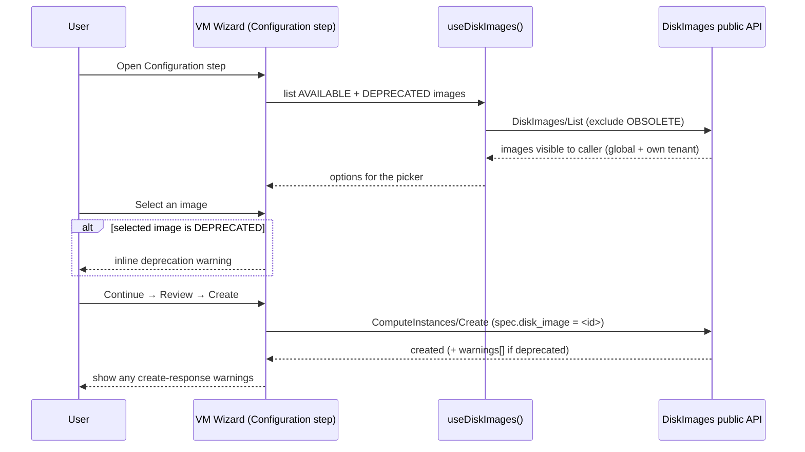
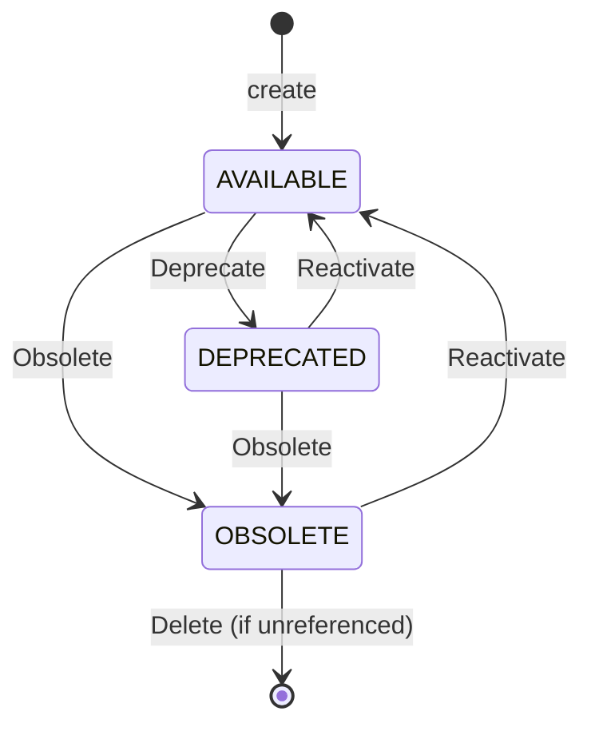

# DiskImage UI

## Summary

This design covers the **osac-ui** (web console) implementation of the
DiskImage feature — the four UI surfaces the PRD lists in scope (image list
page, image picker in the VM creation flow, image detail page, and lifecycle
management controls) that the backend design ([design.md](design.md)) and its
task decomposition explicitly deferred (FR-14). It is a companion to the
backend EP: the backend adds the `DiskImages` gRPC service and the
ComputeInstance `disk_image` reference; this document specifies how the console
consumes them. The approach clones the existing InstanceType admin feature,
which already implements the identical AVAILABLE/DEPRECATED/OBSOLETE lifecycle
model, and replaces the VM wizard's free-text OCI reference field with a
DiskImage picker. See [PRD](prd.md) for detailed requirements.

## Motivation

Today the console has no concept of a disk image. When a Tenant User creates a
VM, the configuration step exposes a **free-text OCI reference** field
(`spec.image.sourceRef`, a plain text input at
`VmConfigurationStep.tsx:89`) plus a separate Windows toggle. The user must
know the exact OCI URL and whether the image is Windows; nothing is
discoverable, curated, or governed from the UI. [Codebase: osac-ui/libs/ui-components/src/components/catalogProvision/wizard/adapters/computeInstance/VmConfigurationStep.tsx]

The backend design replaces that free-text field and boolean with a required
`disk_image` reference to a curated `DiskImage` resource carrying guest OS
family, architecture, and a lifecycle state. Without console support, the only
way to register, browse, and manage DiskImages — and the only way to select
one when creating a VM — would be the CLI or raw API. The PRD requires the
console to cover the full flow for the Cloud Provider Admin, Tenant Admin, and
Tenant User personas.

The console already has a working analog: the InstanceType admin feature
manages a curated, lifecycle-governed catalog with list/detail/create pages, a
lifecycle label, valid-transition logic, and deletion with server-enforced
protection. DiskImage's lifecycle model is identical, so the console work is
primarily a clone-and-adapt of that feature plus one change to the VM wizard.

### Goals

- Reuse the InstanceType admin feature's component, hook, routing, and
  lifecycle-label patterns rather than inventing new UI primitives. [Codebase: osac-ui/libs/ui-components/src/components/InstanceType]
- Consume the DiskImages **public** gRPC service through the existing
  `useApiQuery`/`useApiFetch` (Connect + TanStack Query) data layer; add no new
  data-fetching mechanism. [Codebase: osac-ui/libs/ui-components/src/api]
- Present global and tenant-scoped images on a **single** list page with a
  scope filter, mirroring the console's single admin-page-family convention.
  [User]
- Replace the VM wizard's free-text image field with a DiskImage picker that
  emits `spec.disk_image` and removes the Windows toggle, keeping the wizard's
  existing step/adapter structure. [Codebase: .../catalogProvision/wizard/adapters/computeInstance]
- Reflect the backend RBAC/visibility model in the UI (role-gated global
  management, tenant-scoped self-service) without adding client-side
  authorization logic beyond what the server enforces.

### Non-Goals

- Backend proto, service, database, reconciler, and OPA changes — owned by
  [design.md](design.md).
- Image upload UI, image gallery thumbnails/preview, CVE/scan display, or
  versioning UI — out of scope in the PRD.
- A dedicated Cloud Infrastructure Admin console surface — that persona is not
  affected by this feature.
- Persisted end-to-end (Cypress/Playwright) test suites — osac-ui has no
  persisted e2e harness; coverage is component-level (Vitest).

## Proposal

The console gains a **DiskImage feature module** under
`libs/ui-components/src/components/DiskImage/`, a **public API hook module** at
`libs/ui-components/src/api/v1/disk-image.ts`, a **nested route file** at
`apps/app-frontend/src/shell/DiskImageRoutes.tsx`, and a **modification to the
compute-instance wizard adapter**. Each piece mirrors an existing counterpart:

| New/changed console piece | Cloned from (InstanceType) |
|---------------------------|----------------------------|
| `api/v1/disk-image.ts` — list/get/create/update/delete hooks + AVAILABLE/OBSOLETE filter helpers | `api/v1/private/instance-type.ts` |
| `DiskImage/DiskImageListPage.tsx` | `InstanceType/AdminInstanceTypeListPage.tsx` |
| `DiskImage/DiskImageTable.tsx` | `InstanceType/AdminInstanceTypeTable.tsx` |
| `DiskImage/DiskImageActionsMenu.tsx` | `InstanceType/AdminInstanceTypeActionsMenu.tsx` |
| `DiskImage/DiskImageDetailPage.tsx` | `InstanceType/AdminInstanceTypeDetailPage.tsx` |
| `DiskImage/DiskImageForm.tsx` (create + edit) | InstanceType create page + form |
| `DiskImage/DiskImageLifecycleLabel.tsx` | `InstanceType/InstanceTypeLifecycleLabel.tsx` over `Resource/ResourceLifecycleLabel.tsx` |
| `DiskImage/useDiskImageLifecycleAction.ts` | `InstanceType/useInstanceTypeLifecycleAction.ts` |
| `shell/DiskImageRoutes.tsx` + `AppShell.tsx` + `shellNav.ts` entries | `shell/InstanceTypeRoutes.tsx` + same shell files |
| `api/types.ts` `ApiRoute` union entry | existing `v1/private/instance_types` entry |
| VM wizard picker (replaces free-text field) | existing `SelectField` at `VmConfigurationStep.tsx:97` (instanceType) |

The single change that is not a clone is the compute-instance wizard adapter:
the free-text `InputField name="spec.image.sourceRef"` and the Windows toggle
are removed and replaced by a DiskImage `SelectField` bound to
`spec.disk_image`; `payload.ts` stops emitting `spec.image`/`is_windows` and
emits the selected DiskImage ID instead.

### Workflow Description

Four console workflows, by persona. All use the DiskImages **public** API
through the console's proxy; the console never reaches CRDs directly.

#### 1. Registering a DiskImage (Provider Admin — global; Tenant Admin / Tenant User — tenant-scoped)

Starting state: user is on the DiskImage list page.

1. User clicks **Create disk image**, opening `DiskImageForm` in create mode.
2. The form collects: source type (only `REGISTRY` today, rendered as a fixed
   read-only value), source reference (OCI URL, required), guest OS family
   (`LINUX`/`WINDOWS`, defaulting to `LINUX`), and architecture (multi-select,
   ≥ 1 of `AMD64`/`ARM64`/`S390X`). The human label is `metadata.name`; there is
   no custom icon input (the OS-family icon is derived, see the Resolved
   Questions section).
3. A **Provider Admin** additionally sees a **Scope** control (Global vs a
   tenant). A Tenant Admin / Tenant User does not see the control — the image
   is always tenant-scoped to their own tenant, set server-side from identity.
4. On submit the form calls `DiskImages/Create`. On success it navigates to the
   new image's detail page. On `InvalidArgument` it surfaces the field error
   inline (empty source_ref, empty architecture).

#### 2. Selecting a DiskImage when creating a VM (Tenant User)

Starting state: user is in the VM creation wizard's Configuration step.

The picker is a `SelectField` whose options are labeled by `metadata.name` and
show the guest-OS-family icon plus architecture badge(s) (per the Resolved
Questions decision — a `SelectField`, not a card/gallery). It lists images the
caller can see (global plus own-tenant, resolved server-side) with OBSOLETE
excluded. Selecting a DEPRECATED image shows an inline warning but does not
block. The wizard emits `spec.disk_image` instead
of `spec.image.sourceRef` + `is_windows`; the guest OS family and source are
resolved by the backend at reconcile time, so the Windows toggle is removed.
Any `warnings[]` returned by `ComputeInstances/Create` (e.g. the backend's
`"disk image '<id>' is deprecated"`) are surfaced after creation.

If no image is available to the caller (empty list), the picker shows an empty
state linking to **Create disk image**, because `disk_image` is now required
and a VM cannot be created without one.

#### 3. Viewing image details (all personas)

From the list page a user opens an image's detail page, which renders a
PatternFly `DescriptionList` of all fields (source type, source reference,
guest OS family, architecture, lifecycle, deprecation/obsolescence timestamps,
scope, creation timestamp) and an `ActionList` of the lifecycle actions valid
for the current state (see workflow 4).

#### 4. Lifecycle management: deprecate / obsolete / reactivate / delete

Available from both the detail page `ActionList` and the list-row actions menu.
Valid transitions (from `useDiskImageLifecycleAction`, mirroring InstanceType):

Delete is offered **only from OBSOLETE**, matching the console's InstanceType
behavior (the UI gates delete on the terminal lifecycle state; the server still
enforces the referencing-resource protection). AVAILABLE and DEPRECATED images
must be obsoleted before they can be deleted.

Each action issues `DiskImages/Update` setting `spec.lifecycle`; the backend
auto-sets/clears the deprecation timestamps. Delete issues `DiskImages/Delete`.
When the image is still referenced, the backend returns `FailedPrecondition`
with the referencing resource named; the UI surfaces that message in a toast
and leaves the image in place. [Locked: D4]

The diagram shows the bidirectional lifecycle: reactivation is always offered
from DEPRECATED and OBSOLETE, so the action menu is state-dependent rather than
one-way.

### API Extensions

This is a console-only design. It **adds no API extensions** — no gRPC
services, CRDs, webhooks, or finalizers. Those are defined in
[design.md](design.md): the new `DiskImages` public/private service, the
`ComputeInstanceSpec.disk_image` field, and the `DiskImageLifecycle` /
`GuestOSFamily` / `Architecture` enums.

The console **consumes** the DiskImages **public** service (via the existing
Fulfillment Public API proxy — the console does not use the private API for
tenant-facing CRUD) and the modified `ComputeInstances/Create` request/response
(`spec.disk_image`, `warnings[]`). Console impact of the backend change: the
generated `@osac/types` package must be regenerated (`pnpm gen-types`) after the
proto lands before any of this work can compile — this is a hard sequencing
dependency, not an API change owned here.

## UX Alignment

No `@temp-api` file exists at
`osac-ux/libs/ui-components/src/api/v1/disk-image.ts`, and none exists in the
target repo (osac-ui) either — DiskImage is a net-new resource, and the
console's generated types come from the proto, not a hand-authored temp-api.
Per the template, the field-mapping table is therefore skipped. The console
types will be generated by `pnpm gen-types` once the proto ships; the migration
diff is the picker swap described in the Proposal, not a field remap.

One net-new mapping worth flagging: the current UI models guest OS as a boolean
(`spec.is_windows`), while the backend introduces `spec.guest_os_family` (enum)
on DiskImage. The console drops the boolean toggle entirely; guest OS family is
displayed as read-only image metadata rather than a per-VM control.

### Implementation Details/Notes/Constraints

#### Data layer (`api/v1/disk-image.ts`)

Mirror `api/v1/private/instance-type.ts`, but against the **public**
`DiskImages` service descriptor via `useApiFetch(DiskImages)` and TanStack
Query wrappers `useApiQuery`/`useApiQueryClient`. [Codebase: osac-ui/libs/ui-components/src/api/v1/private/instance-type.ts]

- `useDiskImages(params)` — `List`; by default composes a filter that excludes
  OBSOLETE (`this.spec.lifecycle != 3`) unless the caller's `params.filter`
  already references `this.spec.lifecycle`, matching the backend's own default
  and the InstanceType hook's OBSOLETE-hiding predicate. [Codebase: osac-ui/libs/ui-components/src/api/v1/instance-types.ts] [Locked: D4]
- `useDiskImage(id)` — `Get`.
- `useCreateDiskImage()` — `Create` mutation; invalidates the list query key.
- `useUpdateDiskImage()` — `Update` mutation with an `update_mask`; used for
  both metadata edits (architecture) and lifecycle transitions.
- `useDeleteDiskImage()` — `Delete` mutation; invalidates the list.

Register the new route strings in the `ApiRoute` union at
`api/types.ts` (e.g. `v1/disk_images`, `v1/disk_images/{id}`), following the
existing `v1/private/instance_types` entry, so `apiQueryKey` and invalidation
work. [Codebase: osac-ui/libs/ui-components/src/api/types.ts]

Enum `==`/`!=` CEL filtering has a documented gotcha in this codebase; follow
the pattern already used for cluster-versions/instance-types rather than
hand-rolling the filter string. [Codebase: osac-ui/libs/ui-components/src/api/v1/cluster-versions.ts]

#### List page (`DiskImageListPage.tsx` + `DiskImageTable.tsx`)

`ListPage` + `ListPageBody` shells (loading/error), a **Create disk image**
button, and a PatternFly `@patternfly/react-table` `Table` (`variant="compact"`).
Columns:

| Column | Source |
|--------|--------|
| Name | `metadata.name`, link → detail |
| Guest OS family | `spec.guest_os_family` |
| Architecture | `spec.architecture[]` rendered as `LabelGroup` chips |
| Lifecycle | `DiskImageLifecycleLabel` |
| Scope | Global if `metadata.tenant == "shared"`, else Tenant |
| Created | `metadata.creation_timestamp` (`Timestamp`) |

No per-row actions column for now: `DiskImageActionsMenu.tsx` originally
offered View/Edit, but View duplicated the Name column's link and Edit's
`:id/edit` route was removed (edit mode deferred — see Resolved Questions
§5), leaving no live action to menu. It returns, non-empty, when workflow 4's
lifecycle actions (deprecate/obsolete/reactivate/delete) ship.

Toolbar: name search plus filter controls for guest OS family, architecture,
lifecycle (including a **show obsolete** option that adds
`this.spec.lifecycle == 3`), and scope (Global / Tenant). Filters are passed to
`useDiskImages` as list params (server-side), matching the console's existing
`ListParams` convention. Empty state via `EmptyState`. [Codebase: osac-ui/libs/ui-components/src/components/InstanceType/AdminInstanceTypeTable.tsx]

Scope filter semantics: the server already returns only images the caller may
see (global + own tenant). The Scope filter is a client-visible refinement of
that set, not an authorization boundary.

#### Detail page (`DiskImageDetailPage.tsx`)

`ListPage` + `Breadcrumb`, a `DescriptionList` of all fields, and an
`ActionList` whose buttons are computed by `useDiskImageLifecycleAction`
(deprecate/obsolete/reactivate) plus a delete button with a confirmation modal.
[Codebase: osac-ui/libs/ui-components/src/components/InstanceType/AdminInstanceTypeDetailPage.tsx]

#### Create form (`DiskImageForm.tsx`)

**Milestone scope** [Locked: D11]: create mode only for the first UI
milestone. Edit mode (the only ever-mutable field is `spec.architecture`,
per Immutability below) is deferred to a follow-up story — see Resolved
Questions §5. `DiskImageForm.tsx` is written as a single component so the
deferred edit mode is additive later, not a rewrite.

- Fields: source type (fixed `REGISTRY`, read-only), source reference (text,
  required, `min_len ≥ 1`), guest OS family (select, default `LINUX`), and
  architecture (multi-select, ≥ 1 required). The human label is `metadata.name`;
  there is no custom icon input.
- **Immutability** [Locked: D2]: source type, source reference, and guest OS
  family can never change after creation — the server rejects changes to
  these fields with `InvalidArgument`. Only `spec.architecture` is ever
  mutable via `Update`. This constraint still holds even though the edit UI
  itself is deferred (see Milestone scope above).
- **Scope (Provider Admin only)**: a Global-vs-tenant control shown only to the
  provider-admin role. Tenant personas always create tenant-scoped images; the
  control is hidden and the tenant is set server-side from identity.
- Client validation mirrors the proto constraints (non-empty source_ref, ≥ 1
  architecture) to give immediate feedback; the server remains authoritative.

#### Lifecycle label + action hook

`DiskImageLifecycleLabel.tsx` maps the `DiskImageLifecycle` enum to the shared
`ResourceLifecycleLabel` (AVAILABLE → green, DEPRECATED → orange, OBSOLETE →
grey). `useDiskImageLifecycleAction.ts` exposes `getDiskImageLifecycleActions`
(`canDeprecate`: AVAILABLE; `canObsolete`: AVAILABLE or DEPRECATED;
`canReactivate`: DEPRECATED or OBSOLETE; `canDelete`: OBSOLETE only, matching
InstanceType — the server additionally enforces referencing-resource protection) and `runLifecycleAction` (issues `Update`, toasts on
error). [Codebase: osac-ui/libs/ui-components/src/components/InstanceType/useInstanceTypeLifecycleAction.ts]

#### VM wizard picker (the one non-clone change)

In `catalogProvision/wizard/adapters/computeInstance/`:

- `VmConfigurationStep.tsx`: replace the free-text `InputField
  name="spec.image.sourceRef"` (line ~89) with a `SelectField
  name="spec.disk_image"` driven by `useDiskImages()` filtered to non-OBSOLETE;
  remove the Windows toggle. Show an inline deprecation warning when the
  selected image's lifecycle is DEPRECATED.
- `payload.ts`: stop setting `spec.image` (`source_type`/`source_ref`) and
  `is_windows`; set `spec.disk_image` to the selected ID.
- `schemas.ts`/`fields.ts`: `disk_image` becomes a required field; drop the
  image/`is_windows` schema entries.
- Surface `ComputeInstancesCreateResponse.warnings[]` after creation.

Where a catalog item or template supplies a default `disk_image`, the picker
pre-selects it (and may lock it, consistent with how the current wizard treats
catalog-locked image references).

#### Routing and navigation

`shell/DiskImageRoutes.tsx` defines `index` (list), `create`, and `:id`
(detail) routes, cloned from `InstanceTypeRoutes.tsx`; mount it in
`AppShell.tsx`; add a role-gated sidebar entry in `shellNav.ts`. [Codebase: osac-ui/apps/app-frontend/src/shell/InstanceTypeRoutes.tsx]

#### i18n

All user-facing strings go through `t('...')` with the English string as the
key, imported from `@osac/ui-components/hooks/useTranslation`; run `pnpm i18n`
to regenerate `libs/i18n/locales/en/translation.json` (never hand-edited).
Several lifecycle strings already exist (e.g. "Deprecated", "Lifecycle state").
[Codebase: osac-ui/libs/i18n/locales/en/translation.json]

### Security Considerations

The console introduces no new security model. It authenticates through the
existing session/JWT flow and calls the DiskImages public API through the same
proxy as every other resource; all authorization is enforced server-side by the
OPA policies defined in [design.md](design.md). The UI's role gating (showing
the global-scope control and global-image management only to provider admins) is
a usability affordance, not a security boundary — a tenant user who forged a
global request would still be rejected by the server.

`source_ref` is accepted as free text (OCI URL or digest); consistent with the
backend, the console does not validate registry reachability. No credentials,
pull secrets, or binary uploads are handled by the console. Tenant isolation is
enforced by the server's tenant filtering; the console only renders what `List`
returns for the caller.

### Failure Handling and Recovery

Concrete failure modes for the console:

- **Create/Update validation error (`InvalidArgument`)** — e.g. empty
  source_ref, empty architecture, or an attempt to change an immutable field.
  The form surfaces the message inline against the offending field and keeps
  the user's input; no navigation occurs.
- **Delete blocked (`FailedPrecondition`)** — the image is referenced by an
  active ComputeInstance/Template/CatalogItem. The action menu shows the
  server's message (which names the referencing resource) in a toast; the image
  stays in the list. The user removes the reference and retries.
- **DiskImage not found (`NotFound`)** — a detail-page deep link to a deleted
  image, or a stale picker option. The detail page shows a not-found state; the
  picker refetches on open so stale options self-heal.
- **List/Get network or server error** — `ListPageBody` renders the standard
  error state with a retry; TanStack Query refetches on reconnect.
- **VM create with a now-OBSOLETE image** — the picker excludes OBSOLETE, but if
  an image is obsoleted between list and submit the backend returns
  `FailedPrecondition` ("disk image is obsolete"); the wizard surfaces it on the
  review/submit step and the user re-picks.
- **Deprecated image selected** — non-fatal; inline warning in the wizard plus
  the create-response `warnings[]` after submission.

No console-side data is persisted, so recovery is always "refetch and retry";
there is no partial local state to reconcile.

### RBAC / Tenancy

DiskImage is an API-only resource with no CRD, so there is no
`osac.openshift.io/tenant` / `osac.openshift.io/owner-reference` annotation work
in the console — tenant scoping lives in `metadata.tenant` on the resource and
is enforced server-side (see [design.md](design.md)'s RBAC section). Console
responsibilities:

- **Role gating**: osac-ui maps Keycloak roles to provider / tenant-admin /
  tenant-user. The DiskImage nav entry and list/detail/create pages are visible
  to all authenticated users (all can manage tenant-scoped images). The
  **global scope** control in the create form and global-image lifecycle
  actions are shown only to the provider-admin role.
- **Visibility**: the console renders exactly what `List`/`Get` return for the
  caller — global images (`metadata.tenant == "shared"`) plus the caller's own
  tenant. Cross-tenant images are never returned, so no client-side filtering
  is needed for isolation.
- **Jira component convention**: each persona's UI task carries the epic's
  components plus `UI` (Provider Admin, Tenant Admin, Tenant User all use `UI`).
  [Codebase: .design/context/osac-dimensions.md]

### Observability and Monitoring

No new observability changes. The console emits no metrics of its own; DiskImage
API calls are captured by the existing server-side gRPC Prometheus metrics and
structured logging described in [design.md](design.md). Existing monitoring
mechanisms apply.

### Risks and Mitigations

- **Risk: hard dependency on the backend proto and `pnpm gen-types`.** None of
  this compiles until the DiskImages service and `disk_image` field land and
  types are regenerated. *Mitigation:* sequence the UI epic after the backend
  epic; the picker swap is the only change that touches existing, shipping code,
  so the rest can be built in isolation once types exist.
- **Risk: mandatory image breaks the VM wizard in environments with no
  registered images.** With `disk_image` required, a fresh deployment cannot
  create a VM until an image exists. *Mitigation:* the picker's empty state
  links directly to **Create disk image**, and the field is validated before the
  wizard can proceed, turning a silent failure into an actionable prompt.
- **Risk: divergence from osac-ux.** osac-ux (read-only reference) has a
  differently-structured but equivalent lifecycle UI; a reviewer may expect
  parity. *Mitigation:* this design targets osac-ui only and reuses its own
  InstanceType conventions; osac-ux parity is out of scope.

Security review: covered by the backend EP's security review, since the console
adds no new trust boundary.

### Drawbacks

The strongest argument against this design is that it **couples the console
release to the backend release** and introduces a required field into a
previously flexible flow: users can no longer paste an arbitrary OCI URL when
creating a VM, which is a small regression in raw flexibility in exchange for
governance. It also adds a sixth admin-catalog feature module that is nearly a
copy of InstanceType, increasing surface area that must be maintained in
lockstep with the shared `ResourceLifecycleLabel`/`ListPage` primitives. These
are justified because the PRD makes governance and discoverability the point of
the feature, and the clone approach keeps each new module small and consistent
rather than introducing a new pattern.

## Alternatives (Not Implemented)

### Keep the free-text OCI field alongside the picker

Let the VM wizard accept either a DiskImage selection or a raw OCI URL.
*Pros:* backward compatible, no empty-catalog friction. *Cons:* defeats the
governance goal (users bypass the catalog), and the backend no longer accepts
inline image fields at all — the server would reject a raw URL. Rejected;
mirrors backend [Locked: D5].

### Separate provider and tenant list pages

Model a provider-global catalog page distinct from a tenant self-service page
(as osac-ux does with `pages/provider` vs `pages/tenant`). *Pros:* clean
persona separation. *Cons:* two pages to maintain for one resource; the
console's InstanceType convention is a single admin-page family with role
gating. Rejected in favor of a single page with a scope filter. [User]

### Build a bespoke DiskImage lifecycle UI instead of cloning InstanceType

*Pros:* freedom to tailor. *Cons:* duplicates logic that already exists and is
tested (valid-transition rules, obsolete-hiding, lifecycle label colors),
risking drift. Rejected; cloning the proven pattern is lower-risk and faster.

### Gallery/card picker with thumbnails

Render the VM-create picker as image cards with OS icons and arch badges.
*Pros:* the PRD's "choose visually" language. *Cons:* larger scope, and it
diverges from the existing `SelectField` pattern. Rejected in review: the picker
is a `SelectField` labeled by `metadata.name` with the OS-family icon and
architecture badge(s) (see Resolved Questions).

## Resolved Questions

Questions 1–4 were resolved in PR review (rawagner, PR #223); question 5 was
decided later, during [OSAC-4450](https://redhat.atlassian.net/browse/OSAC-4450)'s implementation:

### 1. Create-form input UX for architecture and icon — RESOLVED

Architecture is a multi-select. There is **no custom icon input**: the only
icon shown is the derived guest-OS-family icon (in the list, detail, and
picker). `metadata.name` is the human label. No dependency on a custom icon
field for the first milestone.

### 2. VM-create picker richness — RESOLVED

A plain `SelectField`, not a card/gallery picker. Options are labeled by
`metadata.name` and show the OS-family icon and architecture badge(s).

### 3. display_name dependency on OSAC-2921 — RESOLVED

Not waiting on OSAC-2921. `metadata.name` is used as the human label
everywhere (list, detail, form, picker). No display_name/description columns or
fields are added.

### 4. Milestone split for the UI — RESOLVED

The first UI milestone includes the **full lifecycle controls**
(deprecate / obsolete / reactivate), plus delete gated to OBSOLETE. No split
into a follow-up.

### 5. Edit-mode milestone split — DEFERRED

Decided during `DiskImageForm.tsx` implementation ([OSAC-4450](https://redhat.atlassian.net/browse/OSAC-4450)):
edit mode is cut from the first UI milestone. `spec.architecture` is the only
field the server ever allows an `Update` to change (see Immutability, above),
so an edit surface in this milestone would be a single-field control for
comparatively high UI cost (a whole read-only-field-rendering mode). The
create flow ships independently; editing architecture post-creation ships as
a follow-up story, tracked separately. `DiskImageForm.tsx` remains a single
component so that follow-up is additive.

## Test Plan

**Note:** *osac-ui uses Vitest 4 + React Testing Library (jsdom), colocated
`*.test.tsx`, with the API mocked via `createMockConnectTransport` passed to
`ApiProvider`. There is no persisted e2e harness, so "E2E" here is documented
as manual/exploratory against a live cluster.*

### Unit Tests

- `useDiskImages` composes a filter that excludes OBSOLETE by default and
  respects an explicit `this.spec.lifecycle` filter (show-obsolete path).
- `DiskImageLifecycleLabel` renders green/orange/grey for
  AVAILABLE/DEPRECATED/OBSOLETE.
- `getDiskImageLifecycleActions` returns the correct enabled actions per state
  (deprecate only from AVAILABLE; obsolete from AVAILABLE/DEPRECATED; reactivate
  from DEPRECATED/OBSOLETE; delete only from OBSOLETE).
- `DiskImageForm` client validation rejects empty source_ref and empty
  architecture (create mode only for this milestone — see Resolved
  Questions §5).
- Scope control is rendered for the provider-admin role and hidden for tenant
  roles.

### Integration Tests (component-level, mocked transport)

- List page: renders images from a mocked `List`, hides OBSOLETE until the
  show-obsolete filter is toggled, applies guest-OS/architecture/scope filters.
- Detail page: renders all fields; lifecycle action buttons issue `Update` with
  the expected `spec.lifecycle`; delete issues `Delete`.
- Delete blocked: mocked `FailedPrecondition` surfaces the referencing-resource
  message in a toast and leaves the row present.
- VM wizard: the Configuration step renders the DiskImage picker (not the
  free-text field), emits `spec.disk_image` in the payload, shows the inline
  deprecation warning for a DEPRECATED selection, and surfaces
  create-response `warnings[]`.
- VM wizard empty state: with no available images, the picker shows the
  create-image call to action and blocks progression.

### E2E Tests

Documented as manual verification against a live cluster (no persisted harness
in osac-ui): a Provider Admin registers a global image, a Tenant User sees it in
the list and picker, creates a VM referencing it, then the admin deprecates and
obsoletes it and the Tenant User observes the warning and the obsolete-block.
If persisted e2e is later required, it would live in osac-ux's Cypress flows
(`apps/e2e/cypress/e2e/flows/`), not osac-ui.

## Graduation Criteria

- **Dev Preview:** list, detail, create/edit, lifecycle actions, and the VM
  wizard picker function against a backend with the DiskImages service; Vitest
  component tests pass; no regression in the existing VM creation wizard.
- **Tech Preview:** role gating (global vs tenant management) verified against
  real Keycloak roles.
- **GA:** accessibility pass (keyboard/AT for the picker and forms),
  i18n strings complete, verified at catalog scale (large image lists paginate/
  filter acceptably).

## Upgrade / Downgrade Strategy

The console is a stateless frontend deployed as a unit; there is no in-place
data migration. This feature is additive: new pages and a modified wizard step.
The only coupling is that the console requires a backend exposing the DiskImages
service and the `disk_image` field — the console must be deployed together with
or after that backend. Downgrading the console removes the DiskImage pages and
restores the prior wizard; because the backend no longer accepts inline image
fields, a downgraded console without the picker could not create VMs, so console
and backend versions must move together for the VM-create path.

## Version Skew Strategy

The relevant skew is console-vs-backend, not intra-cluster component skew (the
console has no CRD or controller). If the console is newer than the backend
(DiskImages service absent), the DiskImage pages' queries fail and the wizard
picker cannot populate — the feature must not be enabled ahead of the backend.
If the backend is newer than the console, the old console still works against
the unchanged public API for non-DiskImage flows but cannot create VMs (which
now require `disk_image`); hence console and backend are released together for
the VM path. Proto backward-compatibility (reserved fields, no number reuse) is
handled backend-side.

## Support Procedures

- **Detection:** DiskImage pages showing persistent error states, or the VM
  wizard picker staying empty, typically indicates the backend DiskImages
  service is unavailable or the console is running ahead of the backend. Browser
  console/network errors on `/api/fulfillment/v1/disk_images` confirm it.
- **Disabling:** the DiskImage nav entry and routes can be removed (feature
  flag or nav gating) to hide the pages. This does not affect running VMs.
  However, the VM-create flow depends on the picker; disabling DiskImage UI
  while the backend requires `disk_image` would leave VM creation without an
  image selector, so disabling is only safe in tandem with backend rollback.
- **Recovery:** re-enabling restores the pages; no console-side consistency
  concerns because the console holds no persistent state — it refetches from the
  API on load.

## Infrastructure Needed

None. No new repos, CI, or test infrastructure — the work lands in the existing
osac-ui repo using its existing Vitest setup. `pnpm gen-types` (already part of
the osac-ui toolchain) must be run against the updated proto before development
begins.

---

## Provenance

Authored: draft @ design 0.8.0 - 7efcedb, workspace main @ 6e8f396 (dirty)
Final: respond @ design 0.8.0 - 7efcedb, workspace main @ 505e141 (dirty)

> Context changed between draft and respond.

<!-- ai-workflow-provenance:{"schema_version":1,"provenance_kind":"session","workflow":"design","workflow_version":"0.8.0","ai_workflows":"7efcedb","source_repo":"505e141 (dirty)","source_repo_branch":"main","commits_behind_main":0,"commits_ahead_main":0,"main_ref":"main","phases":["draft","respond"],"authoring_modes":["skill"],"context_changed":true,"origin_untracked":false} -->
