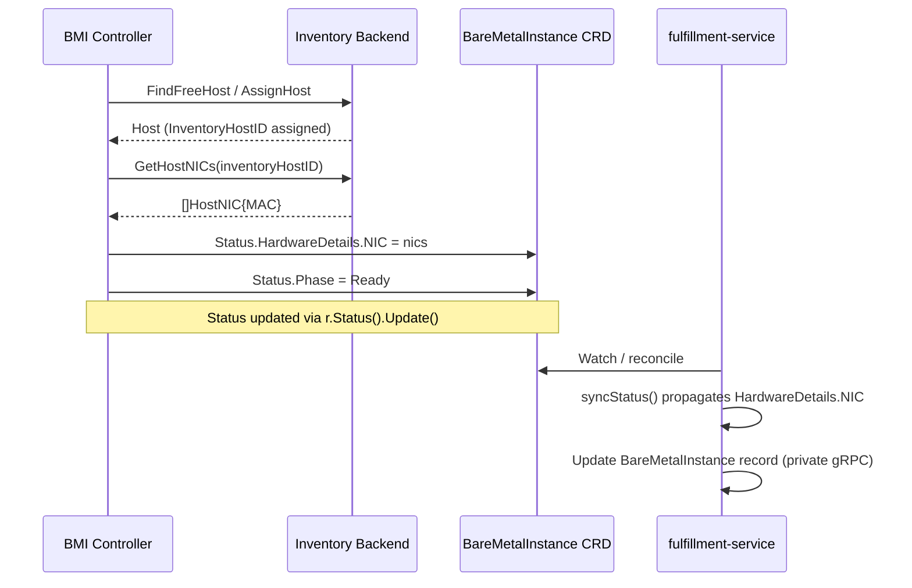

# Expose BareMetalInstance NIC MAC Addresses in Status

## Summary

This design extends `BareMetalInstance` status with physical network interface MAC addresses sourced from the bare metal inventory backend at allocation time and propagated to the fulfillment-service API and CLI. See [PRD](prd.md) for detailed requirements.

## Motivation

The `bare-metal-fulfillment-operator` allocates a physical host from an inventory backend (Metal3 or OpenStack/Ironic) and writes its identifier into `BareMetalInstance.spec.externalHostID`. The inventory backend already records the host's physical network interfaces — including MAC addresses — from its hardware inspection pass. This information is never surfaced to consumers.

The primary driver is CaaS cluster installation: when the Assisted Installer agent registers from a newly booted host, it identifies itself by its boot MAC address. Without that MAC address on the `BareMetalInstance` status, CaaS has no programmatic way to correlate the running agent to the provisioned instance, forcing manual lookup.

Secondarily, Tenant Users and administrators need basic host identity information (MAC addresses) to correlate physical hosts with network and hardware inventories.

MAC addresses are hardware-level identifiers. They do not change after a host is allocated. This makes the propagation problem a one-time fetch per `BareMetalInstance`, with no need for ongoing synchronization.

### Goals

- Extend `BareMetalInstanceStatus` (CRD and proto) with a `HardwareDetails.NIC` field listing physical network interfaces fetched from the inventory backend at allocation time.
- Implement `GetHostNICs` on both Metal3 and OpenStack inventory client backends following existing patterns.
- Propagate NIC metadata from the CRD to the fulfillment-service API through the existing controller reconciler path.
- Surface NIC metadata in the `osac` CLI `describe baremetalinstance` command.
- Leave the instance in `Ready` state if NIC metadata is temporarily unavailable; retry on the next reconcile.

### Non-Goals

- IP address tracking or IPAM (owned by the networking EP/design).
- Modifying the inventory backend schemas or APIs beyond reading existing data.
- Ongoing periodic re-synchronization of MAC addresses (they do not change post-allocation).
- UI visualization of NIC metadata (deferred to a subsequent UI epic).
- Exposing full hardware specifications in status (covered by `BareMetalInstanceType`).
- Adding a `osac get baremetalinstances` list command (does not yet exist; tracked separately).

## Proposal

The feature adds a `GetHostNICs` method to the `inventory.Client` interface, implemented by both the Metal3 and OpenStack inventory backends. The `BareMetalInstance` controller calls this method after host allocation and stores the result under `Status.HardwareDetails.NIC` in the CRD status. The fulfillment-service's existing controller reconciler function propagates the new status fields to the fulfillment-service database via the private gRPC API. New message types and fields are added to both the public and private proto `BareMetalInstanceStatus` messages. The `osac describe baremetalinstance` command renders a NIC table.

### Workflow Description

**Actors:** Cloud Provider Admin, Cloud Infrastructure Admin, Tenant Admin, Tenant User (read-only consumers of the status). The `bare-metal-fulfillment-operator` controller is the only writer.

**Starting state:** A `BareMetalInstance` CR has been created (by the fulfillment-service controller) and the `bare-metal-fulfillment-operator` is beginning reconciliation.

**Normal flow — NIC data available:**



The sequence above shows `GetHostNICs` called once immediately after allocation. The fulfillment-service controller reconciler picks up the updated CRD status on the next watch event and propagates the NIC fields to the fulfillment-service database, making them available via Get and List API calls and the CLI.

**Error flow — NIC data temporarily unavailable:**

If `GetHostNICs` returns an error (inventory API unreachable) or returns nil (Metal3 hardware inspection not yet complete), the controller logs a warning, optionally emits a Kubernetes Warning event on error, proceeds to set `Status.Phase = Ready` with nil `HardwareDetails`, and requeues after `ManagementRecheckIntervalDuration`. On the next reconcile cycle, if `HardwareDetails` is still nil, `GetHostNICs` is called again.

**Idempotency:** If `Status.HardwareDetails` is already populated (non-nil), the controller skips `GetHostNICs` — MACs are immutable post-allocation.

**Consumer read path:**

Any OSAC persona with access to a `BareMetalInstance` (tenant-scoped for Tenant Users/Admins, cross-tenant for Cloud Provider Admin and Cloud Infrastructure Admin) can read NIC metadata via:
- `GET /api/fulfillment/v1/baremetal_instances/{id}` → `status.hardware_details.nics`
- `GET /api/fulfillment/v1/baremetal_instances` → `items[*].status.hardware_details.nics`
- `osac describe baremetalinstance <name>` → Network Interfaces table

**CLI output example:**

`osac describe baremetalinstance my-bmi`:
```
ID:           abc-123
Catalog Item: gpu-node
State:        RUNNING

Network Interfaces:
  MAC
  aa:bb:cc:dd:ee:01
  aa:bb:cc:dd:ee:02
  aa:bb:cc:dd:ee:03
```

When `HardwareDetails` is nil or `NIC` is empty, the Network Interfaces section displays `N/A`.

### API Extensions

#### 1. `inventory.Client` interface — new `GetHostNICs` method

**Package:** `osac/bare-metal-fulfillment-operator/internal/inventory/client.go`

```go
// HostNIC describes one physical network interface from the inventory backend.
// Additional fields (Name, SpeedGbps, etc.) may be added in future without
// breaking the interface contract.
type HostNIC struct {
    MAC string
}

type Client interface {
    FindFreeHost(ctx context.Context, matchExpressions map[string]string) (*Host, error)
    AssignHost(ctx context.Context, inventoryHostID string, bareMetalInstanceID string,
        labels map[string]string) (*Host, error)
    UnassignHost(ctx context.Context, inventoryHostID string, labels []string) error
    // GetHostNICs returns the physical network interfaces for the allocated host.
    // Returns nil (not an error) when the inventory has no NIC data for this host.
    // Returns an error only on backend failures.
    GetHostNICs(ctx context.Context, inventoryHostID string) ([]HostNIC, error)
}
```

The existing in-memory locking client (`inventory.TryLock` / `inventory.Unlock`) is not relevant to `GetHostNICs` — it protects allocation racing, not status reads.

#### 2. `BareMetalInstanceStatus` CRD type — new fields

**File:** `osac/bare-metal-fulfillment-operator/api/v1alpha1/baremetalinstance_types.go`

Two new types and one new field added:

```go
// BareMetalNICStatus describes one physical network interface as reported by
// the inventory backend. Additional fields may be added in future milestones.
type BareMetalNICStatus struct {
    // MAC is the hardware MAC address of this interface.
    // +kubebuilder:validation:Required
    // +kubebuilder:validation:Pattern=`[0-9a-fA-F]{2}(:[0-9a-fA-F]{2}){5}`
    MAC string `json:"mac"`
}

// BareMetalHardwareDetails holds inventory-reported hardware metadata for
// a BareMetalInstance. Modeled after Metal3's HardwareDetails to allow
// compatible future extensions (CPU, memory, storage, etc.).
type BareMetalHardwareDetails struct {
    // NIC lists the physical network interfaces discovered from the inventory backend.
    // +kubebuilder:validation:Optional
    NIC []BareMetalNICStatus `json:"nic,omitempty"`
}
```

Added to `BareMetalInstanceStatus`:
```go
// HardwareDetails holds inventory-reported hardware metadata populated at
// allocation time. Nil if the inventory backend has not yet provided data.
// +kubebuilder:validation:Optional
HardwareDetails *BareMetalHardwareDetails `json:"hardwareDetails,omitempty"`
```

After modifying the types file, run `make manifests generate && make helm-crds` per the operator's `AGENTS.md`.

#### 3. `BareMetalInstanceStatus` proto — new message and fields

**Files:** `osac/fulfillment-service/proto/public/osac/public/v1/baremetal_instance_type.proto` and `osac/fulfillment-service/proto/private/osac/private/v1/baremetal_instance_type.proto`

Both protos receive identical additions:

```protobuf
// Describes one physical network interface as reported by the inventory backend.
// Additional fields may be added in future milestones without breaking API compatibility.
message BareMetalNICStatus {
  // Hardware MAC address of this interface (e.g. "aa:bb:cc:dd:ee:ff").
  string mac = 1;
}

// Holds inventory-reported hardware metadata for a BareMetalInstance.
// Modeled after Metal3's HardwareDetails to allow compatible future extensions.
message BareMetalHardwareDetails {
  // Physical network interfaces discovered from the inventory backend.
  repeated BareMetalNICStatus nics = 1;
}
```

Added to `BareMetalInstanceStatus`:
```protobuf
// Hardware details populated from the inventory backend at allocation time.
// Absent if the inventory backend has not yet provided data.
optional BareMetalHardwareDetails hardware_details = 5;
```

Field 5 is free in both public and private `BareMetalInstanceStatus`. Run `buf lint && buf generate` after changes.

#### 4. Operational impact

- If the `bare-metal-fulfillment-operator` is restarted mid-reconciliation after allocation but before `GetHostNICs` completes, the controller restarts reconciliation from the beginning. Since `NetworkInterfaceMACs` is empty, it retries `GetHostNICs` — idempotent.
- If the fulfillment-service controller is down, the CRD status update succeeds independently; NIC fields are propagated on the next reconcile cycle when the controller resumes.

## UX Alignment

The `@temp-api` file for `BareMetalInstance` in osac-ux (`libs/types/src/osac/public/v1/baremetal_instance_type_pb.ts`) is generated from the public proto and does not currently contain NIC fields. After this EP ships and `pnpm gen-types` is run, the generated types will include `hardwareDetails: { nics: { mac: string }[] }`. No UI work is in scope for this EP — the UI epic is explicitly deferred.

| UI field (`@temp-api` TypeScript) | Proto field (this EP) | Notes |
|---|---|---|
| `status.hardwareDetails.nics[].mac` | `status.hardware_details.nics[].mac` | Direct mapping (camelCase ↔ snake_case) |

No deviations from known anti-patterns.

### Implementation Details/Notes/Constraints

#### Metal3 backend — `GetHostNICs` implementation

**File:** `osac/bare-metal-fulfillment-operator/internal/inventory/metal3.go`

The `inventoryHostID` for Metal3 is formatted as `namespace/name` (parsed by `ParseHostID`). The implementation fetches the `BareMetalHost` via the k8s client and extracts NIC data:

```go
func (m *Metal3Client) GetHostNICs(ctx context.Context, inventoryHostID string) ([]HostNIC, error) {
    namespace, name, err := ParseHostID(inventoryHostID)
    if err != nil {
        return nil, err
    }
    bmh := &metal3api.BareMetalHost{}
    if err := m.client.Get(ctx, client.ObjectKey{Namespace: namespace, Name: name}, bmh); err != nil {
        return nil, fmt.Errorf("failed to get BareMetalHost %s: %w", inventoryHostID, err)
    }
    // HardwareDetails is nil until Metal3 hardware inspection completes.
    if bmh.Status.HardwareDetails == nil {
        return nil, nil
    }
    nics := make([]HostNIC, 0, len(bmh.Status.HardwareDetails.NIC))
    for _, nic := range bmh.Status.HardwareDetails.NIC {
        nics = append(nics, HostNIC{MAC: strings.ToLower(nic.MAC)})
    }
    return nics, nil
}
```

`BareMetalHost.Status.HardwareDetails` is of type `*hardwaredata.HardwareDetails` (from `github.com/metal3-io/baremetal-operator/apis`). The `NIC` field is `[]hardwaredata.NIC` where each entry has `MAC string`.

If `HardwareDetails` is nil (inspection not yet done), `GetHostNICs` returns `nil, nil` — the controller treats this as no NIC data and retries on the next reconcile.

#### OpenStack/Ironic backend — `GetHostNICs` implementation

**File:** `osac/bare-metal-fulfillment-operator/internal/inventory/openstack.go`

The `inventoryHostID` for OpenStack is the Ironic node UUID. Ironic exposes physical ports (one per physical NIC) via the `ports` sub-resource. The gophercloud v2 `openstack/baremetal/v1/ports` package provides `ListDetail` which returns `Port` objects with `Address` (MAC) and `IsBootInterface` (bool, available since Ironic API microversion 1.15).

The implementation follows the same auth-retry pattern used by `FindFreeHost` and `AssignHost`:

```go
func (c *OpenStackClient) GetHostNICs(ctx context.Context, inventoryHostID string) ([]HostNIC, error) {
    nics, err := c.getHostNICs(ctx, inventoryHostID)
    if err != nil && isAuthError(err) {
        if reconnErr := c.reconnect(ctx); reconnErr != nil {
            return nil, fmt.Errorf("get host NICs %s: reconnect failed: %w", inventoryHostID, reconnErr)
        }
        nics, err = c.getHostNICs(ctx, inventoryHostID)
    }
    return nics, err
}

func (c *OpenStackClient) getHostNICs(ctx context.Context, inventoryHostID string) ([]HostNIC, error) {
    var nics []HostNIC
    err := ports.ListDetail(c.client, ports.ListOpts{NodeUUID: inventoryHostID}).
        EachPage(ctx, func(_ context.Context, page pagination.Page) (bool, error) {
            portList, err := ports.ExtractPorts(page)
            if err != nil {
                return false, err
            }
            for _, p := range portList {
                nics = append(nics, HostNIC{MAC: strings.ToLower(p.Address)})
            }
            return true, nil
        })
    return nics, err
}
```

#### Controller reconcile integration

**File:** `osac/bare-metal-fulfillment-operator/internal/controller/baremetalinstance_controller.go`

`GetHostNICs` is called within `reconcileManagement`, after provisioning and power reconciliation complete successfully but before setting `Status.Phase = Ready`. It is guarded so it only runs once:

```go
// In reconcileManagement, before setting Phase=Ready:
if bareMetalInstance.Status.HardwareDetails == nil {
    nics, err := r.InventoryClient.GetHostNICs(ctx, bareMetalInstance.Spec.ExternalHostID)
    if err != nil {
        log.Error(err, "failed to fetch NIC metadata from inventory; will retry",
            "hostID", bareMetalInstance.Spec.ExternalHostID)
        r.Recorder.Eventf(bareMetalInstance, corev1.EventTypeWarning, "NICMetadataUnavailable",
            "Failed to fetch NIC metadata from inventory: %v", err)
    }
    if len(nics) > 0 {
        crdNICs := make([]v1alpha1.BareMetalNICStatus, len(nics))
        for i, n := range nics {
            crdNICs[i] = v1alpha1.BareMetalNICStatus{MAC: n.MAC}
        }
        bareMetalInstance.Status.HardwareDetails = &v1alpha1.BareMetalHardwareDetails{NIC: crdNICs}
    } else {
        // NIC data not yet available (inspection pending or error) — set Ready and requeue.
        bareMetalInstance.Status.Phase = v1alpha1.BareMetalInstancePhaseReady
        return ctrl.Result{RequeueAfter: r.ManagementRecheckIntervalDuration}, nil
    }
}
bareMetalInstance.Status.Phase = v1alpha1.BareMetalInstancePhaseReady
```

The `Recorder` field (`record.EventRecorder`) is already used by controller-runtime controllers; it needs to be injected during `SetupWithManager`. The `corev1.EventTypeWarning` event with reason `NICMetadataUnavailable` is emitted only on backend errors. When `GetHostNICs` returns nil (Metal3 inspection not complete), the controller silently requeues without emitting an event.

#### fulfillment-service controller reconciler — status propagation

**File:** `osac/fulfillment-service/internal/controllers/baremetalinstance/baremetalinstance_reconciler_function.go`

In `syncStatus(object *bmfov1alpha1.BareMetalInstance)`, after the existing status mapping:

```go
// Propagate NIC metadata from CRD status to proto status.
if object.Status.HardwareDetails != nil {
    protoNICs := make([]*privatev1.BareMetalNICStatus, len(object.Status.HardwareDetails.NIC))
    for i, nic := range object.Status.HardwareDetails.NIC {
        protoNICs[i] = privatev1.BareMetalNICStatus_builder{Mac: nic.MAC}.Build()
    }
    t.bareMetalInstance.GetStatus().SetHardwareDetails(
        privatev1.BareMetalHardwareDetails_builder{Nics: protoNICs}.Build(),
    )
}
```

#### CLI — describe command

**File:** `osac/fulfillment-service/internal/cmd/cli/describe/baremetalinstance/describe_baremetalinstance_cmd.go`

`renderBareMetalInstance` is extended to add a Physical Interfaces section below the existing fields:

```go
nics := bmi.GetStatus().GetHardwareDetails().GetNics()
if len(nics) == 0 {
    fmt.Fprintf(writer, "\nNetwork Interfaces:\tN/A\n")
} else {
    fmt.Fprintf(writer, "\nNetwork Interfaces:\n")
    fmt.Fprintf(writer, "  MAC\n")
    for _, nic := range nics {
        fmt.Fprintf(writer, "  %s\n", nic.GetMac())
    }
}
```

#### Test mock update

**File:** `osac/bare-metal-fulfillment-operator/internal/inventory/` — mock generated by `go.uber.org/mock`

The `Client` interface mock must be regenerated after adding `GetHostNICs`. All existing tests that construct a mock `Client` need a `EXPECT().GetHostNICs(...)` call or the mock must use `AnyTimes()` / `Return(nil, nil)` defaults. The implementation PR must update all affected test files.

### Security Considerations

NIC metadata (MAC addresses) is read-only status information. It is included in the `BareMetalInstance` status object, which is already subject to the existing OPA tenant authorization boundary: a Tenant User can only read `BareMetalInstance` objects belonging to their own tenant. Cloud Provider Admin and Cloud Infrastructure Admin roles have cross-tenant read access per existing policy.

No new OPA policies, RBAC roles, or authorization logic are required. The metadata does not expose credentials, private keys, or configuration secrets.

MAC addresses could theoretically aid network reconnaissance. The existing tenant isolation ensures they are only visible to authorized parties.

Input validation: MAC addresses written to `BareMetalInstanceStatus.HardwareDetails.NIC` originate from the inventory backend (trusted source, not user-controlled). The CRD field uses a `+kubebuilder:validation:Pattern` annotation on `BareMetalNICStatus.MAC`; no additional sanitization is needed.

### Failure Handling and Recovery

| Failure | System behavior | User observes |
|---|---|---|
| `GetHostNICs` returns error (inventory API down) | Warning event emitted; `HardwareDetails` left nil; instance set to `Ready`; requeues after `ManagementRecheckIntervalDuration` | Instance is `Ready`; CLI shows `N/A`; Warning event visible via `kubectl describe` |
| `GetHostNICs` returns nil (Metal3 inspection not complete) | `HardwareDetails` left nil; instance set to `Ready`; requeues after `ManagementRecheckIntervalDuration` | Instance is `Ready`; CLI shows `N/A`; no error event |
| fulfillment-service controller restarts mid-propagation | On resume, `syncStatus` re-reads CRD and propagates NIC fields | No inconsistency; propagation is idempotent |
| BareMetalInstance deleted before NIC fetch completes | Deletion path does not call `GetHostNICs` | No impact |
| NIC fetch succeeds but CRD status update fails | controller-runtime returns error; reconcile retries from scratch; NIC fetch runs again | Transient delay; eventual consistency |

All failure paths preserve the `Ready` phase — NIC metadata unavailability is non-blocking for instance provisioning.

### RBAC / Tenancy

No new resources are introduced. NIC metadata is part of `BareMetalInstanceStatus`, which inherits the existing tenant isolation model:

- `BareMetalInstance` CRs are annotated with `osac.openshift.io/tenant` at creation time by the fulfillment-service controller.
- OPA policies enforce that Tenant Users can only read `BareMetalInstance` objects for their own tenant.
- Cloud Provider Admin and Cloud Infrastructure Admin have cross-tenant read access.

No changes to OPA policies, `osac.openshift.io/tenant` annotations, or RBAC roles are required. [Codebase: `osac/fulfillment-service/internal/servers/baremetal_instances_server.go`]

### Observability and Monitoring

One new Kubernetes event is introduced:

| Event | Type | Reason | When |
|---|---|---|---|
| `NICMetadataUnavailable` | `Warning` | `NICMetadataUnavailable` | `GetHostNICs` returns a non-nil error |

No new Prometheus metrics are added. The existing reconcile error counter (standard controller-runtime metric) covers `GetHostNICs` failures when the controller returns an error. NIC metadata fetch failures do not increment the error counter because the controller does not return an error — it continues to `Ready` with empty NIC data and emits the event instead.

Operators can detect hosts with missing NIC metadata by querying `BareMetalInstance` objects where `status.hardwareDetails` is absent and `status.phase == Ready`.

### Risks and Mitigations

| Risk | Mitigation |
|---|---|
| Metal3 hardware inspection completes after allocation | `GetHostNICs` returns nil; the instance enters `Ready` with nil `HardwareDetails` and requeues after `ManagementRecheckIntervalDuration`. On the next reconcile, if `HardwareDetails` is still nil, `GetHostNICs` is called again. The gap closes automatically once inspection completes. |
| Interface extension breaks existing test mocks | Adding `GetHostNICs` to `Client` breaks all existing mock implementations. Mitigation: the implementation PR must update all mock usages in one pass. The CI `make test` target will fail if any mock is incomplete. |

### Drawbacks

Adding `GetHostNICs` to the `Client` interface creates a synchronous inventory API call in the reconcile hot path (once per newly-allocated `BareMetalInstance`). For Metal3 this is a k8s API call (low latency, cached by controller-runtime informers). For OpenStack it is an Ironic REST API call (external network call, potentially higher latency). In both cases the call runs after provisioning has completed — which already implies significant latency — so the incremental impact is negligible.

## Alternatives (Not Implemented)

### Alternative 1: Store MAC in `BareMetalInstance.spec` rather than status

MAC addresses could be written to a spec field by the controller, making them immutable Kubernetes resources. This would simplify change detection (no status subresource needed).

**Rejected:** The Kubernetes convention is that status reflects observed system state, not desired state. MAC addresses are discovered from the inventory at runtime, not specified by the user. Writing discovered data to `spec` violates the spec/status boundary and would make the field immutable even if the host were reallocated (which is possible in future).

### Alternative 2: Separate `BareMetalNICInfo` CRD per host

A dedicated CRD could hold NIC metadata, owned by the `BareMetalInstance`.

**Rejected:** The MAC address list is small (typically 2–8 entries), fits naturally in status, and is inseparable from the instance's identity. A separate CRD adds operational complexity (garbage collection, cross-resource joins in the API) without benefit.

### Alternative 3: Retrieve MACs on demand (server-side join at query time)

The fulfillment-service could query the inventory backend directly at Get/List time, bypassing the operator entirely.

**Rejected:** The fulfillment-service has no inventory client and should not gain one — inventory access is the operator's responsibility. This approach would require significant new infrastructure, duplicate the inventory client, and introduce availability coupling between the public API and the inventory backend.

### Alternative 4: Periodic re-sync of NIC metadata

The controller could re-fetch NIC data on every reconcile cycle or on a fixed interval to handle potential drift.

**Rejected:** MAC addresses are hardware identifiers burned into NIC firmware. They do not change after allocation. One-time fetch is sufficient and avoids unnecessary inventory API load.

## Test Plan

### Unit Tests

**bare-metal-fulfillment-operator:**
- `GetHostNICs` (Metal3): returns correct `[]HostNIC` when `BareMetalHost.Status.HardwareDetails.NIC` is populated; returns nil when `HardwareDetails` is nil; MAC addresses are lowercased.
- `GetHostNICs` (OpenStack): returns correct `[]HostNIC` from mocked port list; applies auth-retry pattern on `401` error; returns empty list when port list is empty.
- Controller `reconcileManagement`: NIC fetch is skipped when `HardwareDetails` is already non-nil; instance enters `Ready` and requeues when `GetHostNICs` returns nil; Warning event is emitted on backend error; no panic on nil Recorder.
- fulfillment-service `syncStatus`: proto `hardware_details.nics` is populated when CRD `HardwareDetails.NIC` is non-empty; proto field is absent when CRD `HardwareDetails` is nil.
- CLI `renderBareMetalInstance`: NIC table displayed when `HardwareDetails.NIC` is non-empty; "N/A" displayed when nil.

**Interface mock:** Regenerate `Client` mock after interface change; update all mock construction sites to expect `GetHostNICs` or use `AnyTimes` where the test is not exercising NIC fetch.

### Integration Tests

**bare-metal-fulfillment-operator (envtest):**
- Create a `BareMetalHost` with `HardwareDetails.NIC` populated; create a `BareMetalInstance` and run the controller to completion; assert `Status.HardwareDetails.NIC` matches the BMH NIC list with correct MAC values.
- Same as above with Metal3 `HardwareDetails` nil at allocation time; assert `Status.HardwareDetails` is nil, instance is `Ready`, and a requeue is scheduled.
- Simulate `GetHostNICs` backend error (mock returns error); assert instance enters `Ready` with nil `HardwareDetails` and a `NICMetadataUnavailable` Warning event is emitted.

**fulfillment-service (kind cluster / integration tests):**
- Create a `BareMetalInstance` CR with `Status.HardwareDetails.NIC` pre-populated; run the fulfillment-service controller reconciler; assert that `BareMetalInstance.status.hardware_details.nics` in the fulfillment-service database matches the CRD status.

### E2E Tests

**osac-test-infra (pytest):**
- Provision a `BareMetalInstance` against a Metal3 backend with known host hardware details; poll until `state = RUNNING`; assert `GET /api/fulfillment/v1/baremetal_instances/{id}` returns `status.hardware_details.nics` as a non-empty list containing the known host MAC addresses.
- Assert that a Tenant User cannot read `status.hardware_details` for a `BareMetalInstance` belonging to a different tenant (403 response).
- Assert that a Cloud Infrastructure Admin can read `status.hardware_details` for any tenant's `BareMetalInstance`.
- Negative: provision a `BareMetalInstance` where the inventory backend returns no port/NIC data; assert `status.hardware_details` is absent and `GET` returns 200 (not an error).
- CLI: run `osac describe baremetalinstance <name>` and assert "Network Interfaces:" section is present; assert it shows "N/A" when NIC data is absent.

## Graduation Criteria

Graduation criteria will be defined when targeting a release. Expected stages: Dev Preview → Tech Preview → GA based on production deployment feedback.

## Upgrade / Downgrade Strategy

This EP adds optional status fields to `BareMetalInstance` (CRD and proto). No migration is required:
- Existing `BareMetalInstance` resources will have `hardwareDetails: null` on upgrade; the controller populates it on the next reconcile cycle that reaches the Ready state check.
- Downgrading the operator removes the `HardwareDetails` field from the CRD schema; the Kubernetes API server drops unknown fields from stored objects on the next write, which is safe.
- Downgrading the fulfillment-service drops the proto fields from API responses; existing stored data is not affected (JSON serialization ignores unknown fields in newer DB rows).

## Version Skew Strategy

The `hardware_details` field is additive. During a rolling upgrade where some fulfillment-service instances are on the new version and some are on the old:
- Old fulfillment-service instances ignore `hardware_details` in proto responses (unknown field, dropped).
- New fulfillment-service instances return `hardware_details` to clients that support it; old clients ignore the field.

The operator and fulfillment-service are upgraded independently. An updated operator may write `HardwareDetails` to the CRD before the fulfillment-service is updated to propagate them — this is safe; the new proto field is simply not yet surfaced in the API until the fulfillment-service is also updated.

## Support Procedures

**Detecting missing NIC metadata:** Query `BareMetalInstance` objects where `state = RUNNING` and `hardware_details` is absent via the fulfillment-service API. Alternatively, check for `NICMetadataUnavailable` Warning events on `BareMetalInstance` objects in the hub cluster.

**Root causes for empty NIC metadata:**
- Metal3: hardware inspection (`BareMetalHost.Status.HardwareDetails`) not yet complete. Check `kubectl describe baremetalhost <name> -n <namespace>` for inspection status. The controller requeues automatically and populates once inspection finishes.
- OpenStack/Ironic: no ports registered for the node. Check `openstack baremetal port list --node <uuid>`.
- Inventory API unreachable: check operator logs for `NICMetadataUnavailable` events.

**Disabling NIC fetch:** There is no feature flag. To disable NIC population, the `GetHostNICs` implementation can be stubbed to return `nil, nil` in a custom build, or the `if bareMetalInstance.Status.HardwareDetails == nil` guard can be changed to always skip.

**Consistency on re-enable:** Since NIC data is immutable once written, re-enabling after a disable has no consistency risk. Instances that missed their NIC fetch window will have it populated on the next reconcile cycle.

## Infrastructure Needed

None.

---

## Provenance

Authored: respond @ design 0.8.0 - 7efcedb, workspace main @ a4b128a
Phases: draft, respond, respond

<!-- ai-workflow-provenance:{"schema_version":1,"provenance_kind":"session","workflow":"design","workflow_version":"0.8.0","ai_workflows":"7efcedb","source_repo":"a4b128a","source_repo_branch":"main","commits_behind_main":0,"commits_ahead_main":0,"main_ref":"main","phases":["draft","respond","respond"],"authoring_modes":["skill"],"context_changed":false,"origin_untracked":false} -->
