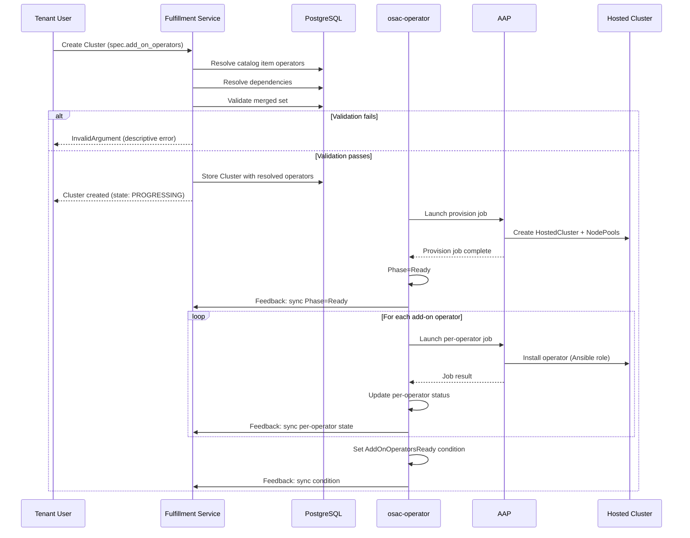

# CaaS Add-On Operator Support

## Summary

This design introduces an `AddOnOperator` resource auto-discovered from Ansible
roles and a config-as-code pipeline, order-time validation of operator sets on
cluster orders, and Ansible-role-based operator installation during CaaS cluster
provisioning. See [PRD](prd.md) for detailed requirements.

## Motivation

CaaS clusters provisioned through OSAC arrive without specialized software.
Tenants needing purpose-built configurations — such as an NVIDIA AI cluster
requiring GPU, network, and driver operators — must install operators manually
after delivery. This is error-prone, time-consuming, and undermines the catalog
experience.

The fulfillment-service already manages a three-tier CaaS catalog
(`ClusterTemplate` → `ClusterCatalogItem` → `Cluster`), and osac-aap already
installs OLM operators in `post_install.yaml` (cert-manager in `ocp_small`).
This design extends both systems: operator metadata is auto-discovered from
Ansible roles (same pipeline as cluster templates), the API validates operator
sets at order time, and the post-install playbook invokes each operator's
Ansible role on the provisioned cluster.

### Goals

- Cloud Provider Admins can add new operators by authoring an Ansible role —
  no API or Go code changes required.
- Tenants can browse available operators and attach them to catalog items or
  cluster orders through the standard fulfillment-service API.
- Perform all operator compatibility validation at order time in the
  fulfillment-service, before the `ClusterOrder` CR is created.
- Use Ansible roles for operator installation so new operators can be added
  without Go code changes.
- Track per-operator installation status via a non-gating condition on the
  `ClusterOrder` CRD, following the `ClusterStorageReady` precedent.

### Non-Goals

- Operator lifecycle management after initial installation (upgrades, removal).
- OLM-awareness or remote-cluster API access in the osac-operator Go code.
- Support for non-CaaS services (VMaaS, BMaaS).
- Version pinning — the first iteration uses a fixed channel and latest version
  per operator.
- UI implementation details — the UI will consume the API surface defined here,
  but operator browsing, catalog attachment, and cluster detail views are
  covered by their own design.
- User-facing documentation — API reference and workflow guides for CPA/TA/TU
  personas will be addressed after the API stabilizes.

## Proposal

Three components change. The **fulfillment-service** gains a new `AddOnOperator`
resource (auto-populated by the config-as-code pipeline), new fields on
`ClusterCatalogItem` and `Cluster` to attach and carry operator references, and
order-time validation logic. The **osac-aap** gains a new `template_type:
addon_operator` for Ansible roles that install OLM operators, discovery and
publishing tasks, and a loop in the post-install playbook that invokes each
operator's role. The **osac-operator** gains a dedicated `AddOnOperatorReconciler` that
watches ClusterOrder resources, dispatches the post-install AAP job, and
manages a new `AddOnOperatorsReady` condition that reflects the job result.

### Workflow Description

#### Adding a new add-on operator (Cloud Provider Admin)

A Cloud Provider Admin authors an Ansible role in `osac-aap` under
`collections/ansible_collections/osac/templates/roles/<operator_name>/` with:

- `meta/osac.yaml` declaring `template_type: addon_operator` and operator
  metadata (OLM package, channel, OCP version constraints, exclusions,
  dependencies).
- `tasks/install.yaml` containing the OLM Subscription creation and any
  pre/post-install configuration.

The config-as-code pipeline (`playbook_osac_config_as_code.yml`) discovers the
role via the `find_template_roles.py` filter plugin, validates it with a
Pydantic model, and publishes it to the fulfillment-service API via HTTP
POST/PATCH. The pipeline preserves existing `published` and `tenant` values on
update (PATCH) so that CPA visibility settings are not overwritten by
re-running the pipeline. No osac-operator or fulfillment-service code changes
are required to add a new operator.

#### Enabling operators for tenants (Cloud Provider Admin)

The CPA lists available add-on operators via the API and controls visibility by
setting a `published` flag and optional tenant scoping on each `AddOnOperator`
via the Update API. This follows the same pattern as `ClusterCatalogItem`
visibility: `published=false` hides the operator from the public API;
`tenant=""` means global; a non-empty `tenant` scopes visibility to that
tenant. New operators default to `published=false` — the CPA must explicitly
publish each operator after review. The fulfillment-service supports an
`ADDON_OPERATOR_DEFAULT_PUBLISHED=true` environment variable that changes
the default to `published=true` for deployments that prefer immediate
visibility (e.g., dev/test environments where CPA gating is unnecessary).

Unpublishing an operator or changing its `tenant` scope is blocked if any
active `ClusterCatalogItem` references it (same Z0003 reverse-reference
pattern as deletion). The CPA must first remove the operator from
referencing catalog items, then change visibility. The Update API returns
`FailedPrecondition` listing the referencing catalog items.

#### Attaching operators to a catalog item (Tenant Admin)

The TA updates a `ClusterCatalogItem` to include `add_on_operators` references.
The Update API validates that each referenced operator is visible to the
catalog item's tenant (published, and either globally scoped or scoped to
that tenant). When a Tenant User browses catalog items, the attached
operators are visible.

#### Ordering a cluster with operators (Tenant User)

The TU creates a `Cluster` with `add_on_operators` in the spec (from catalog
item defaults or direct specification). Validation runs in
`private_clusters_server.go` during `Create`, after resolving the
template/catalog item:

1. **Apply catalog operator policy:** If the cluster references a catalog
   item with `add_on_operators`:
   - If the field is governed as **locked** (PR #228), use the catalog
     item's operator list. If the tenant also specified
     `add_on_operators`, return `InvalidArgument`.
   - If the field is governed as **editable** (PR #228), or ungoverned
     (pre-#228), use the tenant's list if provided; otherwise populate
     from the catalog item's defaults.
   If the cluster does not reference a catalog item, use the tenant's
   `add_on_operators` as-is. No server-side merging or deduplication —
   the client is responsible for composing the desired list.
2. **Resolve dependencies:** For each operator in the set, fetch its
   `dependencies`. Add any missing dependencies to the set. Repeat until no
   new dependencies are added. Detect cycles by tracking the resolution chain
   per operator — if an operator appears twice in its own chain, return
   `InvalidArgument` with a descriptive message naming the cycle.
3. **Validate availability:** For each operator in the resolved set, verify
   it exists, is not deleted, and is visible to the tenant (either global
   with `published=true`, or scoped to the tenant).
4. **Validate mutual exclusivity:** For each pair of operators in the resolved
   set, check whether either declares the other in its `exclusions` list.
   If any pair is mutually exclusive, return `InvalidArgument` listing the
   conflicting operators.
5. **Validate OCP version constraints:** For each operator, compare
   `min_ocp_version` / `max_ocp_version` against the cluster's resolved
   OCP version. If any operator is outside its supported range, return
   `InvalidArgument` naming the operator and version mismatch.
6. **Store resolved set:** Write the fully resolved and validated operator
   list (with `id` and `name` populated) to `ClusterSpec.add_on_operators`.

Validation errors return `InvalidArgument` with a `google.rpc.BadRequest`
containing one `FieldViolation` per failing operator. All DAO lookups
follow the existing cross-resource validation pattern (e.g.,
`ensureClusterVersion`, `validateNetworkAttachmentState`).

The `ClusterOrder` CR is created with the resolved operator list in its spec.




### Implementation Details/Notes/Constraints

#### AddOnOperator proto definition

The `AddOnOperator` resource uses the `buf:lint:ignore OSAC_OBJECT_SHAPE` flat
structure (like `ClusterTemplate`, `ClusterCatalogItem`, and
`ComputeInstanceTemplate`) because it represents static configuration data,
not user-modifiable desired state with system-reported observed state.

```protobuf
// buf:lint:ignore OSAC_OBJECT_SHAPE
message AddOnOperator {
  string id = 1;
  Metadata metadata = 2;
  string title = 3;
  string description = 4;
  string min_ocp_version = 5;   // Inclusive semver; empty = no minimum. Must be <= max_ocp_version when both set.
  string max_ocp_version = 6;   // Inclusive semver; empty = no maximum. Must be >= min_ocp_version when both set.
  repeated AddOnOperatorLocalReference exclusions = 7;    // Bidirectional mutual exclusivity.
  repeated AddOnOperatorLocalReference dependencies = 8;  // Auto-included in resolved set.
  bool published = 9;           // CPA controls via Update API. Default false (overridable via env var).
  string tenant = 10;           // Empty = global; non-empty = scoped to tenant.
}

// Standard reference (same shape as ClusterVersionReference, etc.)
message AddOnOperatorReference {
  string id = 1;
  string name = 2;
  string project = 3;
  bool shared = 4;
}

message AddOnOperatorLocalReference {
  string id = 1;
  string name = 2;
}
```

OLM subscription details (`package_name`, `channel`, `catalog_source`,
`catalog_source_namespace`) are **not** published to the API. They remain in
the Ansible role's `meta/osac.yaml` and `tasks/install.yaml` — the role is
the sole consumer of those values. The API stores only what it needs for
validation (version constraints, exclusions, dependencies) and display
(title, description).

#### ClusterCatalogItem changes

New `repeated AddOnOperatorReference add_on_operators` field on
`ClusterCatalogItem`. Operators listed here are installed on every cluster
ordered from this catalog item.

<!-- NOTE: PR #228 (successor to PR #202, OSAC-3538) redesigns
     ClusterCatalogItem with a locked/editable governance model. If #228
     lands first, add-on operators should use
     AddOnOperatorReferenceListFieldPolicy (locked/editable) rather than a
     plain repeated field. The order-time validation in step 1 is designed
     to handle both governed and ungoverned fields. -->

#### ClusterSpec / ClusterStatus changes

```protobuf
message ClusterSpec {
  // ... existing fields ...

  // Resolved set of add-on operators to install on this cluster.
  // Populated by the server at creation time from the catalog item's
  // operators merged with any directly-specified operators.
  // Immutable after creation — operator lifecycle management (add/remove
  // post-provisioning) is out of scope for v1.
  repeated AddOnOperatorReference add_on_operators = 12;
}
```

New field on `ClusterStatus` for per-operator installation state:

```protobuf
message ClusterStatus {
  // ... existing fields ...

  // Per-operator installation state, synced from the ClusterOrder's
  // AddOnOperatorJobs via the feedback controller.
  repeated AddOnOperatorStatus add_on_operators = N;
}

message AddOnOperatorStatus {
  string name = 1;
  AddOnOperatorInstallState state = 2;
  string message = 3;  // Empty on success; bounded error summary on failure.
}

enum AddOnOperatorInstallState {
  ADD_ON_OPERATOR_INSTALL_STATE_UNSPECIFIED = 0;
  ADD_ON_OPERATOR_INSTALL_STATE_PENDING = 1;
  ADD_ON_OPERATOR_INSTALL_STATE_INSTALLING = 2;
  ADD_ON_OPERATOR_INSTALL_STATE_INSTALLED = 3;
  ADD_ON_OPERATOR_INSTALL_STATE_FAILED = 4;
}
```

Installation errors are also reported via the existing
`CLUSTER_CONDITION_TYPE_DEGRADED` condition for aggregate visibility.

#### ClusterOrder CRD changes

```go
type ClusterOrderSpec struct {
    // ... existing fields ...

    // AddOnOperators lists add-on operator names to install on this cluster.
    // Each name matches the Ansible role's meta/osac.yaml name field.
    // Populated from the fulfillment-service's resolved operator set.
    // +kubebuilder:validation:Optional
    AddOnOperators []string `json:"addOnOperators,omitempty"`
}
```

The ClusterOrder carries only operator names — not OLM subscription details
or AddOnOperator record IDs. The post-install playbook uses each name to
invoke the corresponding Ansible role (`osac.templates.{{ name }}`), which
contains its own OLM subscription configuration. The role name is the stable
identity: it is immutable once published (renaming a role means creating a
new one). If an AddOnOperator API record is updated between order validation
and AAP job launch, the Ansible role itself is unchanged — the role is the
source of truth for installation, not the API record. A future iteration
could carry a role revision or digest for stricter TOCTOU guarantees, but
the time window is small (minutes) and the risk is low for v1.

New condition type on ClusterOrder:

```go
const (
    // ClusterOrderConditionAddOnOperatorsReady indicates whether all add-on
    // operators have been successfully installed on the provisioned cluster.
    // Owned by the post-install AAP job. Does not gate Phase=Ready.
    ClusterOrderConditionAddOnOperatorsReady ClusterOrderConditionType = "AddOnOperatorsReady"
)
```

New status fields on ClusterOrderStatus:

```go
type ClusterOrderStatus struct {
    // ... existing fields ...

    // AddOnOperatorJobs holds the per-operator installation job history.
    // One entry per operator per attempt — keyed by operator name.
    // Follows the same pattern as ClusterStorageJobs.
    // +kubebuilder:validation:Optional
    AddOnOperatorJobs []AddOnOperatorJobStatus `json:"addOnOperatorJobs,omitempty"`
}

type AddOnOperatorJobStatus struct {
    // Name is the add-on operator name (matches the Ansible role name).
    Name string `json:"name"`

    JobStatus `json:",inline"`
}
```

Add-on operator installation runs as a **separate AAP job** dispatched after
the cluster reaches `Phase=Ready`. A dedicated `AddOnOperatorReconciler`
(named `clusterorder-addon-operators`) watches ClusterOrder resources
independently of the main `ClusterOrderReconciler`, following the same
multi-controller pattern as the existing `FeedbackReconciler`
(`clusterorder-feedback`). The reconciler filters to ClusterOrders that
have `addOnOperators` set and `Phase=Ready`, dispatches AAP jobs using the
existing `ProvisioningProvider` interface, and exclusively owns the
`AddOnOperatorsReady` condition and `addOnOperatorJobs` status fields. The
main `ClusterOrderReconciler` does not touch these fields. A non-gating
condition (`AddOnOperatorsReady`) tracks post-provisioning work
independently of `Phase=Ready`, with its own job history
(`addOnOperatorJobs`).

#### Database migration

New migration creates `add_on_operators` and `archived_add_on_operators`
tables following the standard pattern from `99_create_disk_images_tables.up.sql`.
No changes to existing tables — the new `add_on_operators` field on clusters
and catalog items is stored within their JSON `data` column (standard
GenericDAO pattern).

#### Ansible role metadata schema

New `template_type: addon_operator` in the config-as-code pipeline. Each
add-on operator role declares its metadata in `meta/osac.yaml`:

```yaml
name: gpu-operator
title: NVIDIA GPU Operator
description: >
  Installs the NVIDIA GPU Operator for GPU-accelerated workloads.
  Requires nodes with supported NVIDIA GPUs.

template_type: addon_operator

# Published to the fulfillment-service API for validation and display:
min_ocp_version: "4.14.0"
max_ocp_version: ""
exclusions: []
dependencies:
  - node-feature-discovery

# Role-local — used by tasks/install.yaml, NOT published to the API:
package_name: gpu-operator-certified
channel: stable
catalog_source: certified-operators
catalog_source_namespace: openshift-marketplace
```

The `find_template_roles.py` filter plugin gains a new `AddOnOperatorTemplate`
Pydantic model. The model reads all fields from `meta/osac.yaml` for validation
— including a cross-field check that rejects inverted version ranges
(`min_ocp_version > max_ocp_version` when both are set) — but only serializes
the API-relevant fields (`title`, `description`, `min_ocp_version`,
`max_ocp_version`, `exclusions`, `dependencies`) for publishing. OLM subscription fields remain in the role for `tasks/install.yaml`
to consume directly. The `enumerate_templates` role gains a new task file for
add-on operators. The `publish_templates` role gains a new
`addon_operators.yaml` task file that POST/PATCHes to
`/api/private/v1/addon_operators`.

#### New AAP playbook and job template

A new playbook `playbook_osac_install_addon_operator.yml` (AAP job template
`osac-install-addon-operator`) installs a **single** add-on operator on a
provisioned cluster. The playbook receives the operator name, the
ClusterOrder CR as `osac_job_vars.resource`, and the `admin_kubeconfig`
for the provisioned cluster. It invokes the operator's Ansible role
(`osac.templates.{{ name }}`) with `tasks_from: install`. Installation
order across operators does not matter — OLM is declarative, so operators
that depend on each other resolve through OLM's dependency engine on the
target cluster, not through job ordering.

The `AddOnOperatorReconciler` dispatches **one AAP job per operator** for
each Ready ClusterOrder that has `addOnOperators`. On each reconcile, the
reconciler walks the operator list and checks each operator's state:

- **No job exists** → dispatch a new job, operator state = PENDING.
- **Job running** → poll AAP for status, operator state = INSTALLING.
- **Job succeeded** → operator state = INSTALLED (skip on future reconciles).
- **Job failed** → dispatch a new job on the next reconcile with backoff,
  operator state = FAILED until retry succeeds. Retries follow the existing
  unlimited-backoff pattern (matching provisioning and storage jobs). Each
  attempt adds an entry to `addOnOperatorJobs` for that operator, preserving
  the full retry history.

`AddOnOperatorsReady=True` is set only when all operators reach INSTALLED.
`AddOnOperatorsReady=False` is set when any operator is FAILED, with a
message listing the failed operators. The reconciler truncates
`result_traceback` to a maximum length before persisting to
`AddOnOperatorJobStatus.Message` — this bounds the CRD status size and
catches unexpected Ansible crashes. Full diagnostic details remain in the
AAP job logs.

The feedback controller syncs per-operator state from ClusterOrder's
`addOnOperatorJobs` to `ClusterStatus.add_on_operators` (the proto
`AddOnOperatorStatus` field), giving tenants structured per-operator
visibility via the fulfillment-service API. The feedback controller also
maps `AddOnOperatorsReady=False` to a `DEGRADED` condition with a
tenant-appropriate message (e.g., "Add-on operator installation failed:
gpu-operator") — no traceback details are exposed through the API.

The AAP job template `osac-install-addon-operator` (singular — one
invocation per operator) is registered by adding an entry to the
`controller_templates` list in
`collections/ansible_collections/osac/config_as_code/roles/aap/vars/controller.yml`
— the same mechanism that registers all other job templates (e.g.,
`osac-create-hosted-cluster`). The template is configured with
`allow_simultaneous: true` and assigned to a dedicated instance group
(e.g., `addon-operators`) to control concurrency. The instance group's
capacity (number of execution nodes) caps how many operator jobs run at
once — the rest queue in AAP. This isolates operator installation load
from provisioning jobs and gives the CPA a tunable knob without requiring
reconciler-side throttling. The Helm chart's bootstrap job
(`charts/aap/templates/bootstrap-job.yaml`) runs
`osac.config_as_code.configure` on install/upgrade, which calls the AAP
controller API to create the template and instance group assignment. No
osac-installer changes are needed.

Each operator role's `tasks/install.yaml` follows the cert-manager pattern in
`ocp_small/tasks/post_install.yaml`: create the OLM Subscription, optionally
wait for the CSV, and perform any post-install configuration (CRDs, config
maps, namespace setup).

#### Feedback controller mapping

The feedback controller (`feedback_controller.go`) needs a new mapping for
`AddOnOperatorsReady` to `CLUSTER_CONDITION_TYPE_DEGRADED`:

| CRD Condition | Proto Condition | Mapping |
|---------------|-----------------|---------|
| `AddOnOperatorsReady=False` | `DEGRADED=True` | One or more operators failed |
| `AddOnOperatorsReady=True` | _(no change to DEGRADED)_ | All operators installed; does not clear DEGRADED |
| `AddOnOperatorsReady` absent | _(no change to DEGRADED)_ | No operators requested |

The add-on operator mapping only **sets** `DEGRADED=True` on failure — it
never clears `DEGRADED` to `False`. Clearing `DEGRADED` is the
responsibility of the feedback controller's aggregation logic, which must
confirm that **all** sources of degradation (add-on operators, NodePool
health, HyperShift conditions) are healthy before clearing the condition.
This prevents `AddOnOperatorsReady=True` from clearing an unrelated
NodePool or HyperShift degradation.

**Interaction with PR #227 (OSAC-1604, Granular Cluster Status Reporting):**
PR #227 redesigns the feedback controller with a table-driven map and also
maps HyperShift-driven degradation (partial NodePool failures) to `DEGRADED`.
The implementation should use a distinct reason (e.g.,
`AddOnOperatorsFailed`) so consumers can tell operator installation failures
apart from node health issues. The table-driven approach in #227 naturally
supports multi-source aggregation — each source contributes independently,
and `DEGRADED` clears only when all sources agree.

### Security Considerations

AddOnOperator inherits the existing fulfillment-service security model:

- **Authentication:** JWT validation via the gRPC interceptor chain.
- **Authorization:** OPA policies enforce tenant isolation. Tenants can only
  see AddOnOperators that are published and either globally scoped or scoped to
  their tenant.
- **Config-as-code pipeline:** Uses a Kubernetes ServiceAccount token to
  authenticate to the private API (same as template publishing today).
- **Operator installation:** The post-install playbook runs with
  `admin_kubeconfig` credentials on the provisioned cluster. The Ansible role
  creates OLM Subscriptions in the `openshift-operators` namespace, which
  grants cluster-admin-level access. This is consistent with the existing
  cert-manager installation pattern.
- **Input validation:** API-facing fields (`title`, `min_ocp_version`,
  `max_ocp_version`) are validated via `buf.validate` annotations. The API
  also enforces a cross-field constraint: when both `min_ocp_version` and
  `max_ocp_version` are non-empty, `min_ocp_version` must be `<=`
  `max_ocp_version` (semver comparison); an inverted range returns
  `InvalidArgument`. OLM-specific fields (`package_name`, `channel`,
  `catalog_source`) are not in the API proto — they are validated by the
  Pydantic model in the config-as-code pipeline (which also enforces the
  same range constraint at publish time). External-state checks (operator
  existence, version compatibility) are performed in server logic.

### Failure Handling and Recovery

**Config-as-code pipeline failure:** If `playbook_osac_config_as_code.yml`
fails to publish an AddOnOperator, the operator remains unavailable in the API.
The pipeline is idempotent; re-running publishes the missing operator.

**Order-time validation failure:** The fulfillment-service returns
`InvalidArgument` with a `google.rpc.BadRequest` containing one
`FieldViolation` per failing operator. The cluster is not created.

**Per-operator AAP job failure:** Each operator has its own AAP job. If a
job fails (AAP connection error, timeout, OLM Subscription rejected, CSV
timeout, post-install config error), the `AddOnOperatorReconciler` marks
that operator as FAILED and requeues with backoff. On the next reconcile,
only failed operators are retried — successful operators are left alone.
The cluster enters `Phase=Ready` from the main provision job;
`AddOnOperatorsReady=False` persists until all operator jobs succeed.
Retries follow the existing unlimited-backoff pattern (matching
provisioning and storage jobs).

**Controller restart mid-reconciliation:** The `AddOnOperatorReconciler`
checks each operator's AAP job status on each reconcile. If restarted, it
picks up where it left off by polling existing jobs referenced in
`status.addOnOperatorJobs`. There is a narrow window where the controller
could crash after AAP accepts a job but before the job reference is
persisted to status — this is a known cross-cutting limitation shared with
all AAP job dispatches (`ClusterStorageReady`, provisioning jobs) and will
be addressed holistically with deterministic idempotency keys across all
job types.

**AddOnOperator deletion or visibility change:** Deleting, unpublishing, or
re-scoping an AddOnOperator that is referenced by active `ClusterCatalogItem`
records is prevented by reverse-reference triggers (standard Z0003 pattern —
see `DiskImage` and `ClusterVersion` precedents). The triggers fire on
soft-delete transitions and on updates that change `published` to `false` or
change `tenant` to a value that would make the operator invisible to a
referencing catalog item's tenant. The server returns `FailedPrecondition`
listing the referencing catalog items. The CPA must first remove the operator
from referencing catalog items, then change visibility or delete.

Operators referenced by already-provisioned clusters are unaffected — the
operator is already installed on those clusters and the reference is
historical. Operators referenced by in-progress cluster orders (not yet at
`Phase=Ready`) continue to install normally since the Ansible role still
exists; the delete only removes the API record.

### RBAC / Tenancy

**AddOnOperator tenancy:**

- `metadata.tenant` is set to the creating user's tenant for the
  config-as-code pipeline (typically the system tenant).
- `tenant` field (visibility scope) controls which tenants can see the
  operator. Empty = global; non-empty = scoped to that tenant.
- OPA policies enforce that tenants cannot access operators outside their
  visibility scope.

**AddOnOperator does not require `osac.openshift.io/tenant` or
`osac.openshift.io/owner-reference` annotations** because it is provider-managed
reference data, not a tenant-scoped resource. This follows the `ClusterTemplate`
and `ClusterVersion` precedent.

**ClusterCatalogItem and Cluster** already have tenant isolation enforced.
Adding `add_on_operators` references to them does not change the isolation
boundary — the references are validated at Create time to ensure the operator
is visible to the tenant.

### Observability and Monitoring

No new observability changes. Existing monitoring mechanisms apply:

- Per-operator AAP job status is tracked in `addOnOperatorJobs` on the
  ClusterOrder status (visible in `oc describe cord`), with one entry per
  operator per attempt.
- `AddOnOperatorsReady` condition is visible via `oc get cord` with
  priority column.
- Per-operator installation state (PENDING, INSTALLING, INSTALLED, FAILED)
  is synced to `ClusterStatus.add_on_operators` via the feedback controller
  and exposed through the fulfillment-service API.
- `CLUSTER_CONDITION_TYPE_DEGRADED` condition provides aggregate failure
  visibility via the fulfillment-service API.

### Risks and Mitigations

**Risk: Exclusion consistency.** Mutual exclusivity is declared per-operator
(A excludes B). If A declares B as excluded but B does not declare A, the
validation result depends on which operator the code checks first.

**Mitigation:** The config-as-code pipeline validates bidirectional consistency
at publish time. If A excludes B but B does not exclude A, the pipeline emits
a warning and auto-adds A to B's exclusions. The fulfillment-service validates
bidirectionally at order time regardless.

**Risk: Long post-install times.** Some operators take minutes to install (CRD
registration, CSV creation, operand deployment). A cluster with many operators
could keep `AddOnOperatorsReady=False` for an extended period.

**Mitigation:** The condition is non-gating. Tenants see `Phase=Ready`
immediately after the main provisioning completes. Per-operator status
(PENDING, INSTALLING, INSTALLED, FAILED) gives tenants visibility into
individual operator progress without blocking cluster access.

**Risk: AAP resource contention.** Per-operator jobs multiply the AAP
workload — a burst of cluster orders with many operators could saturate AAP
execution capacity and delay provisioning jobs.

**Mitigation:** The `osac-install-addon-operator` template is assigned to a
dedicated AAP instance group with controlled capacity. Operator jobs queue
within that group without competing with provisioning or storage jobs for
execution slots. The CPA can tune concurrency by adjusting the instance
group's node count.

**Risk: Stale operator metadata.** If an Ansible role is removed from osac-aap
but the AddOnOperator record remains in the database, orders referencing it
will fail at post-install time (role not found) rather than at order time.

**Mitigation:** The config-as-code pipeline detects removed roles and
attempts to unpublish the corresponding AddOnOperator. If the operator is
still referenced by active catalog items, the visibility-change guard
blocks the unpublish — the pipeline emits a warning identifying the
referencing catalog items so the CPA can remove the references and then
unpublish manually. Until cleanup, orders referencing the stale operator
will fail at post-install time with a clear "role not found" error in the
`AddOnOperatorsReady` condition.

**Risk: Catalog Items v2 interaction.** PR #228 (successor to PR #202,
OSAC-3538) redesigns `ClusterCatalogItem` with strongly-typed governed
fields using a `locked`/`editable` discriminator. If it lands first,
the `add_on_operators` field should use an
`AddOnOperatorReferenceListFieldPolicy` rather than a plain repeated
field — TAs could then lock specific operators as always-installed vs.
editable at order time.

**Mitigation:** The order-time validation (step 1) is designed to handle
both governed and ungoverned fields. If #228 lands first, the field is
wrapped in the policy type at implementation time. The rest of the design
(AddOnOperator resource, dependency resolution, AAP installation) is
unaffected.

### Drawbacks

Adding a new resource type increases the API surface and the number of database
tables. However, `AddOnOperator` follows established patterns (same shape as
`ClusterTemplate`, same publishing pipeline, same server/DAO/migration
patterns), so the marginal complexity is low.

The Ansible-role-per-operator model means operator installation logic lives in
osac-aap rather than being self-describing from OLM metadata alone. This is a
deliberate trade-off: roles can encapsulate pre/post-install configuration that
a bare OLM Subscription cannot (namespace setup, CRD instances, config maps,
wait logic). The cost is that adding a new operator requires authoring an
Ansible role rather than just registering OLM coordinates.

## Alternatives (Not Implemented)

### Controller-based OLM installation

The osac-operator could create OLM Subscriptions directly on the provisioned
cluster and watch CSV status for readiness.

**Pros:** Real-time status tracking. No AAP dependency for operator
installation.

**Cons:** Requires the osac-operator to have write access to provisioned
clusters and OLM-awareness in Go code. Adding a new operator requires Go code
changes. Continuous remote-cluster polling adds multi-cluster API load for a
fundamentally one-shot operation. Does not support operator-specific
pre/post-install configuration without building a plugin system.

**Rejected because:** Ansible roles provide a more flexible plugin model. The
existing post-install playbook and cert-manager pattern demonstrate that this
approach works. Controller-based OLM management is better suited for ongoing
lifecycle (upgrades, removal), which is explicitly out of scope.

### Manual API registration

Cloud Provider Admins manually create `AddOnOperator` resources via the API,
entering OLM coordinates and constraints by hand.

**Pros:** No config-as-code pipeline changes needed.

**Cons:** Disconnected from the Ansible roles that actually install the
operators. Metadata drift between the API record and the role is inevitable.
Requires CPA to know OLM internals (package names, channels, catalog sources).

**Rejected because:** Auto-discovery from Ansible role metadata keeps the
source of truth in one place (the role's `meta/osac.yaml`). This matches the
existing ClusterTemplate pattern and eliminates metadata drift.

### Hybrid: Ansible install, controller monitor

Ansible installs operators; a controller watches OLM status on provisioned
clusters for real-time condition updates. Rejected because continuous
multi-cluster polling adds complexity for marginal benefit over the AAP job
result, which already reports per-operator success/failure.

### Delegate to assisted-service

Use the assisted-service's built-in operator installation via
`AgentClusterInstall`. Rejected because adding a new operator would require
merging code in another team's repository first — a cross-project dependency
on their release cycle. The assisted-service also has opinionated, hardcoded
operator sets that limit OSAC's flexibility.

## Open Questions

### 1. ~~Post-install playbook failure message format~~ **Resolved**

Each operator has its own AAP job, so `result_traceback` contains a single
operator's error — no multi-operator breakdown needed. The reconciler
truncates `result_traceback` to a maximum length before persisting to
`AddOnOperatorJobStatus.Message` (no raw module arguments, URLs, or secret
values). The feedback controller syncs per-operator state to
`ClusterStatus.add_on_operators` and produces a tenant-appropriate summary
for the `DEGRADED` condition.

### 2. ~~Default published state for auto-discovered operators~~ **Resolved**

New operators default to `published=false` — the CPA must explicitly publish
each operator after review. Deployments that prefer immediate visibility
(e.g., dev/test environments) can set the fulfillment-service environment
variable `ADDON_OPERATOR_DEFAULT_PUBLISHED=true` to change the default.

### 3. Exclusion validation directionality

Affects whether the config-as-code pipeline needs to enforce
bidirectional exclusion consistency at publish time, or whether the
fulfillment-service validates both directions at order time regardless.
The design proposes both (pipeline warns + server validates), but the
pipeline-side enforcement is optional if the server handles it.

## Test Plan

### Unit Tests

- **Proto validation:** `AddOnOperator` fields reject empty `title`, invalid
  `min_ocp_version` / `max_ocp_version` semver format, inverted version ranges
  (`min > max`), self-referencing exclusions or dependencies.
- **Default published state:** New `AddOnOperator` records default to
  `published=false`; setting `ADDON_OPERATOR_DEFAULT_PUBLISHED=true` changes
  the default to `true`.
- **Order-time validation:** Cluster creation rejects unavailable operators,
  mutually exclusive pairs, version-constrained operators, circular
  dependencies.
- **Dependency resolution:** Correct transitive inclusion, duplicate
  deduplication, cycle detection.
- **Catalog operator policy:** Locked catalog operators reject tenant overrides;
  editable/ungoverned operators accept tenant-provided list or fall back to
  catalog defaults.
- **Condition mapping:** Feedback controller maps `AddOnOperatorsReady=False`
  to `DEGRADED=True`; `AddOnOperatorsReady=True` does not clear an existing
  `DEGRADED` from another source.
- **Per-operator status sync:** Feedback controller syncs per-operator state
  (PENDING, INSTALLING, INSTALLED, FAILED) from ClusterOrder to
  `ClusterStatus.add_on_operators`.
- **Per-operator retry:** Failed operator job is retried with backoff;
  successful operators are not re-dispatched.
- **Immutable add_on_operators:** Cluster update rejects changes to
  `add_on_operators` after creation.
- **Visibility change guard:** Unpublishing or re-scoping an AddOnOperator
  referenced by an active catalog item returns `FailedPrecondition`.
- **Error truncation:** osac-operator truncates oversized `result_traceback`
  before persisting to CRD status.

### Integration Tests

- **Config-as-code pipeline:** `find_template_roles.py` discovers
  `addon_operator` roles and produces correct API payloads.
- **Publish flow:** `publish_templates` creates/updates AddOnOperator records
  in a running fulfillment-service instance.
- **End-to-end cluster create:** Create a cluster with add-on operators in a
  kind environment; verify `AddOnOperatorsReady` condition is set after the
  post-install job.
- **Validation rejection:** Attempt cluster creation with invalid operator
  combinations; verify descriptive error responses.

### E2E Tests

- **Happy path:** Order a cluster from a catalog item with add-on operators;
  verify operators are installed on the provisioned cluster; verify
  `AddOnOperatorsReady=True` and no `DEGRADED` condition.
- **Catalog defaults:** Order a cluster from a catalog item without
  specifying operators; verify catalog item's defaults are installed.
- **Tenant override:** Order a cluster from an editable catalog item with
  tenant-specified operators; verify tenant's list is used.
- **Validation error:** Attempt to order a cluster with mutually exclusive
  operators; verify rejection with descriptive error.
- **Degraded recovery:** Simulate operator installation failure; verify
  `DEGRADED` condition; re-run post-install; verify recovery.

## Graduation Criteria

**Dev Preview:**
- AddOnOperator CRUD via private and public API
- Config-as-code pipeline discovers and publishes operators
- Order-time validation covers all five error paths (unavailable, incompatible,
  version-constrained, circular dependency, unpublished)
- Separate AAP job installs operators on provisioned clusters
- `AddOnOperatorsReady` condition reflects installation outcome
- Degraded recovery verified (re-run post-install clears condition)

**Tech Preview:**
- E2E tests cover happy path, mixed source, validation errors, and degraded
  recovery in CI
- At least two production add-on operator roles authored and published

**GA:**
- Stable API with no breaking changes for one release cycle
- Production deployment feedback incorporated

## Upgrade / Downgrade Strategy

This is a new API with no upgrade impact. Downgrade requires:

1. Removing all `AddOnOperator` records from the fulfillment-service database.
2. Removing the `add_on_operators` field from existing `ClusterCatalogItem` and
   `Cluster` records (the JSON `data` column tolerates unknown fields, so this
   is optional but recommended for cleanliness).
3. Reverting the database migration (dropping the `add_on_operators` table).
4. Reverting the CRD (removing the `addOnOperators` field from
   `ClusterOrderSpec`).

Existing clusters with operators already installed are not affected — the
operators remain on the provisioned cluster regardless of the OSAC-side
resource.

## Version Skew Strategy

The fulfillment-service and osac-operator are deployed together via
osac-installer. Helm applies CRD updates before rolling workload pods, so
the `addOnOperators` field is present in the ClusterOrder CRD before either
component's new code runs. Version skew is limited to the pod rollout
window:

- **Fulfillment-service upgrades first:** The new fulfillment-service accepts
  `add_on_operators` on cluster creates and writes them to the ClusterOrder
  CR. The old osac-operator ignores the unknown `addOnOperators` field (Go
  JSON unmarshalling skips unknown fields), so the cluster reaches
  `Phase=Ready` without operators installed. The operator set is **not
  lost** — it persists in both the fulfillment-service database and the
  ClusterOrder CR (the CRD was updated before the pods rolled). When the
  new osac-operator pod starts, it reconciles existing ClusterOrders, finds
  `addOnOperators` with no `AddOnOperatorsReady` condition, and dispatches
  the AAP installation job. Operators are installed late but not dropped.

- **osac-operator upgrades first:** The old fulfillment-service does not
  populate `add_on_operators`, so the new osac-operator has nothing to act
  on. No impact.

## Support Procedures

**Symptom: Cluster stuck in Degraded.**

1. Check `oc describe cord <name>` for `AddOnOperatorsReady` condition
   message and per-operator status in `status.addOnOperatorJobs`.
2. Check the AAP job logs for the failed operator's job (job ID in
   the operator's `addOnOperatorJobs` entry).
3. Verify the Ansible role exists in `osac.templates` for the failing operator.
4. Verify OLM catalog source availability on the provisioned cluster.

**Disabling/re-enabling:** Remove `add_on_operators` from catalog items to
disable. Re-add and re-run `playbook_osac_config_as_code.yml` to re-enable.
Existing clusters are unaffected either way.

## Infrastructure Needed

None. The config-as-code pipeline, AAP job templates, and fulfillment-service
deployment infrastructure already exist.

---

## Provenance

Committed: commit @ design 0.8.0 - 7efcedb, workspace design/OSAC-4090 @ 4a8867a (dirty)

> Authoring phases not recorded this session (commit-time snapshot only).

<!-- ai-workflow-provenance:{"schema_version":1,"provenance_kind":"commit_only","workflow":"design","workflow_version":"0.8.0","ai_workflows":"7efcedb","source_repo":"4a8867a (dirty)","source_repo_branch":"design/OSAC-4090","commits_behind_main":0,"commits_ahead_main":1,"main_ref":"main","phases":["commit","commit","commit"],"authoring_modes":["skill"],"context_changed":true,"origin_untracked":false} -->
