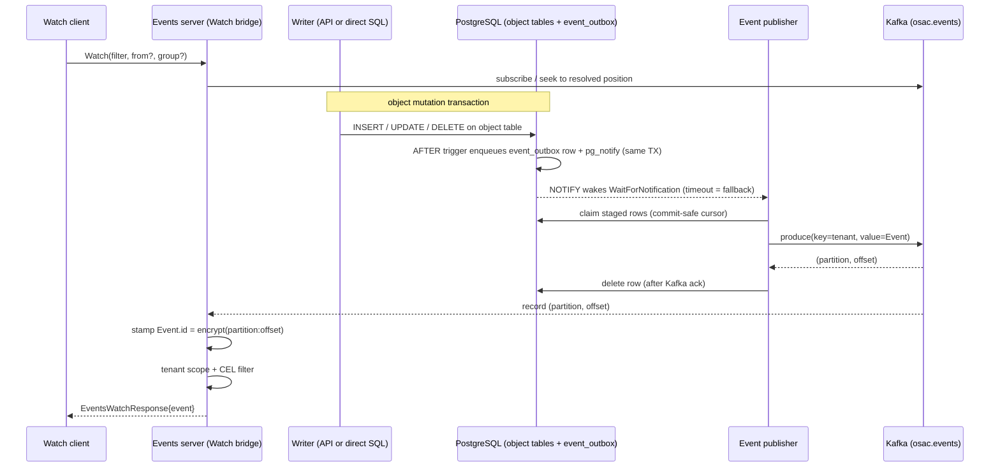

# Reliable Event Distribution

## Summary

This design makes the fulfillment-service `Watch` API deliver object change
events reliably by introducing a durable, ordered event pipeline: an
`event_outbox` table populated by database triggers on each object-type table (so
every committed change produces an event, whether it came through the API or a
direct SQL statement), an event publisher that tails the outbox — blocking on a
database notification rather than looping on a timer — and forwards rows to a
Kafka topic keyed by tenant, and a gRPC `Watch` bridge that streams events from
Kafka
with two new opt-in request fields — `from` (resume position) and `group`
(consumer group). Keying by tenant gives each tenant a totally ordered event
stream on a single partition — a superset of the PRD's per-object ordering — so a
consumer resumes with a single monotonic offset rather than reconstructing a
position across partitions. Each delivered event's `id` is an opaque, encrypted
encoding of its Kafka position `(partition, offset)`, so a consumer resumes simply
by replaying that id as `from`, with no server-side resume index. The
`event_outbox` is a transient staging buffer — drained and deleted once published —
and Kafka (within its retention window) is the sole durable, replayable event log. Delivery becomes at-least-once with per-tenant total
ordering and end-to-end tenant isolation, while requests that omit the new fields
behave exactly as they do today. See [PRD](prd.md) for detailed requirements.

## Motivation

The `Watch` method already lets clients subscribe to object change events, but
delivery is best-effort: events are emitted by inserting a row into a short-lived
`notifications` table (cleaned up after roughly one minute) and firing
`pg_notify('events', id)`, which a single per-server `LISTEN` connection fans out
to unbuffered in-memory subscriber channels [Codebase:
osac/fulfillment-service/internal/database/database_notifier.go]. `NOTIFY` is
fire-and-forget — any event produced while a subscriber is disconnected is
silently lost — and the transport carries no sequence, offset, consumer group,
acknowledgement, or replay capability [Codebase:
osac/fulfillment-service/internal/database/database_listener.go]. The service's
own controllers work around this by re-listing every object on each watch
(re)start and on a periodic timer, which is expensive and still leaves gaps
between scans.

Reliability-sensitive consumers — notifications (OSAC-75), audit logging
(OSAC-63), breakfix structured events (OSAC-3128), and HIPAA/NIST compliance
pipelines — cannot be built on a source that drops events. Capture must also be
independent of the write path: an event must be produced even when a row is
changed by a direct SQL statement outside the API — for example, when an
administrator corrects a bad field value in an emergency for which no API method
exists. This design replaces the best-effort transport with a durable, replayable
pipeline whose capture originates in the database itself, while preserving the
existing event content and the existing `Watch` request/response shape for
callers that do not opt in.

The messaging technology is Kafka, resolved during the design phase per the epic
that frames this work [Research: §Recommended Approach; OSAC-1161]. Kafka is
already operated in the organization by `osac-metering`, which publishes
CloudEvents to Kafka [Codebase: osac/osac-metering]. PostgreSQL LISTEN/NOTIFY is
retained only as a low-latency wake hint for the publisher, never as the delivery
transport.

### Goals

- Capture events with database triggers on each object-type table so every
  committed mutation produces an event atomically and independently of the write
  path — API calls and direct SQL statements alike [User].
- Deliver events through Kafka keyed by tenant, giving each tenant a totally
  ordered stream on one partition (a superset of the PRD's required per-object
  ordering) and a single-offset resume, requiring no global ordering across
  tenants [PRD: In Scope].
- Add `from` and `group` as optional `EventsWatchRequest` message fields (not HTTP
  headers) so REST transcoding forwards them without gateway header-matcher
  changes [Codebase:
  osac/fulfillment-service/internal/cmd/service/start/restgateway/start_rest_gateway_cmd.go].
- Enforce tenant isolation in the `Watch` bridge (application logic) on both live
  and replayed events, because the service is the sole Kafka principal and Kafka
  ACLs cannot separate tenants [Research: §Integration Constraints].
- Migrate the 18 fulfillment-service reconcilers onto the reliable path first,
  with a periodic full resync retained as a low-frequency backstop rather than a
  per-reconnect operation [PRD: In Scope].

### Non-Goals

- Changing, adding, or reformatting events; the `Event` message and its payloads
  are delivered unchanged [PRD: Out of Scope].
- A tenant-facing event query or history API; replay is available only through
  `Watch` [PRD: Out of Scope].
- Migrating non-controller consumers (for example cost-management/metering) onto
  the reliable path; they adopt later through the same API [PRD: Out of Scope].
- Notification delivery (OSAC-75), audit-log storage/query (OSAC-63), and
  Prometheus alerting rules [PRD: Out of Scope].

## Proposal

The reliable path is composed of four cooperating pieces — one in the database
schema, three in fulfillment-service — plus one new infrastructure dependency:

1. **Event outbox populated by database triggers** — a new durable `event_outbox`
   table, filled by an `AFTER INSERT OR UPDATE OR DELETE` trigger installed on
   each object-type table. Capturing changes in the database, rather than in the
   Go write path, guarantees an event for every committed mutation regardless of
   how it was made, including a direct SQL statement issued outside the API
   [User]. The `Signal` RPC, which emits an event without mutating a row, inserts
   its outbox row explicitly within its own transaction — the sole application-
   level emission [Codebase:
   osac/fulfillment-service/internal/servers/generic_server.go].
2. **Event publisher** — a component that tails staged `event_outbox` rows in
   commit-safe order, publishes each to Kafka, and deletes the row once Kafka
   acknowledges it. The outbox is a transient staging buffer, not a retained log —
   Kafka holds the durable, replayable history. It is
   not a naive timer-poll loop: it blocks on a dedicated `LISTEN` connection
   (`WaitForNotification`) until a change arrives and only then drains, so an idle
   system does no repeated querying; a bounded wait timeout is a fallback that
   guarantees progress if a notification is ever missed. This revives the
   change-capture mechanism removed in osac-project/fulfillment-service#10 (a
   durable table filled by triggers, drained by a `for update skip locked` claim,
   with a blocking `LISTEN`/`WaitForNotification` wait plus a timeout fallback),
   reused here to feed Kafka rather than to invoke an in-process callback [User;
   Research: §Existing Solutions].
3. **Kafka topic** — `osac.events`, records keyed by `tenant` so all of
   a tenant's events land on one partition and form a totally ordered stream (a
   superset of the per-object ordering the PRD requires). This makes resume exact
   — a single monotonic offset per tenant, with no cross-partition position
   reconstruction [Research: §Kafka delivery semantics]. Multiple tenants share a
   partition (the key is hashed), so reading a partition still yields several
   tenants' events and the bridge must tenant-filter (see Security). Deployed via
   the Strimzi operator in production and via a single-broker KRaft Helm chart in
   the integration-test harness [Research: §Kafka on Kubernetes].
4. **Watch bridge** — the public and private `Events` servers become Kafka
   consumers that stream matching events to gRPC `Watch` clients, applying CEL
   filtering and tenant isolation, and honoring the new `from`/`group` fields
   [Codebase: osac/fulfillment-service/internal/servers/events_server.go]. The
   bridge stamps each delivered event's `id` with an opaque, encrypted encoding of
   that record's Kafka `(partition, offset)` — derived from the consumer record at
   read time, because Kafka assigns the offset only at produce time — and resolves
   an incoming `from` by decrypting it back to a position and seeking, with no
   database lookup (see Opaque resume cursor under Implementation Details).

The new infrastructure dependency is a Kafka cluster. The client library is
`github.com/confluentinc/confluent-kafka-go/v2`, matching the proof-of-concept
that introduced Kafka into this service [Research: §Existing Solutions].

### Workflow Description

Actors: **Tenant User / Tenant Admin / Cloud Provider Admin** (public `Watch`
consumers) and the **fulfillment-service controllers** (private `Watch`
consumers, the first adopters). The starting state is a running service with the
Kafka pipeline deployed.

Live delivery, in order:

1. A caller opens `Watch`, optionally supplying `filter`, `from`, and `group`.
2. Any writer — the API or a direct SQL statement — commits a change to an
   object-type table. The `AFTER` trigger enqueues an `event_outbox` row and
   issues `pg_notify('events_outbox', …)` inside that same transaction.
3. The event publisher, blocked on `WaitForNotification` and woken by that
   notification (or by its bounded wait-timeout fallback), drains the pending
   rows, publishes each to `osac.events` keyed by `tenant`, and deletes the row
   once Kafka acknowledges it (no partition/offset is persisted back to the DB).
4. The bridge's Kafka consumer receives the record, stamps the `Event.id` with the
   encrypted encoding of the record's `(partition, offset)`, applies the caller's
   tenant scope and CEL filter, and streams the `Event` to the caller.



The diagram shows the two decoupled halves — capture-and-publish on the left,
consume-and-stream on the right — joined by Kafka. The takeaway is twofold:
capture happens in the database transaction of whichever writer made the change,
so nothing produced outside the API is missed; and a client's connection state no
longer affects capture, so a disconnected consumer misses nothing it can later
replay.

**Resume after disconnect (broadcast mode, no `group`).** A consumer records the
`id` of the last event it processed. On reconnect it passes that id as `from`. The
id *is* the (encrypted) Kafka position, so the bridge decrypts it directly to a
partition and offset and seeks that partition to the next offset — no database
lookup and no server-side index. Because a tenant's events all live on one
partition, a consumer scoped to a single tenant resumes from exactly one offset —
a total order with no cross-partition reconstruction and no timestamp-based
approximation. A consumer authorized for multiple tenants reads the (few)
partitions those tenants hash to; because the token is opaque it encodes the full
set of per-partition offsets the consumer had reached, so a single `from` still
resumes every partition exactly, without any timestamp seek. Delivery remains
at-least-once, so a consumer
may still see a boundary event twice and must be idempotent — this is expected,
not an error [PRD: In Scope].

**Load-balanced delivery (group mode, `group` supplied).** Each event is
delivered to exactly one member of the group. The bridge derives a Kafka consumer
group id from the caller's authorized tenant scope combined with the
client-supplied `group` string, so the same `group` value used by two different
tenant scopes maps to two independent Kafka groups with independent committed
positions. A replacement instance in the same group resumes from the group's last
committed position [PRD: In Scope].

**Error and alternative paths.**
- *Omitted new fields:* the request behaves exactly as today — every event the
  caller may see, live only, no resume [PRD: In Scope].
- *Expired `from`:* if the resume point predates Kafka retention, the bridge fails
  the stream with `FAILED_PRECONDITION` and a message directing the caller to
  resync, rather than silently skipping or replaying from the beginning [Research:
  §Integration Constraints].
- *Invalid or tampered `from`:* if the token fails authenticated decryption
  (garbled, forged, or truncated), the bridge rejects the request with
  `INVALID_ARGUMENT` and never positions the stream.
- *Cross-tenant `from`:* the tenant bound inside the token must be within the
  caller's visible tenants; otherwise the bridge rejects the request with
  `PERMISSION_DENIED` and never positions the stream on it [PRD: In Scope].

### API Extensions

This enhancement modifies the existing `Events` gRPC service in
fulfillment-service (both public `osac.public.v1` and private `osac.private.v1`).
No CRDs, webhooks, finalizers, or object types owned by other parties are
affected.

Two optional fields are added to `EventsWatchRequest` in both APIs:

```protobuf
message EventsWatchRequest {
  // Existing CEL filter (unchanged).
  optional string filter = 1;

  // Resume position: the opaque id of the last event the consumer processed (an
  // encrypted encoding of the Kafka position; clients treat it as opaque). When
  // set, the server resumes delivery immediately after that position. Ignored when
  // a group is supplied (the group's committed position governs resume). The bound
  // is generous because for a multi-partition (multi-tenant) scope the token
  // encodes one offset per partition read.
  optional string from = 2 [
    (buf.validate.field).string.max_len = 4096
  ];

  // Consumer group identifier. When set, each event is delivered to exactly one
  // member of the group; when unset, every event is delivered to every watcher.
  optional string group = 3 [
    (buf.validate.field).string.max_len = 253,
    (buf.validate.field).string.pattern = "^[a-zA-Z0-9._-]+$"
  ];
}
```

`EventsWatchResponse` and the `Event` message are unchanged, so event content and
format are preserved [PRD: Out of Scope]. Because `from` and `group` are message
fields, grpc-gateway maps them from `GET` query parameters automatically; no
`DefaultHeaderMatcher` change is required in the REST gateway [Codebase:
osac/fulfillment-service/internal/cmd/service/start/restgateway/start_rest_gateway_cmd.go].

Operational impact: when the publisher is down, capture continues (rows
accumulate durably in `event_outbox`) and live delivery pauses until it resumes;
no events are lost. When Kafka is unreachable, the publisher retries and outbox
rows accumulate; `Watch` streams stall but resume without loss once Kafka
recovers.

## UX Alignment

Not applicable. No `@temp-api` file exists at
`osac-ux/libs/ui-components/src/api/v1/` for events or the `Watch` stream, and
this enhancement adds no tenant-facing object type or field that the UI consumes
[Codebase: osac-ux/libs/ui-components/src/api/v1]. The change is limited to
delivery semantics of an existing stream and to two request parameters.

### Implementation Details/Notes/Constraints

**`event_outbox` table (new migration).** Filled by the change-capture triggers
below; replaces `notifications` as the emission target. It is a transient staging
buffer: rows exist only between capture and successful publish, then are deleted —
so it does not grow with history (Kafka holds the durable log), and it needs no
Kafka-position columns because the position is encoded into the delivered event id
(see Opaque resume cursor) rather than stored:

| Column | Type | Notes |
|--------|------|-------|
| `serial` | `bigserial primary key` | Monotonic capture order; the publisher drains in this order for commit-safe per-tenant ordering into Kafka |
| `tenant` | `text not null` | Kafka partition key (per-tenant total ordering); also the scope for isolation and filtering (from the row's `tenant` column), and bound into the resume token |
| `object_type` | `text` | Source object-type table (e.g. `cluster`, `subnet`) |
| `object_id` | `text not null` | Identifies the object the event concerns (the object's `id`, `object.id`); carried in the event, not the partition key |
| `event_type` | `text` | `created` / `updated` / `deleted` / `signaled` |
| `payload` | `jsonb` | Object snapshot (the row's `data`): `NEW` for insert/update, `OLD` for delete |
| `creation_timestamp` | `timestamptz not null default now()` | Capture time; used only for publish-latency metrics |

Indexes: the primary key on `serial` is sufficient for the ordered
`for update skip locked` claim; because published rows are deleted, every row
present is by definition unpublished, so no partial "unpublished" index is needed.

**Change-capture triggers.** A single shared `PL/pgSQL` trigger function
(`enqueue_event()`) is attached by one `AFTER INSERT OR UPDATE OR DELETE … FOR
EACH ROW` trigger per object-type table (`clusters`, `subnets`, `virtual_networks`,
…) — the same shape as the change detector removed in
osac-project/fulfillment-service#10 [User; Research: §Existing Solutions]. Because
the trigger fires inside the transaction of whichever statement changed the row,
capture is atomic with the mutation and covers every write path, including direct
SQL. The function derives each outbox column from the trigger context: `object_type`
from `TG_TABLE_NAME`, `event_type` from `TG_OP`, and `object_id`/`tenant`/`payload`
from the affected row's `id`, `tenant`, and `data` columns (`NEW` for
insert/update, `OLD` for delete), which every object-type table carries [Codebase:
osac/fulfillment-service/AGENTS.md — standard DAO columns]. The trigger does not
generate an event id: the `Event.id` is the record's Kafka position, which does not
exist until produce time, so it is stamped by the bridge on delivery (see Opaque
resume cursor). The `Event` proto is otherwise constructed by the publisher from
these columns, so the delivered event content is unchanged [PRD: Out of Scope]. A new object-type table must add its trigger; this
is enforced by a test that asserts every object-type table has the trigger
installed (see Test Plan).

**Commit-safe publisher drain.** Because published rows are deleted rather than
tracked by an advancing numeric cursor, no row can be skipped by a cursor that
raced ahead of a still-committing transaction — a late committer simply becomes
visible and is claimed on a subsequent drain. The remaining hazard is *ordering*,
not loss: `bigserial` values are assigned at statement execution but become visible
at commit, possibly out of order, so producing rows in the order they happen to
become visible could place a tenant's later-`serial` event on Kafka ahead of an
earlier one still committing — breaking that tenant's total ordering. The publisher
prevents this by bounding each drain with a transaction-visibility watermark: it
only produces rows whose owning transaction is no longer in the in-progress set,
using `pg_snapshot_xmin(pg_current_snapshot())` as the ceiling (rows from
transactions at or above `xmin` are deferred to the next drain), and produces
strictly in `serial` order. Rows are claimed with `select … for update skip locked`
so multiple publisher instances can share the load without double-publishing. Like
the change detector removed in osac-project/fulfillment-service#10, the publisher
`delete`s each row once Kafka acknowledges it — the outbox is transient staging,
not a retained index. Because Kafka delivery is at-least-once, a row produced but
not yet deleted (a crash between produce and delete) is re-produced on recovery;
it lands at a new offset and is therefore delivered as an at-least-once duplicate
(a distinct id), which consumers already tolerate — there is no stable logical
event id to dedup on, so idempotent consumers must reconcile by object state, as
the reconcilers already do.

This visibility-watermark handling is the most intricate part of the publisher,
and it is intrinsic to draining an execution-ordered staging table safely. The one
mechanism that removes it — consuming PostgreSQL's write-ahead log via logical
replication, which delivers only committed transactions and delivers them in
commit order — was evaluated as a replacement for the whole outbox and rejected on
high-availability grounds (a logical replication slot is server-local state that
does not survive a primary/standby failover without provider-specific configuration
the outbox does not need). See *Logical replication (in-process logical decoding)
in place of the outbox* under Alternatives. The `xmin`-watermark complexity here is
therefore the deliberately accepted price of the outbox's provider-agnostic,
config-free durability under HA.

**Notification-driven wake (not timer polling).** The publisher does not run a
query on a fixed timer. Following the change detector removed in
osac-project/fulfillment-service#10, it holds a dedicated connection that has
issued `LISTEN events_outbox` and blocks on `WaitForNotification`; the trigger's
`pg_notify('events_outbox', …)` (fired in the writing transaction) wakes it, and
it then drains all pending rows via the `for update skip locked` claim above
before blocking again. An idle system therefore performs no repeated querying —
the goroutine simply parks on the connection. The `WaitForNotification` call
carries a bounded timeout that acts purely as a safety-net fallback: if a
notification is ever missed (or the listen connection drops and is reconnected),
the timeout ensures pending rows are still drained within that bound, so a lost
notification costs latency, never an event [Research: §Standards; Codebase:
osac-project/fulfillment-service#10]. This is the one retained use of
LISTEN/NOTIFY.

**Opaque resume cursor (event id ↔ Kafka position).** The resume position is
carried *in the event id itself* rather than in a server-side index, which is what
lets the outbox stay transient. Each delivered event's `id` encodes the tuple
`(tenant, partition, offset)` of its Kafka record. Because Kafka assigns the offset
only when the record is produced, the id cannot be embedded in the message value
beforehand: the Kafka value carries the `Event` with no meaningful id, and the
bridge stamps `Event.id` from the consumer record's own `(partition, offset)`
metadata at read time. To resume, a client replays that id as `from`; the bridge
decodes it and seeks — no database lookup.

The encoding is an authenticated, symmetric encryption (AEAD, e.g. AES-GCM-SIV or
XChaCha20-Poly1305) over the tuple, keyed by a service-held secret, for three
reasons: (1) *obfuscation* — clients see an opaque token and cannot come to depend
on the internal `partition:offset` structure; (2) *tamper-evidence* — a forged or
truncated token fails authenticated decryption and is rejected with
`INVALID_ARGUMENT`; (3) *tenant binding* — the `tenant` travels inside the token
(as plaintext-bound associated data), so the bridge rejects with `PERMISSION_DENIED`
any `from` whose tenant is outside the caller's visible scope. Encryption is
*obfuscation and integrity, not the isolation boundary*: even a valid token only
selects a seek position, and every delivered event is still tenant-filtered
regardless of the supplied cursor (see Security). A *deterministic* AEAD (synthetic
IV) is used so the same record always yields the same id — stable and repeatable
across re-reads — rather than a fresh random ciphertext each time. For a
multi-partition (multi-tenant or cluster-wide controller) scope, the token encodes
the vector of per-partition offsets the consumer had reached, so one `from` resumes
every partition it reads. The signing/encryption key is supplied from service
configuration (a Kubernetes secret) and rotated via a keyset — the newest key
encrypts, all live keys decrypt — so cursors minted before a rotation remain
valid (see Infrastructure Needed).

**Kafka topic.** `osac.events`, keyed by `tenant`. Each tenant maps to
exactly one partition, so a tenant's events are totally ordered and a
single-tenant consumer resumes from one offset. Partition count is fixed at
creation because changing it re-hashes the tenant keys and would move a tenant to
a different partition, breaking its ordering continuity; it also bounds how many
tenants can be distributed across brokers and caps parallelism for cross-tenant
consumers (a single tenant is always one partition, so an intra-tenant group
cannot scale past one active consumer — see Drawbacks). The exact count is an open
question to be sized against real throughput (see Open Questions) [Research:
§Integration Constraints]. Because the outbox is transient, Kafka's retention is
now the *entire* replay bound — the sole durable event history. Retention is the
resume-window SLA and is set to Kafka's default of 7 days: a consumer offline
longer than 7 days receives the fail-fast resync signal rather than a silent skip
[User; Research: §Kafka delivery semantics]. The idempotent producer
(`enable.idempotence=true`, default since client 3.0) prevents producer-retry
duplicates and preserves per-partition order [Research: §Kafka delivery
semantics].

**Watch bridge.** The `Events` servers replace the in-memory
`listener.Listen`-plus-unbuffered-channel fan-out with per-connection Kafka
consumers [Codebase:
osac/fulfillment-service/internal/servers/events_server.go]. Each subscriber gets
a buffered channel so one slow client cannot block others (the current
unbuffered blocking send under `subsLock.RLock` is removed) [Codebase:
osac/fulfillment-service/internal/servers/events_server.go]. The public bridge
continues to map private events to public events and to drop signal/hub-only
events. Each consumed record's `Event.id` is stamped from its `(partition, offset)`
metadata (see Opaque resume cursor) before filtering and delivery. Resume
resolution (`from` → position) decrypts the token to its `(partition, offset)`(s)
and seeks directly; because a tenant is confined to one partition, this is an exact
seek with no timestamp-based approximation and no database lookup. The outbox is
not consulted on the read path at all — it is transient staging on the write side.

**Controller migration.** Each of the 18 reconcilers passes a stable `group`
(its own name) on the private `Watch` and persists the `from` id of the last
processed event, so a restarted reconciler resumes instead of re-listing every
object [Codebase:
osac/fulfillment-service/internal/controllers/reconciler.go]. The per-reconnect
full `List` is removed; the periodic `syncInterval` full resync is retained as a
low-frequency correctness backstop [PRD: In Scope]. Reconcilers already re-read
fresh state before acting, so they tolerate the at-least-once duplicates
[Codebase: osac/fulfillment-service/internal/controllers/reconciler.go].

**Coexistence and cutover.** Rollout is phased: first add `event_outbox`, the
change-capture triggers, the publisher, the Kafka topic, and the Kafka-backed
bridge while the request contract stays backward compatible; then, once the Kafka
path is validated in production, a later additive migration drops the
`notifications` table and its application-level emission. Existing migrations are
never modified — each step is a new numbered `*.up.sql` file [Codebase:
osac/fulfillment-service/internal/database/migrations].

### Security Considerations

Tenant isolation is the central security property and is enforced entirely in
application logic in the Watch bridge, because the fulfillment-service is the sole
Kafka principal and Kafka ACLs therefore cannot separate tenants from one another
[Research: §Integration Constraints]. On the public path the bridge filters every
delivered event — live or replayed — against the caller's visible tenants via the
existing `DetermineVisibleTenants` logic, extending the filter that today runs
only on live delivery to also cover replayed and retained events [Codebase:
osac/fulfillment-service/internal/servers/events_server.go;
osac/fulfillment-service/internal/auth/default_tenancy_logic.go] [PRD: In Scope].
The `tenant` used for filtering is captured by the trigger from the row's own
`tenant` column, so isolation data originates at capture time and covers
out-of-band writes as well as API writes. Note that keying the topic by `tenant`
is an ordering/partitioning choice, **not** an isolation mechanism: the key is
hashed, so multiple tenants share a partition and a consumer reading a partition
still sees other tenants' events. Application-level filtering therefore remains
mandatory on every delivered and replayed event.

Two additional bindings prevent an offset or group identity from crossing
tenants:
- `from` is an authenticated-encrypted token that binds the event's `tenant`
  (AEAD associated data). The bridge rejects a tampered or forged token with
  `INVALID_ARGUMENT` (authenticated decryption fails) and a token whose bound
  tenant is outside the caller's visible tenants with `PERMISSION_DENIED`; the
  replayed stream is tenant-filtered regardless of the supplied id [PRD: In Scope].
  The encryption is obfuscation and integrity, **not** the isolation boundary — a
  valid token only selects a seek position; every delivered event is still filtered
  against the caller's visible tenants, so even a correctly minted cursor cannot
  surface another tenant's events.
- The effective Kafka consumer group id is derived from the caller's authorized
  tenant scope plus the client-supplied `group`, so group identity is scoped to
  the authorized organization(s) and cannot be used to read another tenant's
  events [PRD: In Scope].

The cursor key is a symmetric secret held only by the service (Kubernetes secret),
rotated via a keyset so cursors minted before a rotation remain decryptable; losing
or rotating out all keys invalidates outstanding cursors, which degrades to the
fail-fast resync path rather than to any data exposure.

The private path used by controllers remains cluster-wide and trusted (no tenant
filter), unchanged from today [Codebase:
osac/fulfillment-service/internal/servers/private_events_server.go]. Transport
security to Kafka uses mTLS, matching the proof-of-concept's cert-manager-issued
broker credentials [Research: §Existing Solutions]. Input validation on the new
fields is declarative (`buf.validate` length and pattern constraints above).

### Failure Handling and Recovery

- **Publisher crash mid-batch (produced to Kafka, not yet deleted):** on restart
  the row is re-claimed and re-produced; it lands at a new offset and is delivered
  as an at-least-once duplicate (a distinct id) that idempotent consumers absorb by
  reconciling object state. No loss.
- **Publisher down:** outbox rows accumulate durably; live delivery pauses;
  capture is unaffected. On restart the publisher drains the backlog in
  commit-safe order. No loss.
- **Direct SQL write during an outage:** still captured by the trigger into
  `event_outbox` within the writer's transaction, and delivered once the
  publisher drains. No loss and no dependence on the write path.
- **Kafka unreachable:** the producer retries; outbox rows accumulate; `Watch`
  streams stall. On recovery the backlog drains and streams resume. No loss.
- **Consumer/bridge restart:** group-mode consumers resume from the group's
  committed position; broadcast consumers resume from the client-supplied `from`.
  Duplicates possible, no loss.
- **`from` older than retention:** stream fails fast with `FAILED_PRECONDITION`
  and a resync instruction — never a silent skip or full replay [Research:
  §Integration Constraints].
- **Tampered, forged, or truncated `from`:** authenticated decryption fails and
  the stream is rejected with `INVALID_ARGUMENT`; the bridge never seeks on an
  unverified position.
- **Long-running writer transaction:** the `xmin` watermark defers newer rows
  until that transaction commits, adding latency but never reordering or losing
  events. A pathologically long transaction raises delivery latency (see Open
  Questions).
- **Slow client:** its buffered channel fills and its stream is terminated with
  `RESOURCE_EXHAUSTED`; other subscribers are unaffected (no head-of-line
  blocking) [Codebase:
  osac/fulfillment-service/internal/servers/events_server.go].

### RBAC / Tenancy

No new tenant-scoped object type is introduced, so no
`osac.openshift.io/tenant` / `osac.openshift.io/owner-reference` annotations
apply. The tenancy change is behavioral: authorization is enforced on replayed
and retained events in addition to live ones, and resume/group identities are
bound to the caller's authorized organization(s) as described in Security
Considerations [PRD: In Scope]. Visibility is unchanged from today — a tenant
sees only its own events; the private (controller) path remains cluster-wide.
Authorization continues to use the existing tenancy logic; no OPA policy changes
are required [Codebase:
osac/fulfillment-service/internal/auth/default_tenancy_logic.go].

### Observability and Monitoring

New Prometheus metrics:
- `event_outbox_unpublished_rows` (gauge) — current backlog (= rows in
  `event_outbox`, since published rows are deleted); sustained growth indicates the
  publisher is stalled or Kafka is unreachable.
- `event_outbox_publish_latency_seconds` (histogram) — time from `creation_timestamp`
  to successful publish, measured in the publisher at delete time; rising values
  indicate publisher lag or watermark stalls.
- `event_publish_total` / `event_publish_errors_total` (counters, labeled by
  `event_type`) — publish throughput and failures.
- `event_watch_active_streams` (gauge, labeled by `mode=broadcast|group`) —
  current `Watch` subscribers.
- `event_watch_resume_expired_total` (counter) — `from` requests rejected as
  aged-out; a spike signals retention is too short for real consumers.

Structured log events on publisher claim/publish/mark failures and on
resume-position resolution failures. No new Kubernetes events (there is no CRD).
Prometheus alerting rules are out of scope [PRD: Out of Scope].

### Risks and Mitigations

- **Out-of-commit-order publication breaking per-tenant ordering.** Highest-impact
  ordering risk: producing rows in visibility order rather than commit order could
  place a tenant's later event on Kafka ahead of an earlier one. Mitigated by the
  `xmin`-watermark ceiling plus in-`serial`-order production described in
  Implementation Details; covered by an explicit out-of-commit-order integration
  test [Research: §Integration Constraints]. (Loss is separately precluded because
  published rows are deleted, not tracked by an advanceable cursor, so a late
  committer is never skipped.)
- **Cursor forgery or tampering.** A client could try to craft a `from` to seek an
  arbitrary position or another tenant's partition. Mitigated by authenticated
  encryption (rejected on decrypt failure) with the `tenant` bound into the token
  and validated against the caller's scope, and — as defence in depth — the
  mandatory per-event tenant filter that applies regardless of the cursor.
- **Missing trigger on a new object-type table.** A newly added object-type table
  without the event trigger would silently emit no events. Mitigated by the single
  shared trigger function and a schema-assertion test that fails if any
  object-type table lacks the trigger.
- **Cross-tenant leakage on replay.** A replay/seek path that forgets the tenant
  filter is a data breach. Mitigated by making tenant filtering a single
  non-bypassable layer applied to both live and replayed events, `from` tenant
  validation, and scope-bound group ids; covered by a private-field-leak-style
  isolation test over replayed events [Codebase:
  osac/fulfillment-service/internal/servers/events_server_test.go].
- **Hot / skewed partition from a high-volume tenant.** Because a tenant's events
  all hash to one partition, a single very active tenant concentrates load on one
  partition and broker, and cannot be relieved by adding partitions. Mitigated by
  sizing partition count against per-tenant throughput (Open Questions) and, if a
  single tenant ever outgrows a partition, revisiting the key (for example a
  `tenant` + coarse bucket) as a follow-up; accepted as a deliberate trade-off for
  per-tenant total ordering (Drawbacks).
- **Resume window too short.** If consumers are offline longer than retention,
  their `from` expires. Mitigated by the fail-fast expired-cursor signal, the
  `event_watch_resume_expired_total` metric, and the retained low-frequency
  controller resync backstop.
- **New operational dependency (Kafka).** Adds Strimzi/broker operations.
  Mitigated by reusing the organization's existing Kafka experience
  (`osac-metering`) and the proof-of-concept's `it/` chart for tests [Research:
  §Existing Solutions].
- **Publisher throughput / write amplification.** Every mutation now writes an
  outbox row via the trigger. Mitigated by the partial index and batched
  `skip locked` draining; log-based CDC remains a future option if amplification
  becomes measurable (Alternatives).

Security review should be performed by the fulfillment-service maintainers
together with the security/compliance owners of the downstream audit and
compliance pipelines (OSAC-63, HIPAA/NIST).

### Drawbacks

The strongest argument against this proposal is the operational cost of adding
Kafka to a service that currently needs only PostgreSQL: a new cluster to deploy,
secure (mTLS), monitor, and upgrade, plus a `cgo`/librdkafka client dependency
(`confluent-kafka-go/v2`) that complicates builds. A purely PostgreSQL-based
durable log (Alternatives) would avoid the new dependency. A second drawback is
that capturing events in database triggers couples emission to the schema: every
object-type table needs its trigger, and the event-construction logic is split
between SQL (enqueue) and Go (build the `Event` proto). The proposal is justified
because Kafka is already operated in-org and provides consumer-group
load-balancing and rewindable retention a bespoke Postgres log would have to
reimplement [OSAC-1161], and because triggers are the only way to guarantee
capture for out-of-band writes; the coupling is contained by using a single
shared trigger function and a test that asserts full coverage. A third drawback
follows from keying the topic by `tenant`: because total per-tenant ordering and
parallel ordered consumption are mutually exclusive, a consumer group scoped to a
single tenant cannot scale beyond one active consumer for that tenant's stream —
the "scale out event processing" user story (IS-3/IS-4) is therefore only
available to cross-tenant consumers (a provider admin, the controllers), not to a
single tenant load-balancing its own events. This is accepted deliberately in
exchange for the exact, single-offset resume that keying by object identifier
could not provide without timestamp-based cross-partition reconstruction (see
Alternatives) [User]. Encoding the Kafka position into the event id (which lets the
outbox stay transient and removes a server-side resume index) has its own costs:
the `Event.id` now identifies a *delivery position* rather than a stable logical
event, so an at-least-once re-produce surfaces as a new id and there is no stable
id to dedup on — idempotent consumers must reconcile by object state (the
reconcilers already do, but external adopters must too); and the service gains a
symmetric-key management/rotation responsibility for the cursor cipher. A residual
drawback is added write amplification from the outbox, addressed under Risks.

## Alternatives (Not Implemented)

- **Application-level (in-process) outbox emission from the DAO callback.** Write
  the outbox row in the Go write path — the existing DAO event callback that today
  inserts into `notifications` — instead of in a trigger. Rejected: it captures
  only changes made through the service's own code, so a direct SQL modification
  (an admin correcting a field in an emergency, a future out-of-band job) would
  produce no event. Database triggers fire inside every writer's transaction
  regardless of path [User].
- **Publish directly from the application (no outbox).** The service would produce
  to Kafka right after committing the DB change. Rejected: this is the dual-write
  problem — a crash between commit and produce loses events, violating
  at-least-once delivery. This is precisely the mechanism removed in
  osac-project/fulfillment-service#10, whose change-capture the user asked to
  revive [User; Research: §Recommended Approach].
- **Swap LISTEN/NOTIFY for a Kafka listener/notifier with no durable outbox** (the
  proof-of-concept's approach). Rejected: without an outbox, capture is not
  transactionally tied to the mutation, reintroducing the dual-write risk. The
  proof-of-concept's Kafka client code, interface seams, and `it/` chart are
  reused, but paired with the durable outbox [Research: §Existing Solutions].
- **Logical replication (in-process logical decoding) in place of the outbox.**
  Instead of triggers + an `event_outbox` table + a watermarked drain, enable
  `wal_level = logical`, create a publication over the object-type tables (with
  `REPLICA IDENTITY FULL` so updates and deletes carry the full row), and have the
  publisher consume the streaming replication protocol in-process via
  `pgx`/`pglogrepl` (`pgoutput`), turning each decoded change into an `Event` and
  the `Signal` RPC into a transactional `pg_logical_emit_message`. This is genuinely
  attractive: it is doable on the deployed PostgreSQL 18 (all required features —
  `pgoutput` messages, `pg_logical_emit_message`, `max_slot_wal_keep_size` — exist),
  it removes the trigger-per-table schema coupling and the extra outbox write per
  mutation, it captures out-of-band (direct SQL) writes for free from the WAL, and —
  the decisive appeal — logical decoding delivers only committed transactions and in
  commit order, which would eliminate the entire `xmin`-watermark / `serial`-cursor
  machinery described under *Commit-safe publisher drain*. **Rejected primarily
  because of PostgreSQL high availability.** A logical replication slot is
  server-local state, not ordinary table data, so in a primary/standby
  streaming-replication HA setup it does not survive a failover on its own: before
  PostgreSQL 16 the slot exists only on the primary and a promotion loses it
  (creating an event *gap*, not just a pause); PostgreSQL 17+ adds native "failover
  slots" (a slot created with `failover = true`, synced to standbys via
  `sync_replication_slots`, gated by `synchronized_standby_slots` on the primary,
  with `hot_standby_feedback` and a physical slot), and the publisher must always
  connect to the *current* primary (logical decoding runs only there; a synced
  standby slot is not consumable until promotion). That machinery is available on
  PG18 but is a substantial cross-node configuration, and it does not exist for the
  *default* production deployment, where the database is external and
  customer-managed: failover-slot support varies by provider (AWS RDS Multi-AZ
  clusters and RDS 17+/Aurora support it with caveats; standard single-instance RDS,
  Cloud SQL, and Azure Flexible Server vary or lack it), so OSAC cannot guarantee it,
  and where it is absent a failover silently drops events. `synchronized_standby_slots`
  also introduces a new coupling absent from the outbox — the primary withholds
  decoded changes from our publisher until a physical standby has flushed the WAL, so
  a lagging or down standby stalls event delivery and grows retained WAL. By
  contrast, the `event_outbox` is ordinary table rows: it is carried by physical
  replication like all other data and therefore survives failover with **zero**
  special configuration on any provider, and its drain position is table data too. In
  short, logical replication would trade the outbox's publisher-code complexity (the
  `xmin` watermark) for operational and portability complexity (failover-slot
  configuration plus a hard dependency on the DB provider supporting it) — a poor
  trade given OSAC's provider-agnostic, customer-managed-database default. Kept as a
  viable future direction if OSAC ever standardizes on OSAC-controlled or
  failover-slot-capable PostgreSQL 17+ HA, at which point the commit-ordered stream
  becomes the natural way to retire the watermark [User; Research: §Comparison
  Matrix; PostgreSQL 17 §29.3 Logical Replication Failover].
- **Log-based CDC via Debezium / Kafka Connect.** The same WAL logical-decoding
  source as above, but run through Debezium on Kafka Connect rather than in-process.
  Rejected for the same HA/slot reasons, plus it adds a separate Connect runtime to
  deploy, secure, and operate — more moving parts than either the outbox or an
  in-process consumer [Research: §Comparison Matrix].
- **PostgreSQL-only durable event log with offset cursors (no Kafka).** Keeps the
  stack to PostgreSQL and makes tenant filtering a trivial SQL `WHERE`. Rejected:
  it would reimplement consumer groups, partitioned ordering, and retention that
  Kafka already provides, and it contradicts the recorded Kafka decision
  [OSAC-1161]. Retained conceptually only as the LISTEN/NOTIFY wake hint.
- **Key the topic by object identifier (`object.id`) instead of by tenant.**
  Spreads a tenant's events across all partitions, giving higher intra-tenant
  consumer parallelism and only per-object (not per-tenant) ordering. Rejected:
  because a single `from` event id then pins only one partition, resume across the
  remaining partitions requires timestamp-based seeking (`offsetsForTimes`), which
  only approximates position and replays extra duplicates — confusing semantics for
  consumers. Tenant keying trades intra-tenant parallelism (Drawbacks) for exact,
  single-offset resume and stronger per-tenant total ordering [User].
- **Store group offsets in an app-side table instead of Kafka.** Rejected:
  deriving a scope-namespaced Kafka consumer group id lets Kafka manage committed
  offsets per scope natively, avoiding a bespoke offset table [Research: §Kafka
  delivery semantics].
- **Retain the outbox as a durable resume index (map a stable event id → Kafka
  offset).** Keep every published row (marked, not deleted) with its recorded
  `kafka_partition`/`kafka_offset`, and resolve a `from` id by a database lookup.
  Rejected: it grows the outbox with the full history (a second durable copy
  alongside Kafka), adds a DB read on every resume, and needs its own
  retention/cleanup. Encoding the position into the (encrypted) event id delivers
  the same exact-seek resume with none of that — the outbox stays transient and
  Kafka is the single durable log [User]. The cost is that the id becomes a
  delivery position rather than a stable logical id (see Drawbacks).

## Open Questions

### 1. Long-running-transaction impact on the `xmin` watermark

- **Question:** Does the fulfillment-service ever hold write transactions open
  long enough that an `xmin`-watermark publisher cursor would introduce
  unacceptable delivery latency, and if so should the ceiling fall back to an
  advisory-lock minimum-in-flight scheme?
- **Owner:** fulfillment-service maintainers
- **Impact:** Implementation Details (publisher cursor); delivery latency SLA.

### 2. Data-at-rest tenant isolation for compliance

- **Question:** Do the HIPAA/NIST compliance and audit pipelines (OSAC-63)
  require per-tenant data-at-rest isolation in Kafka (per-tenant topics), or is a
  single shared topic with enforced application-level filtering acceptable given
  the service is the sole Kafka client?
- **Owner:** security/compliance owners of OSAC-63
- **Impact:** Proposal (topic model), Security Considerations, Kafka topic/ACL
  layout.

### 3. Removing versus reducing the controller full resync

- **Question:** With reliable `from`-based resume, can the periodic full resync be
  lengthened to a purely defensive interval (and what value), or must it stay at
  the current cadence to guarantee no regression in object consistency?
- **Owner:** fulfillment-service maintainers
- **Impact:** Controller migration; correctness backstop behavior.

### 4. Kafka topic partition count

- **Question:** How many partitions should `osac.events` be created
  with? The count is fixed at creation (changing it re-hashes the `tenant` keys and
  moves a tenant to a different partition, breaking its ordering continuity). It
  governs how evenly tenants spread across brokers and the parallelism ceiling for
  cross-tenant consumers; it does not help a single high-volume tenant, whose
  events are always confined to one partition (see the hot-partition risk).
- **Owner:** fulfillment-service maintainers
- **Impact:** Proposal (Kafka topic); tenant distribution / hot-partition risk;
  cross-tenant group parallelism ceiling.

### 5. Resume-cursor cipher and key management

- **Question:** Which AEAD (e.g. AES-GCM-SIV vs XChaCha20-Poly1305), and where is
  the key stored and rotated — a dedicated Kubernetes secret with a keyset, or an
  existing service key? Must deterministic encryption be used (stable id per
  record), and is the resulting equality-leak (same position → same token)
  acceptable?
- **Owner:** fulfillment-service maintainers + security/compliance owners
- **Impact:** Opaque resume cursor (Implementation Details); Security; Infrastructure
  Needed.

### 6. Event id semantics versus OOS-2

- **Question:** Is redefining `Event.id` from a capture-time identifier to an
  encoded Kafka delivery position acceptable under "events delivered unchanged"
  (OOS-2)? The message shape is identical and clients that treat the id as opaque
  are unaffected, but any consumer that relies on a stable logical id across
  re-deliveries would be impacted (at-least-once duplicates now carry distinct ids).
- **Owner:** fulfillment-service maintainers
- **Impact:** API Extensions; Opaque resume cursor; downstream consumer contracts.

## Test Plan

### Unit Tests

- The shared trigger enqueues an `event_outbox` row for INSERT/UPDATE/DELETE with
  the correct `object_type`, `object_id`, `tenant`, `event_type`, and `payload`
  (`NEW` for insert/update, `OLD` for delete).
- Publisher produces in commit-safe order when sequences commit out of order: a
  row with a lower `serial` committing after a higher one is still produced in
  `serial` order (no reordering, no skip), and each row is deleted after Kafka ack.
- Publisher re-produces a row that was produced but not deleted (crash
  simulation); the duplicate lands at a new offset and is tolerated (no stable id
  to dedup on — idempotent consumers reconcile by state).
- The bridge stamps `Event.id` from the consumer record's `(partition, offset)`,
  and the same record deterministically yields the same encrypted id.
- `from` resolution decrypts a token to the correct partition/offset and seeks
  exactly, with no database lookup; a single-tenant consumer resumes from one
  offset with no timestamp-based approximation; a multi-partition scope resumes
  every partition from a single token.
- A tampered, forged, or truncated `from` is rejected with `INVALID_ARGUMENT`.
- `from` whose token-bound tenant is outside the caller's visible tenants is
  rejected with `PERMISSION_DENIED`.
- `from` older than retention is rejected with `FAILED_PRECONDITION`.
- Scope-namespaced group id: the same `group` string under two tenant scopes
  yields two distinct Kafka group ids.
- Omitting `from`/`group` reproduces today's broadcast, live-only behavior.
- A slow subscriber's stream is terminated without blocking other subscribers.

### Integration Tests

- Every object-type table has the event trigger installed (schema-assertion test
  that enumerates object-type tables and fails on any missing trigger).
- A direct SQL `UPDATE` that bypasses the API produces an `event_outbox` row and a
  delivered event, proving capture is write-path independent.
- The `Signal` RPC produces an `event_outbox` row within its transaction and a
  delivered `signaled` event.
- End-to-end reliable delivery on a kind cluster with the `it/` Kafka chart: a
  consumer disconnects, events are produced, it reconnects with `from` and
  receives every missed event (at-least-once, duplicates allowed).
- Per-tenant total ordering: interleaved mutations across objects of one tenant
  arrive in the exact order they were committed, including after a resume (this
  also demonstrates the required per-object ordering).
- All of one tenant's events land on a single partition (partition-key assertion),
  and two tenants that hash to the same partition still each observe their own
  totally ordered subsequence.
- Group mode: for a cross-tenant scope, two members of a group receive disjoint
  events; killing one reassigns its partitions and the survivor resumes from the
  committed position with no loss. For a single-tenant scope, only one member
  receives events (the intra-tenant parallelism ceiling is expected behavior).
- Tenant isolation over replay: a tenant replaying with `from` never receives
  another tenant's events; extends the existing events isolation suite to the
  replay path [Codebase:
  osac/fulfillment-service/internal/servers/events_server_test.go].
- Backlog drain: with the publisher stopped, mutations accumulate in
  `event_outbox`; on restart all are published in commit-safe order and the rows
  are deleted, leaving the table empty (transient staging, not a retained log).

### E2E Tests

- A controller (reconciler) restarts and reconciles correctly using `from`-based
  resume without a full re-list, verified against `osac-test-infra` pytest
  patterns.

Tricky areas called out: out-of-commit-order sequence visibility, per-tenant total
ordering and exact single-offset resume, deterministic cursor encryption plus
tamper/cross-tenant rejection, read-time id stamping from record metadata, multiple
tenants sharing a partition, consumer-group rebalance during delivery, tenant
filtering on replayed events, and trigger coverage across all object-type tables.

## Graduation Criteria

Targeting milestone 0.3. Expected stages: Dev Preview → Tech Preview → GA based
on production deployment feedback. Signals for graduation: the 18 controllers run
on the reliable path with the per-reconnect re-list removed and no
object-consistency regressions observed; `event_outbox_unpublished_rows` stays
bounded under production load; `event_watch_resume_expired_total` stays near zero
for in-SLA consumers; and at least one downstream consumer (OSAC-75 or OSAC-63)
integrates against the reliable path.

## Upgrade / Downgrade Strategy

Upgrade is additive and backward compatible: new migrations create `event_outbox`
and install the change-capture triggers (and later drop `notifications`); the new
`from`/`group` fields are optional, so existing clients and stored requests are
unaffected. The Kafka dependency must be deployed (Strimzi) before or with the
service upgrade; until the publisher and bridge are active, no events are lost
because the triggers persist outbox rows regardless. Downgrade to a pre-feature
version requires reverting the service image; the accompanying down migration must
also drop the triggers, otherwise they would keep enqueuing into `event_outbox`
with no publisher draining it and grow the table unbounded. Events captured but
not yet consumed remain in Kafka within retention. The `notifications`-drop
migration is applied only after cutover is validated, so a downgrade before that
step retains the old transport.

## Version Skew Strategy

Once the trigger migration is applied, every writer — old or new replica, API or
direct SQL — enqueues into `event_outbox`, so the reliable path is fed regardless
of which replica served the write. Old replicas additionally keep using the
`notifications` transport for their own in-memory delivery until cutover; the two
mechanisms are independent and neither loses events. Because `from`/`group` are
optional and ignored by old replicas, a client that sends them to an old replica
simply gets today's behavior. There is no CRD, so no CRD version migration
applies. Kafka client/broker skew is bounded by using the `confluent-kafka-go/v2`
client against a broker version validated in the `it/` chart [Research: §Existing
Solutions].

## Support Procedures

- **Detection:** a stalled pipeline shows as rising
  `event_outbox_unpublished_rows` and `event_outbox_publish_latency_seconds`,
  `event_publish_errors_total` increments, or `event_watch_resume_expired_total`
  spikes; publisher and bridge log structured errors on claim/publish/resume
  failures.
- **Disabling:** the reliable path cannot be disabled by removing an API
  extension (there is no webhook/APIService); to fall back, redeploy the prior
  service version (which uses LISTEN/NOTIFY) while `notifications` still exists. If
  reverting for longer than a brief maintenance window, also drop the triggers to
  stop unbounded `event_outbox` growth. Consequence on cluster health: none
  directly; consumers relying on replay lose it until re-enabled. Existing
  workloads and newly created objects are unaffected — capture continues either
  way while the triggers are present.
- **Recovery:** re-enabling (redeploying the Kafka-backed version) resumes
  draining the outbox backlog in commit-safe order; consistency is maintained
  because capture never stopped and consumers tolerate the at-least-once duplicates
  a recovery drain may produce by reconciling object state.

## Infrastructure Needed

A Kafka cluster: Strimzi-managed in production, and the single-broker KRaft Helm
chart in the fulfillment-service `it/` harness for integration tests [Research:
§Existing Solutions]. A symmetric key (Kubernetes secret, keyset for rotation) for
the resume-cursor cipher must be provisioned and mounted into the service. No new
repositories or CI infrastructure beyond adding the Kafka client dependency, the
`it/` Kafka chart, and the cursor-key secret.

---

## Provenance

Authored: draft @ design 0.8.0 - 7efcedb, workspace main @ 4bfc214
Final: revise @ design 0.9.0 - 5629175, workspace main @ 4bfc214

> Context changed between draft and revise.

<!-- ai-workflow-provenance:{"schema_version":1,"provenance_kind":"session","workflow":"design","workflow_version":"0.9.0","ai_workflows":"5629175","source_repo":"4bfc214","source_repo_branch":"main","commits_behind_main":0,"commits_ahead_main":0,"main_ref":"main","phases":["draft","revise","revise","revise","revise","revise","revise","revise","revise","revise"],"authoring_modes":["skill"],"context_changed":true,"origin_untracked":false} -->
